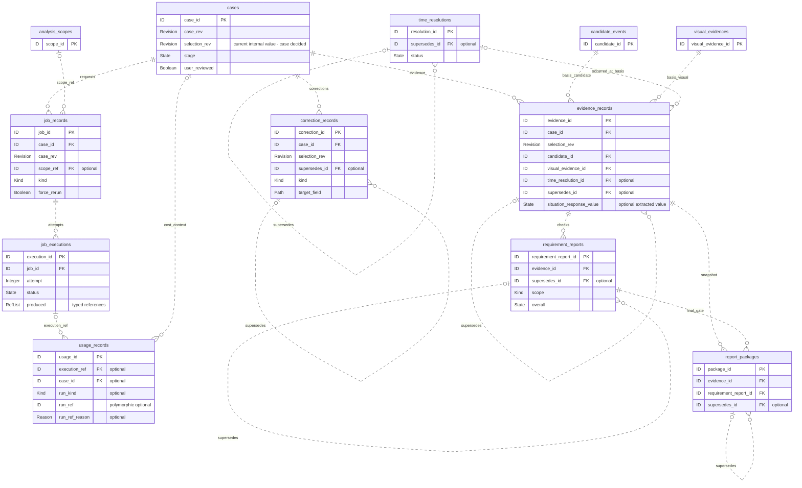
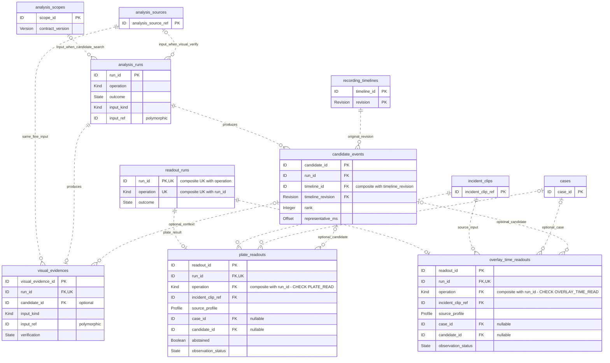
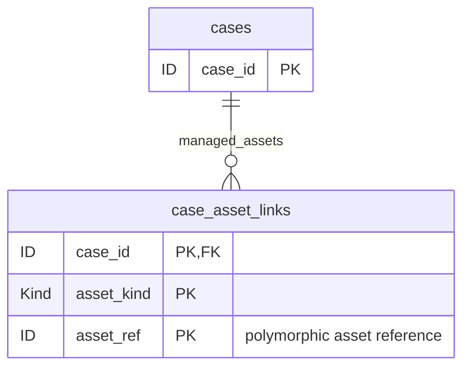

# 대신고 논리 ERD 및 Canonical Contract 저장 대응표

> 상태: **논리 설계 — evidence·case·recording·readout·search 결정 반영, web 제안 일부 검토 대기** · 수정일: 2026-09-19
>
> **Maintainer / 통합 정합화:** 김준영(PM · 문서 일관성 · common/runtime). 각 domain의 데이터 의미·cardinality를 새로 바꾸는 결정권은 해당 Domain Owner에게 있다. 이미 Final Contract / Accepted ADR에서 정답이 유일하게 정해진 stale 표현은 maintainer가 정합화할 수 있다.
>
> 반영 근거: 김준영(evidence/common)·유소연(case)·신유민(readout/web)·서어진(search)·정철원(recording)의 검토·결정과 Final Data Contract를 통합한다. 이 문서는 Canonical Contract 본문을 대신하지 않으며, 충돌 시 상위 Contract/Accepted Owner Decision을 따른다. 정합화 기준은 [ERD ↔ Runtime 정합화 ADR](contracts/adr/adr-erd-runtime-alignment-2026-09-19.md)을 따른다.

## 1. 문서의 목표와 범위

이 문서는 **실제 테이블 후보, PK/FK 후보, 관계의 개수 조건, 핵심 상태**를 설명하는 논리 ERD다. MySQL의 컬럼 길이·정밀도·인덱스·물리 FK 적용·삭제 전파·DDL은 여기서 확정하지 않는다.

정합성 판정은 **Product/Architecture → Final Data Contract·Accepted Owner Decision/ADR → Logical ERD → Runtime/구현** 순으로 읽는다. 따라서 ERD가 상위 결정과 어긋나면 ERD를 수정하고, 상위 문서와 ERD가 모두 물리 저장 방식을 열어둔 경우에는 Runtime/각 구현 문서가 그 세부를 후속 결정한다. Research/experiment는 결정의 근거이지 단독 SoT가 아니다.

이전 초안의 포괄적인 `workflow`, `run_data`, `results`, `snapshot` JSON 묶음을 핵심 도표에서 제거했다. **관계를 설명하기 위해 상세 컬럼을 생략한 것과, 실제 JSON embed 저장을 제안한 것을 구분**한다. JSON 저장 제안은 §5 대응표에 구체적인 부모·필드와 함께 적었다.

독립 참조·생명주기가 있는 기록 25개에 recording 내부 연결 테이블 `case_asset_links`를 추가하여 **26개 테이블 후보**를 제시한다. 이는 26개 모두 구현이 확정됐다는 뜻이 아니다. 업무 중심 관계도와 두 상세 관계도로 나누며, 반복된 테이블은 같은 테이블의 참조용 표시다.

| 표기 | 의미 |
| --- | --- |
| PK / FK / UK | 기본 키 / 참조 키 / 유일 키의 **논리 설계 후보**. 실제 DB 제약 생성은 별도 검토 |
| ID, Revision, State, Kind 등 | 의미를 나타내는 논리 타입. MySQL 타입 선언 아님 |
| optional | 관계가 없을 수 있음. 복합 참조는 구성 필드를 함께 채우거나 함께 비움 |
| `||` / `o|` / `o{` | 하나 / 없거나 하나 / 없거나 여러 개 |
| 도표의 점선 | 비식별관계: 부모 참조가 자식 PK에 포함되지 않음. JSON 저장 여부와 무관 |
| 상세 컬럼 생략 | 기존 계약 필드는 여전히 필요함. 생략만으로 JSON 저장을 뜻하지 않음 |

**검토 상태:** evidence는 전체 논리 ERD 방향을 수용하고 참조·생명주기·Fine 입력 명확화를 요청했다. case는 현재 selection_rev 저장 및 중단 후 재개 방식을 결정했다. 이 결정들은 아래에 반영했으며, 나머지 테이블·JSON embed 선택의 세부 승인까지 완료됐다는 뜻은 아니다. 미확정 항목은 `미정` 또는 `검토 대기`로 표시한다.

readout의 A-1~A-3과 search의 run당 VisualEvidence 수 결정을 반영했다. web의 현재 포인터·package stale 표시 및 실행 산출물 정규화는 아래에서 **제안**으로 구분한다. 선택지인 `job_execution_products`는 아직 채택하지 않아 26개 테이블 수에 포함하지 않는다.

## 2. 업무 중심 논리 ERD — 사건·작업·증거·신고자료

- **case 결정:** `cases.selection_rev`는 Case 내부의 단일 현재값이며 별도 선택 이력 테이블은 만들지 않는다. 후보 선택 시 `case_rev`와 함께 증가시키되 두 필드는 서로 다른 의미를 유지한다. `selection_rev`는 CaseView에 노출하지 않는다. 과거 선택 문맥은 CorrectionRecord/EvidenceRecord의 selection_rev snapshot과 supersedes 체인, JobRecord의 case_rev별 요청 이력으로 재구성한다. 후보 선택 외의 모든 case_rev 증가 조건까지 새로 확정한 것은 아니다.
- 수정·시각 확정·증거·검사·신고자료의 `supersedes_id`는 같은 종류의 이전 레코드를 가리킨다. 순환·다른 사건으로의 잘못된 연결을 막아야 한다. 후속 분기 허용 여부는 확정하지 않아 UNIQUE를 붙이지 않았다.
- CorrectionRecord는 유효 수정 후 downstream 작업보다 먼저 append한다. 현재 유효한 수정은 같은 수정 문맥의 chain head로 판단한다. 타임스탬프 최댓값으로 대체하지 않는다.
- **web 제안:** EvidenceRecord·RequirementReport·ReportPackage도 해당 문맥의 supersedes chain head를 기준으로 현재 결과를 선택하고, 체인을 무시한 타임스탬프 최댓값으로 대체하지 않는다. 단, RequirementReport는 이미 [CaseView 계약 B절 §7](contracts/contract-job-record-case-view.md)에 있는 **현재 evidence basis → scope별 supersedes head → evaluated_at 최신** 순서를 유지한다. Evidence/Package의 복수 head 선택·분기 처리는 case/evidence 합의 대상이며, 현재 포인터 캐시는 §5.2 선택지다.
- EvidenceRecord의 `time_resolution_id`는 원문 `occurred_at.time_resolution_ref`에서 추출한 선택적 참조다. TimeResolution은 미채택/UNKNOWN 결과도 독립 보존할 수 있도록 별도 테이블을 제안한다.
- ReportPackage는 연결한 RequirementReport가 `scope=FINAL_PACKAGE`, `overall ∈ {PASS,WARN}`이고 필수 자산·조립이 준비됐을 때만 생성한다. 두 객체가 같은 evidence를 가리키는지도 검사한다. Package 자체에 BUILDING 상태를 만들지 않는다.

## 3. 분석·판독 논리 ERD

**Fine 입력은 확정된 결정이다.** `operation=VISUAL_VERIFY`인 AnalysisRun과 그 VisualEvidence는 **동일한 AnalysisSource**를 input_ref로 가리킨다. IncidentClip은 후보 선택 이후 생성되는 readout/evidence용 downstream 결과물이다. 아래 도표의 입력 관계선은 ContractRef 연결이며 물리 FK 추가를 뜻하지 않는다.

두 AnalysisRun 입력선은 operation에 따른 대안이다. CANDIDATE_SEARCH는 AnalysisScope 하나, VISUAL_VERIFY는 AnalysisSource 하나를 참조하며 둘을 동시에 입력으로 갖지 않는다. VisualEvidence의 input_ref는 자신을 생성한 Fine run의 input_ref와 일치해야 한다. **2026-09-19 재검수에서 현재 Final VisualEvidence 계약 §2 예시가 `{kind:"analysis_source", ref:"as_17"}`로 이미 정정·병합된 것을 확인했다.** 따라서 옛 `incident_clip` 예시의 병합 확인은 종결됐고, Fine 입력 결정은 확정 상태다.

- `CandidateEvent`, `VisualEvidence`, `PlateReadout`, `OverlayTimeReadout`를 실행 JSON에서 독립 테이블 후보로 분리했다. 다른 모듈이 ID로 재참조하고, 결과가 없는 실패에도 실행 기록은 남아야 하기 때문이다.
- 후보의 `(timeline_id, timeline_revision)`은 `recording_timelines(timeline_id, revision)`을 참조하는 **복합 FK 후보**다. rebase 후에도 기존 후보 좌표를 변경하지 않는다.
- 후보 span은 coarse 후보 창이다. 정밀 사건 구간과 혼동하지 않으며, `representative_ms`와 원문 start/end 좌표도 보존한다(도표에서는 상세 컬럼 생략).
- **search 결정:** `VisualEvidence.candidate_id`는 optional이다. candidate-independent Fine을 허용한다. VISUAL_VERIFY run 하나는 VisualEvidence **0..1건**을 생성한다(완료 시 1건, FAILED이면 0건). `visual_evidences.run_id`에 UK를 둔다. CandidateEvent는 **0..N건**을 유지하며 SUCCEEDED + 빈 candidates도 정상이다.
- **readout 결정:** ReadoutRun당 결과는 **두 결과 테이블 합산 0~1건**이다. 부모에 복합 UK `(run_id, operation)`, 각 결과에 복합 FK `(run_id, operation)`와 개별 `UNIQUE(run_id)`를 둔다. 결과 operation은 각각 `PLATE_READ` / `OVERLAY_TIME_READ`로 CHECK 고정한다. 참조 필드 run_id·operation은 NOT NULL이며 operation 단독 UNIQUE가 아니다. 이 조합으로 잘못된 종류 연결과 합산 복수 결과를 DB 제약으로 차단한다. operation은 내부 참조용 컬럼이며 공개 결과 Contract에 새 필드를 요구하지 않는다. FAILED 결과 없음 등 outcome 연계 검증은 이 제약과 별도다.
- **readout 결정:** 두 결과의 `case_id`·`candidate_id`는 nullable이며 NOT NULL로 만들지 않는다. 서비스 경로는 문맥을 채우고, clip만 받는 독립 eval은 없어도 정상이다. 존재하면 대상 존재·kind를 검증한다.
- `input_ref.source_profile`과 `incident_clip_ref`는 각각 독립 컬럼으로 보존한다. 전자는 crop 추출 조건과 재판독 차이를 추적하는 축이다. source_profile을 recording의 profile_ref와 임의로 동일시하지 않는다. 프레임·합의 상세 JSON 동의 범위는 §5.2를 따른다.

## 4. 영상 자산·시간축 논리 ERD

- `media_assets` 하나로 묶었던 자산을 SourceAsset / AnalysisSource / IncidentClip / DerivedAsset으로 분리 제안한다. 각 identity와 생성 목적이 다르다는 점을 관계도에서 드러내기 위함이다.
- `recording_timelines`의 기본 키는 `(timeline_id, revision)`이다. 분석·파생 자산의 시간축 참조는 없을 수 있으나, clip의 provenance 기준 revision은 반드시 보존한다.
- `SourceAsset → MediaStream`의 0개 표현은 probe 실패 등 미확인 상태를 차단하지 않는 넓은 후보 관계다. 정상 자산에서 빈 배열을 허용하는 조건은 recording 계약 Pending이므로 여기서 확정하지 않는다.
- frame은 원본 MediaStream과 source-local offset을 통해 재참조한다. opaque frame_ref를 유지하며 위치 문자열을 새 ID로 만들지 않는다.
- `RemoteCopy`는 만료 후 같은 source/provider의 새 사본이 생길 수 있다. `(analysis_source_ref, provider)` 전체 이력에 UNIQUE를 걸지 않는다.
- 자산의 직접 부모·원본 배치·클립 구성 구간은 배열 참조라 도표의 단일 FK로 축약하지 않았다. 저장 대응과 참조 검증은 아래 표를 따른다.

### 4.1 Case→recording 자산 연결 — recording 결정

`purge_case(case_id)`가 관리 자산을 찾는 근거로 recording 내부 **`case_asset_links` 테이블**을 둔다. 공개 Canonical Contract를 새로 만들거나 모든 자산 Contract에 case_id를 추가하지 않는다. case_id는 연결 문맥으로 보관하며 recording이 Case의 업무 상태를 해석하지 않는다.

| 항목 | recording 결정 |
| --- | --- |
| 필요한 이유 | 자산의 생성 계보와 Case 소속은 다른 관계다. 삭제 대상을 source_refs의 계보만으로 추정하지 않고 명시적으로 조회 |
| 기본 키 | `(case_id, asset_kind, asset_ref)` 복합 키. 동일 연결 중복 금지 |
| 대상·cardinality | Case 1건 → 연결 0..N건. 연결 1건 → kind에 해당하는 관리 SourceAsset / AnalysisSource / IncidentClip / DerivedAsset / RemoteCopy 중 정확히 1건. 다형 참조이므로 단일 자산 테이블 FK로 표현하지 않음 |
| 연결 기록 시점 | 자산을 생성하거나 기존 자산을 해당 Case에서 사용하기로 연결하는 시점. 같은 Case 내 재사용은 동일 연결을 유지하며, 관련 RemoteCopy도 등록 |
| MVP 공유 규칙 | Case에 연결된 서비스 관리 자산은 다른 Case와 공유하지 않음. `(asset_kind, asset_ref)`의 Case 소속은 최대 1개로 검증. Case 밖 독립 사용 자산은 연결이 없을 수 있음 |
| 외부 원본 | 동일한 사용자 외부 원본을 여러 Case가 참조하는 것은 허용. 외부 원본 자체는 이 관리 자산 연결 테이블과 삭제 대상에서 제외하며 기존 external_source_ref 관계로 추적 |
| 삭제 범위 | 해당 Case에 연결된 서비스 관리 사본·파생 자산만 정리. 외부 원본 파일은 삭제하지 않음 |
| 원격 삭제 | provider 삭제 API 호출은 기존 계약대로 search/providers 책임. recording은 registry와 자산별 처리 결과를 관리 |

MVP의 단일 Case 소속 규칙은 `(asset_kind, asset_ref)`의 논리 유일성 조건이다. 물리 UNIQUE·FK·인덱스 구성은 구현 설계에서 정한다. 자산 kind와 대상 존재는 recording 경계에서 검증하며 ID 접두어로 종류를 추론하지 않는다. 다른 Case에서 같은 입력을 처리할 때 기존 관리 자산 ref를 공유하지 않는다.

삭제 결과는 [자산 Lifecycle 계약 §8](contracts/contract-analysis-source-derived.md)의 DeletionReport.items로 반환한다. `FAILED` 또는 `PENDING_EXPIRY`인 대상은 후속 처리에 필요한 연결·registry를 유지하며, 연결 행을 지우는 것만으로 삭제 성공을 처리하지 않는다. 보관 기간, 삭제 감사 저장 위치, 성공한 연결의 정리 시점은 후속 설계다.

**추가 recording 결정 — case의 별도 등록 호출안을 수용한다.** 자산 생성·재사용 후 case가 recording 공개 함수 **`register_case_asset(case_id, asset_kind, asset_ref)`**를 호출한다. 기존 생성 함수에 case_id를 일괄 추가하지 않는다. 이는 이번에 채택한 인터페이스 설계이며 현재 코드·Canonical Contract에 이미 구현/등재됐다는 뜻은 아니다.

- 같은 연결 재등록은 멱등 처리한다. kind·대상 존재·관리 자산 여부를 검증하고 다른 Case 소속이면 거부하며, 기존 소속을 이동하지 않는다.
- 생성과 등록은 두 호출이므로 등록 실패 시 자산을 다시 생성하지 않고 같은 ref로 등록을 재시도한다. case는 등록 성공 전 해당 자산의 Case 연결을 완료로 처리하지 않는다.
- 생성 후 case에 ref를 전달하기 전 중단되는 공백도 있다. 생성 측의 복구 가능한 산출물 기록과 미등록 관리 자산의 회수 절차가 필요하며, 등록 재시도와 purge의 동시 실행도 접합 검증 대상이다. 오류/반환 형식·복구 및 회수 시점은 case와 계약 후속에서 구체화한다.
- 관련 RemoteCopy도 연결 대상이다. case가 직접 받지 않는 내부 사본의 ref 전달·등록 경로는 case/search와 접합 시 명시한다. 공개 등록 함수를 추가해도 provider upload/delete 실행 책임은 search/providers에 유지된다.

## 5. Canonical Contract → persistence 대응표

**분류:** `독립 테이블` / `JSON embed` / `projection·파생` / `미정`. case가 결정한 selection_rev 현재값 저장은 아래에 별도 표시한다. 나머지 저장 선택의 세부 승인은 잔여 검토 대상이며, 계약이 Final이라는 사실만으로 저장 방식까지 승인됐다고 해석하지 않는다.

### 5.1 독립 identity가 있는 Contract

| Canonical Contract | 분류 | 테이블 후보 · 주요 연결 | 선택 이유 / Owner |
| --- | --- | --- | --- |
| SourceAsset | 독립 테이블 | `source_assets` · source_asset_ref | 원본 파일 identity / 정철원 |
| MediaStream | 독립 테이블 | `media_streams` · source_asset_ref FK | 파일 하나의 복수 stream / 정철원 |
| FrameRef | 독립 테이블 | `frame_refs` · media_stream_ref FK | 재조회 가능한 동일 프레임 / 정철원 |
| RecordingTimeline | 독립 테이블 | `recording_timelines` · (timeline_id, revision) PK | 과거 좌표 재현 / 정철원 |
| TimeSourceCandidate | 독립 테이블 | `time_source_candidates` · applies_to.source_asset_ref → FK | 시각 후보와 Source 위치 연결 / 정철원 |
| AnalysisSource | 독립 테이블 | `analysis_sources` · timeline id/revision 선택적 FK | 실제 분석 가능한 입력의 identity / 정철원 |
| RemoteCopy | 독립 테이블 | `remote_copies` · analysis_source_ref FK | provider 사본 재사용·만료 / 정철원 |
| IncidentClip | 독립 테이블 | `incident_clips` · provenance timeline id/revision FK | 원본 유래 사건 클립, 재처리 이력 / 정철원 |
| DerivedAsset | 독립 테이블 | `derived_assets` · timeline id/revision 선택적 FK | 신고 영상 등 파생 자산 / 정철원 |
| AnalysisScope | 독립 테이블 | `analysis_scopes` · job_records.scope_ref로 연결 | 별도 ID로 참조되는 입력. 생산자 case, eval 독립 사용 가능 / 유소연 |
| AnalysisRun | 독립 테이블 | `analysis_runs` · input_kind/input_ref | 탐색·검증 logical run / 서어진 |
| CandidateEvent | 독립 테이블 | `candidate_events` · run_id 및 timeline 복합 FK | 후보 선택·근거 참조의 대상 / 서어진 |
| VisualEvidence | 독립 테이블 — search 동의 | `visual_evidences` · run_id FK/UK, candidate_id 선택적 FK | VISUAL_VERIFY당 0..1건 / 서어진 |
| ReadoutRun | 독립 테이블 | `readout_runs` · (run_id, operation) 복합 UK | 결과 없는 실패도 기록. 결과 상호배타성은 §3 / 신유민 |
| PlateReadout | 독립 테이블 | `plate_readouts` · (run_id, operation) 복합 FK, run_id UK, incident_clip_ref FK, source_profile 컬럼 | case_id/candidate_id nullable, 존재하면 대상 존재·kind 검증 / 신유민 결정 |
| OverlayTimeReadout | 독립 테이블 | `overlay_time_readouts` · (run_id, operation) 복합 FK, run_id UK, incident_clip_ref FK, source_profile 컬럼 | case_id/candidate_id nullable, 존재하면 대상 존재·kind 검증 / 신유민 결정 |
| TimeResolution | 독립 테이블 | `time_resolutions` · resolution_ref.ref → PK, supersedes FK | 미채택·UNKNOWN 포함 독립 확정 시도 / 김준영 |
| EvidenceRecord | 독립 테이블 | `evidence_records` · case/candidate/visual/time 참조 | 확정 정보의 immutable snapshot / 김준영 |
| RequirementReport | 독립 테이블 | `requirement_reports` · evidence FK, scope 구분 | 반복 검사·정책 근거 보존 / 김준영 |
| ReportPackage | 독립 테이블 | `report_packages` · evidence/report FK | 실제 handoff snapshot / 김준영 |
| JobRecord | 독립 테이블 | `job_records` · case FK, scope 선택적 FK | append-only 발주 의도 / 유소연 |
| JobExecution | 독립 테이블 | `job_executions` · job FK | 같은 Job의 복수 시도 / 김준영·구현 정철원 |
| UsageRecord | 독립 테이블 | `usage_records` · execution/case 선택적 FK, run 다형 참조 | 실제 호출 단위 비용 / 김준영 |
| CorrectionRecord | 독립 테이블 | `correction_records` · case FK, supersedes FK | typed 값 변경과 계보 / 유소연 |

### 5.2 값 객체·배열·projection·미정 항목

일부 행은 독립 Canonical Contract가 아니라 계약 내부 값 객체/배열이다. 저장 대응에서 빠지지 않도록 함께 적었다. 아래 JSON 컬럼명은 **내부 저장 제안**이며 공개 계약에 새 필드를 추가하지 않는다.

| Contract 또는 내부 구조 | 분류 | 저장 위치 후보 / 처리 | 근거·확인할 사항 / Owner |
| --- | --- | --- | --- |
| Case (아키텍처 내부 aggregate) | 독립 테이블 | `cases` | 현재 stage/user_reviewed/revision·선택 참조. 상세 schema 미정 / 유소연 |
| Selection 현재값·과거 문맥 | Case 내부 필드 — case 결정 | `cases.selection_rev` 단일 현재값. 별도 선택 이력 테이블 없음 | 후보 선택 시 case_rev와 함께 증가. CaseView 비노출. 기존 CorrectionRecord/EvidenceRecord snapshot·supersedes 및 JobRecord 이력 활용 / 유소연 |
| Case↔recording 자산 매핑 (내부 구조) | 독립 테이블 — recording 결정 | `case_asset_links` · `(case_id, asset_kind, asset_ref)` PK | §4.1. 새 공개 Contract 아님. 관리 자산은 MVP에서 단일 Case 소속, 외부 원본은 제외 |
| AssetSpan | JSON embed | `incident_clips.source_provenance.asset_spans[]` | 독립 identity 금지. sequence와 두 범위·source/stream 참조 보존 / 정철원 |
| SpanResolution | 미정 | recording 호출 결과 snapshot의 저장 부모·내부 키 검토 | clip 생성 전·실패 결과도 있으므로 clip JSON 하나로 대체 불가 / 정철원 |
| TimeSourceCheck | 미정 | recording probe/시간 추출 결과 보존 위치 검토 | 시각 후보가 없는 이유를 후보 행 부재만으로 대체하지 않음 / 정철원 |
| DeletionReport | 미정 | 삭제 감사 저장소, 필요 시 내부 audit 키 | 공개 ID가 없고 Job 경계 밖. 반복 삭제·보관 정책 확인 / 정철원·김준영 |
| AssetFacts | projection·파생 | recording의 lookup에서 자산 사실 조립 | 확인 시각·availability를 포함. 당시 판정 입력 snapshot의 보존 위치는 별도 미정 / 정철원·김준영 |
| CaseView | projection·파생 | case가 상태·결과 참조에서 조립 | 독립 원본 테이블 아님. web 제안: cases.current_evidence_id/current_package_id 또는 테이블별 head 플래그로 재생성 가능한 캐시 유지. 정본 체인과 갱신 일치 보장 필요. 채택·복수 head 선택은 case/evidence 검토 대기 / 유소연·신유민·김준영 |
| EvidenceNeeds | 미정 | evidence 평가 반환값; 저장 여부·평가 이력 부모 검토 | Need 자체 ID 없음. 발주 의도/중복 발주 방지는 case 책임 / 김준영·유소연 |
| Observation (판독 결과 내부) | JSON embed | `plate_readouts.observation`, `overlay_time_readouts.observation` | value/status/source/support_refs/produced_by 전체 보존 / 신유민 |
| Observation (GPS 등 recording 관찰) | 미정 | recording 관찰 결과의 저장 부모·조회 키 검토 | 판독 테이블로 억지 통합하지 않음 / 정철원 |
| EvidenceValue / Coordinate | JSON embed | `evidence_records.event`, `.vehicle_number`, `.location`의 중첩 필드 | 값·출처·needs_review·user_corrected 분리 보존 / 김준영 |
| EvidenceRecord.situation_response | JSON embed 제안 | `evidence_records.situation_response`에 전체 `{value, responded_at, candidate_ref}` 보존 | 도표의 situation_response_value는 value만 추출한 논리 표기. 별도 실컬럼이면 원본 객체와 일치 검증 / 김준영 |
| EvidenceRecord의 interval·correction 참조 | JSON embed 제안 | `evidence_records.basis.evidence_interval_ref`, `.provenance.correction_refs[]` | 대상·cardinality는 §6.1 관계표. JSON 속 참조도 kind·존재·수정 문맥 검증 / 김준영 |
| RequirementReport의 자산 참조 | JSON embed 제안 | `requirement_reports.basis.asset_refs[]` | 판정에 사용한 자산 참조, §6.1 관계표 / 김준영 |
| TimeResolution 상세 값 | JSON embed | `time_resolutions.resolved`, `.considered`, `.conflict`, `.provenance`, `.post_stamp` | 선택하지 않은 입력과 UNKNOWN도 보존 / 김준영 |
| RequirementCheck[] | JSON embed | `requirement_reports.checks` | report에 종속된 검사 결과 배열 / 김준영 |
| ReportPackage 내부 묶음 | JSON embed | `report_packages.report_inputs`, `.report`, `.assets`, `.provenance`, `.handoff` | snapshot의 의도된 복제 유지, evidence 전체를 embed하지 않음 / 김준영 |
| AnalysisScope 범위·조건 | JSON embed | `analysis_scopes.time_ranges`, `.target_event_types`, `.hint`, `.budget` | scope의 상대 범위는 timeline id/revision 필수, 종류 혼합 금지 / 유소연 |
| Timeline 배치·시각 후보·빈 구간 | JSON embed | `recording_timelines.source_placements`, `.time_source_candidates`, `.gaps`, `.time_basis` | source/stream/time candidate 참조를 resolver로 검증 / 정철원 |
| 자산의 source_refs / media_stream_refs | JSON embed | 해당 `analysis_sources`, `incident_clips`, `derived_assets`의 계약상 배열 | 원문에 존재하는 배열만. direct parent와 평탄화 lineage 구분 / 정철원 |
| SourceAsset.media_stream_refs | projection·파생 | `media_streams.source_asset_ref`에서 재구성 | 역방향 배열을 별도 원본으로 이중 관리하지 않는 제안 / 정철원 |
| VisualEvidence 내부 관찰 | JSON embed | `visual_evidences.target`, `.primitives`, `.temporal_facts`, `.uncertainties` | 관찰 자체의 세부, frame refs 유지 / 서어진 |
| CandidateEvent 상세 | JSON embed 제안 — search 권고 반영 | `candidate_events.details`에 ranking_score·event_type_hint·summary·uncertainties·thumbnail_ref 보존 | 독립 결과의 종속 상세. thumbnail_ref 참조 검증은 유지. details는 내부 저장 컬럼명 제안 / 서어진 |
| 판독 프레임·합의 상세 | JSON embed — readout 동의 | `plate_readouts.frame_results`, `.best_frame`, `.consensus`, `.target_association`; `overlay_time_readouts.samples`, `.validation` | input_ref.source_profile·incident_clip_ref는 별도 컬럼. input_ref 전체를 embed하지 않음. provenance도 보존하되 상세 저장 위치는 후속 설계. canonical frame_ref 검증; crop_ref는 readout 내부 ref / 신유민 |
| AnalysisRun 구현·요약 | JSON embed | `analysis_runs.implementation`, `.issues`, `.usage_summary` | 완료 시점 usage_summary는 immutable snapshot / 서어진 |
| JobExecution.produced | **논리 Contract 확정 / 물리 저장 미정** | `job_executions.produced` JSON 또는 `job_execution_products(execution_id, kind, ref)` 정규화 | Final JobExecution Contract의 `produced: ContractRef[]` 존재·의미는 확정. 미정인 것은 MySQL 물리 표현뿐이다. 후자는 execution FK·typed 대상 검증, 실행별 run/UsageRecord 조회에 유리. 공개 produced는 Contract대로 조립하며 두 저장소를 독립 정본으로 이중 관리하지 않음. readout 호출 실행의 run 1건 및 STALE 예외 유지 / 김준영·정철원·유소연 |
| AnalysisRun / ReadoutRun.usage_refs | projection·파생 | UsageRecord.run_kind/run_ref로 조회 | 정본은 UsageRecord.run_ref. 별도 양방향 원장 없음 / 김준영 |
| JobExecution.usage_refs | **논리 Contract 확정 / 물리 materialization 미정** | Final serialization에는 `usage_refs: ID[]`가 존재. DB에서는 별도 저장하거나 `UsageRecord.execution_ref`로 projection하는 두 방식 검토 | UsageRecord가 비용 원장이고 JobExecution은 참조만 소비한다. `usage_refs`를 물리 저장할지 projection할지는 Runtime 구현에서 결정하되 두 방향을 독립 authoritative 원장으로 이중 관리하지 않음 / 김준영·정철원 |
| CorrectionRecord 수정 전후 값 | 미정 | `correction_records.previous_value`, `.new_value`의 구체 물리 저장 | target별 타입 검증은 확정. 공용 JSON 사용 여부는 미정 / 유소연 |
| ContractRef (공통 값 구조) | 미정 | 단일 대상은 §6의 FK 후보로, 다형 참조는 kind/ref로 표현. JSON 배열 속 참조는 해당 부모를 따름 | 필드별 변환과 구현 방식을 확인. 공통 ref 테이블은 제안하지 않음 / 각 Owner |
| Money (금액·통화 값 구조) | 미정 | UsageRecord.cost 등 부모의 상세 값 | 금액·통화는 보존하되 컬럼 분리/JSON과 물리 정밀도는 후속 결정 / 김준영 |
| 정책·가격표·profile·template 등 versioned artifact refs | 미정 | 소유 모듈의 versioned config/artifact와 연결 | 단순 ID 참조를 근거로 신규 DB 테이블을 만들지 않음 / 각 Owner |

## 6. FK로 표현한 참조와 다형 참조의 차이

### 6.1 핵심 ContractRef 관계표 — 대상·cardinality

이 표는 도표와 함께 읽는 **논리 ERD의 참조 관계 명세**다. 물리 FK나 별도 조인 테이블 추가를 요구하지 않는다. 개수는 참조하는 레코드 1건을 기준으로 쓰고, 역방향 재사용 관계도 함께 표시했다.

| 참조 필드 | 대상 레코드 | 정방향 cardinality | 역방향 cardinality / 조건 |
| --- | --- | --- | --- |
| EvidenceRecord.basis.evidence_interval_ref | `candidate_events` **또는** `incident_clips` | EvidenceRecord 1건 → 둘 중 **정확히 1건** | Candidate/Clip 1건 ← EvidenceRecord 0..N건. clip 준비 전 candidate fallback, 준비 후 clip. 두 참조를 동시에 필수로 만들지 않음 |
| EvidenceRecord.provenance.correction_refs[] | `correction_records` | EvidenceRecord 1건 → CorrectionRecord **0..N건** | CorrectionRecord 1건 ← EvidenceRecord 0..N건. kind·존재·해당 수정 문맥을 검증 |
| RequirementReport.basis.asset_refs[] | kind에 해당하는 자산 레코드: `source_assets`, `media_streams`, `analysis_sources`, `incident_clips`, `derived_assets` 등 해당 계약이 허용하는 대상 | RequirementReport 1건 → 관련 자산 **0..N건** | 자산 1건 ← RequirementReport 0..N건. FINAL_PACKAGE는 실제 판정에 사용한 신고용 자산 refs를 포함해야 하므로 무조건 빈 배열을 허용한다는 의미가 아님 |
| ReportPackage.assets.report_video_ref | `derived_assets`의 REPORT_VIDEO | ReportPackage 1건 → **정확히 1건(필수)** | DerivedAsset 1건 ← ReportPackage 0..N건. 원본 영상으로 대체하지 않음 |
| ReportPackage.assets.plate_image_ref | `derived_assets`의 PLATE_IMAGE | ReportPackage 1건 → **0..1건(선택)** | DerivedAsset 1건 ← ReportPackage 0..N건. 없을 때 가짜 asset 생성 금지 |
| CaseView.package.package_ref → ReportPackage.evidence_id (web 제안) | package 생성 당시 `evidence_records`와 현재 head evidence 비교 | 선택한 Package 1건 → snapshot evidence **정확히 1건** | 불일치하면 stale로 표시하고 package snapshot을 새 evidence 값으로 덮어쓰지 않는 안. case/evidence 합의 대기. 새 stale 필드·capabilities 차단 규칙은 아직 확정하지 않음 |

각 배열의 물리 표현은 §5.2 JSON embed 제안을 따르되, 별도 관계 테이블로 분리할 수 있다. `asset_refs`는 위 나열만으로 전역 kind enum을 새로 정의하지 않으며, 실제 허용 kind·자산 역할은 Canonical Contract와 AssetFacts registry를 검증한다. 파생 자산의 원본 lineage와 이 표의 직접 참조는 서로 다른 관계다.

**package 표시 동기화 검토:** 현재 로컬 [CaseView 계약 B절 §7](contracts/contract-job-record-case-view.md)은 현재 evidence display를 report_fields/report_field_states로 복사하고, [ReportPackage 계약 §8](contracts/contract-requirement-report-package.md)은 생성 당시 report_inputs를 보존한다. 확인한 두 계약에서 위 불일치를 처리하는 명시적 package stale 동기화 규칙은 찾지 못했다. 위 행은 web의 보완 제안이다. 표시 값·출처·COPY_FIELDS/DOWNLOAD_ASSETS가 어느 snapshot을 사용할지와 재생성 중 표시 방식은 case/evidence/web이 함께 확정해야 하며, ERD만으로 기존 CaseView 매핑을 바꾸지 않는다.

### 6.2 단일 종류와 복합 참조

- `record_ref.ref → evidence_id`, `resolution_ref.ref → resolution_id`, `requirement_report_ref.ref → requirement_report_id`, `package_ref.ref → package_id`는 **내부 컬럼명 제안**이다. 공개 응답의 `{kind, ref}`는 유지한다.
- `run_ref.ref → run_id`, `basis.candidate_ref.ref → candidate_id`, `basis.visual_evidence_ref.ref → visual_evidence_id`도 kind를 검증한 뒤 단일 대상 FK 후보로 표현했다.
- 모든 timeline FK는 `(timeline_id, timeline_revision) → recording_timelines(timeline_id, revision)` 쌍이다. revision 없이 최신 row만 참조하지 않는다.
- `observation_status`, `situation_response_value`는 중첩 값의 핵심 상태를 보이기 위한 **논리적 추출 표기**다. 후자는 전체 situation_response 객체가 아니라 그 안의 value만 뜻한다. 전체 `{value, responded_at, candidate_ref}`는 §5.2의 저장 제안을 따르며, 실제 추출 컬럼 생성 여부는 미정이다. candidate_ref의 null 허용 조건은 원문 계약을 따른다.

### 6.3 다형 참조 — 단일 테이블 FK로 위장하지 않음

| 위치 | 허용 대상·관계 | 검증 방식 제안 |
| --- | --- | --- |
| AnalysisRun.input_kind/input_ref | CANDIDATE_SEARCH → AnalysisScope. VISUAL_VERIFY → AnalysisSource (**확정**) | operation별 kind/ref 검사. 물리 참조 표현 방식만 미정 |
| VisualEvidence.input_kind/input_ref | 자신을 생성한 Fine AnalysisRun과 **동일한 AnalysisSource** (**확정**) | kind와 ref 모두 일치 검증. IncidentClip 입력으로 해석하지 않음. search가 예시 수정 완료 회신, 현재 브랜치 병합 반영 확인은 §3 |
| UsageRecord.run_kind/run_ref | AnalysisRun 또는 ReadoutRun 또는 없음 | kind/ref 동시 null 규칙, 대상 존재 검사. 독립 eval의 case/execution 참조는 강제하지 않음 |
| JobExecution.produced[] | run, 파생 자산 등 산출물 ContractRef | 종류별 참조 검증. readout public 함수가 실제 호출되어 run을 생성한 실행의 연결 보존 |
| EvidenceRecord.basis.evidence_interval_ref | clip 준비 전 CandidateEvent, 준비 후 IncidentClip | 생성 단계별 대상 종류 검사; 무조건 clip FK로 만들지 않음 |
| TimeResolution 입력 / Evidence provenance | 시간 후보·판독·보정·관찰 근거 등 | 계약상 kind별 resolver. 문자열 접두어로 관계 추론 금지 |
| 자산 source_refs / external_source_ref | 직접 부모 자산 또는 외부 원본 ref | 원본 lineage 보존. 외부 원본은 내부 FK 대상이 없을 수 있음 |
| case_asset_links.asset_kind/asset_ref | 관리 SourceAsset / AnalysisSource / IncidentClip / DerivedAsset / RemoteCopy | 연결당 대상 1건. 대상 존재·kind·단일 Case 소속 검증. 외부 원본과 생성 계보는 별도 관계 |

다형 참조의 부모 배열을 JSON으로 저장하더라도 참조 무결성을 포기하는 것이 아니다. §5에서 JSON으로 제안한 배열은 생산 모듈의 write/조회 경계에서 kind·존재·revision을 검사한다. 모듈 간 직접 DB 조회를 허용하는 설계도 아니다.

## 7. 핵심 상태와 lifecycle

| 대상 | 상태·보존 규칙 |
| --- | --- |
| Case | INTAKE / SEARCHING / CANDIDATE_REVIEW / EVIDENCE_REVIEW / READY. user_reviewed는 별도 축 |
| JobRecord | 요청 의도는 생성 후 보존하는 append-only 기록. 실행 상태 변경 때문에 요청 행을 갱신하지 않음 |
| JobExecution | 실행 시도 한 건의 **동일 행이** QUEUED → RUNNING → terminal로 전이. QUEUED에서 FAILED/CANCELLED로 직접 종료도 가능. 상태 변경마다 새 execution을 생성하지 않음 |
| 인프라 재시도 | 같은 job_id 아래 새 execution_id와 증가한 attempt 생성. 이전 실행 행 보존 |
| CANCELLED 후 이어서 찾기 — case 정정 결정 | 사용자가 누른 새 Intent이므로 **새 job_id의 JobRecord와 새 execution_id** 생성. 이전 Job의 attempt 연장이 아님. 기존 CANCELLED 실행과 이미 Case에 남은 CandidateEvent·부분 결과는 보존하며 완결 결과로 승격하지 않음. 이전 같은 job_id 재사용 결정은 철회. force_rerun 값은 재개라는 이유만으로 새로 확정하지 않음 |
| 의도가 바뀐 재요청 | correction 이후 재판독 등은 새 JobRecord. 강제 재판독에는 새 job_id + force_rerun=true 적용. 모든 새 요청이 무조건 force_rerun=true라는 규칙을 추가하지 않음 |
| AnalysisRun / ReadoutRun | SUCCEEDED / PARTIAL / FAILED. 실행 상태와 domain outcome을 합치지 않음 |
| Readout의 관찰 불가·의도적 포기 | 정상 완료한 판독의 observation.status=UNKNOWN + value=null, 또는 abstained=true + abstain_reason은 실행 실패가 아님. 이 경우 outcome=SUCCEEDED이고 progress는 DONE이며 FAILED로 접지 않음. invocation 자체 실패와 구분 |
| VisualEvidence | OBSERVED / NOT_OBSERVED / UNCERTAIN. legal_status는 항상 null |
| TimeResolution | OK / NEEDS_REVIEW / UNKNOWN. 채택된 결과만 저장하지 않음 |
| RequirementReport | PASS / WARN / BLOCK / UNKNOWN. EVIDENCE와 FINAL_PACKAGE 검사 이력 분리 |
| EvidenceRecord | 별도 readiness를 발명하지 않음. situation_response는 CONFIRMED / CORRECTED / USER_UNSURE; USER_UNSURE 단순 응답으로 CorrectionRecord 미생성 |
| UsageRecord | 실제 invocation이 **시작된 호출만 기록 대상**. 성공·실패·STALE 여부와 무관하게 호출별 append. dispatch 전에 종료된 실행은 row 미생성. run_ref가 없으면 DIRECT_NO_RUN / RUN_NOT_PRODUCED 구분, 사건 비용은 case_id 기준 |
| Case 관리 자산 — recording 결정 | 생성·사용 연결 시 case_asset_links 기록. MVP에서 Case 간 관리 자산 공유 금지. purge_case는 해당 Case 관리 자산만 처리하고 외부 원본 제외. FAILED/PENDING_EXPIRY 대상은 후속 처리 연결 유지 |

계약 버전·시각·출처·금액·입력 지문·상세 조건 등은 도표에서 생략했을 뿐 필수성을 변경하지 않는다. 핵심 상태를 제외한 enum·정밀도·컬럼 길이는 해당 Canonical Contract와 후속 구현 설계가 정한다.

**같은 kind의 여러 Job — 확정:** 재개가 새 Job이므로 같은 kind에 여러 job_id가 존재하는 것은 정상이다. [JobRecord·CaseView 계약 A절 §10](contracts/contract-job-record-case-view.md)에 따라 **동일 job_id 안에서는 attempt 최댓값의 JobExecution**, 같은 kind에 여러 job_id가 있으면 **`requested_at`이 가장 늦은 JobRecord**를 대표 상태로 투영한다. `case_rev`는 발주 순서 정렬 키로 사용하지 않는다. PR #46의 재개 정책도 develop에 병합돼 있으므로 이 항목은 더 이상 후속 합의가 아니다.

**UsageRecord의 생성 조건과 저장 시점은 다르다.** 위의 '시작된 호출'은 기록 대상을 정하는 조건이며, 시작 순간에 아직 모르는 비용·소요시간을 확정 기록하라는 뜻이 아니다. 관측 가능한 호출 결과·사용량·실패 정보를 바탕으로 원장 row를 append하고, 모르는 값은 계약의 null 규칙을 따른다. 미완성 원장 row를 먼저 INSERT한 뒤 UPDATE하는 방식을 확정하지 않는다. 진행 중 호출 추적·worker 소멸 후 복구·중복 방지와 최종 append 시점의 구현은 common/runtime 후속 설계다. JobExecution의 mutable 상태 행과 UsageRecord의 append-only 원장을 혼동하지 않는다.

## 8. Owner 검토 결과 및 잔여 요청

| Owner | 이번 문서에서 확인할 것 |
| --- | --- |
| 유소연(case) | **반영 완료:** selection_rev 결정 유지, 재개는 새 job_id로 정정, 같은 kind 여러 Job의 대표 상태는 최신 `requested_at` Job으로 확정. 자산 생성·재사용 후 별도 register_case_asset 호출안 recording 수용. **잔여:** 등록 실패 복구·호출 계약 접합, AnalysisScope 저장 소유·보정 chain 분기·타입 저장 |
| 정철원(recording) | **위임된 Owner 역할의 결정 반영:** §4.1 case_asset_links·별도 공개 등록 호출·멱등성·단일 Case 소속·외부 원본 제외·provider 경계 유지. **잔여:** 등록 반환/오류 계약·미등록 자산 복구·RemoteCopy 등록 경로·purge 동시성, 보조 결과/삭제 감사·보관 기간·성공 연결 정리, 저장 세부 승인 |
| 서어진(search) | **확인·결정 반영:** 독립 저장·VisualEvidence embed·candidate optional·원본 revision 보존·상태 축·usage 방식 유지. VISUAL_VERIFY당 VisualEvidence 0..1, CandidateEvent 0..N. candidate 상세 embed 권고 반영. **종결:** VisualEvidence §2의 Fine input 예시가 `analysis_source`로 정정·병합된 것까지 확인 |
| 신유민(readout/web) | **A-1~A-3 반영:** 복합 FK/UK·operation CHECK, source_profile 컬럼·프레임 embed, case/candidate nullable. **B-1~B-3 반영:** 새 Job 재개, produced 정규화 선택지, UNKNOWN/abstained 성공 축. **B-4~B-5 제안 보존:** head 캐시·선택 및 package stale/표시 snapshot은 case/evidence와 합의 필요 |
| 김준영(evidence/common) | **본검토 보완 반영:** §6.1 참조 관계·cardinality, §7 lifecycle, §3 Fine 입력, situation_response 전체 저장. **잔여:** TimeResolution/EvidenceNeeds·당시 AssetFacts snapshot의 세부 저장, 검사·Package 이력, 원장 append 시점·복구 구현 |

**검토된 결정과 잔여 제안을 구분한다.** 사건-자산 연결과 등록 방식·MVP 공유·삭제 범위는 §4.1에 결정으로 반영했다. 인증·권한·보관 기간·미정 저장 부모와 물리 구현 전체를 완성한 것은 아니다. 사용자가 전달한 회신 및 recording 역할 위임을 반영했으며 추가 Owner 요청은 이 작업에서 별도로 발송하지 않았다. ERD 반영만으로 Canonical Contract 본문이나 코드까지 갱신됐다고 간주하지 않는다.

## 9. 근거

- [ERD ↔ Runtime 정합화 ADR](contracts/adr/adr-erd-runtime-alignment-2026-09-19.md)
- [모듈 구조](module-architecture.md), [Owner 배정](../management/ownership.md)
- [SourceAsset·MediaStream·FrameRef·AssetFacts](contracts/contract-source-asset-media-stream.md), [Timeline·AssetSpan·시간 후보](contracts/contract-recording-timeline-asset-span.md), [AnalysisSource·RemoteCopy·IncidentClip·DerivedAsset·삭제](contracts/contract-analysis-source-derived.md)
- [AnalysisScope](contracts/contract-analysis-scope.md), [AnalysisRun·CandidateEvent](contracts/contract-analysis-run-candidate-event.md), [VisualEvidence](contracts/contract-visual-evidence.md), [후보 span 결정](../modules/search/decisions/candidate-span-semantics-2026-09-10.md)
- [ReadoutRun](contracts/contract-readout-run.md), [PlateReadout·OverlayTimeReadout](contracts/contract-plate-overlay-readout.md), [Observation](contracts/contract-observation.md)
- [TimeResolution](contracts/contract-time-resolution.md), [EvidenceRecord·EvidenceNeeds](contracts/contract-evidence-record-needs.md), [RequirementReport·ReportPackage](contracts/contract-requirement-report-package.md)
- [JobRecord·CaseView](contracts/contract-job-record-case-view.md), [JobExecution](contracts/contract-job-execution.md), [UsageRecord](contracts/contract-usage-record.md), [CorrectionRecord](contracts/contract-correction-record.md)
- 보조 결정 자료: [readout 실패 분류](../modules/readout/decisions/failure-taxonomy.md), [접합 과정 기록 — 계약 원문 아님](../mock/CONTRACT_CONFLICTS.md). 조문·불변조건의 출처는 위 Canonical Contract 원문을 우선한다. 현재 브랜치에 미반영된 Owner 정정은 사용자 전달 회신을 근거로 명시했다.
