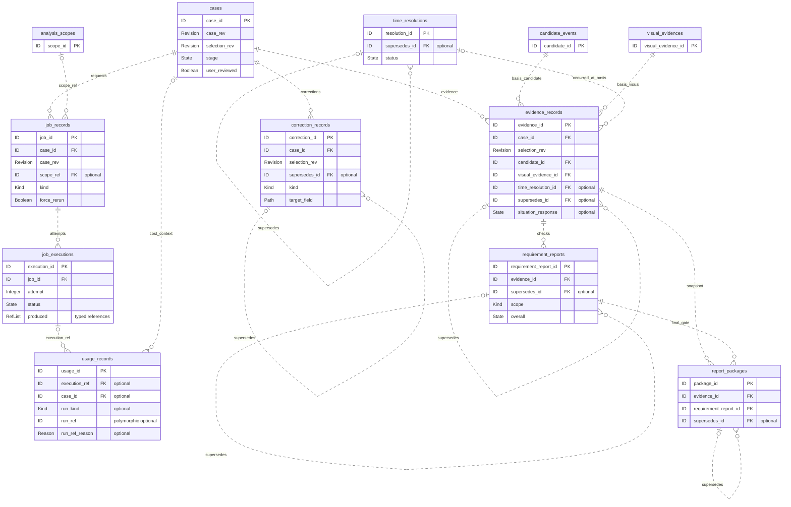
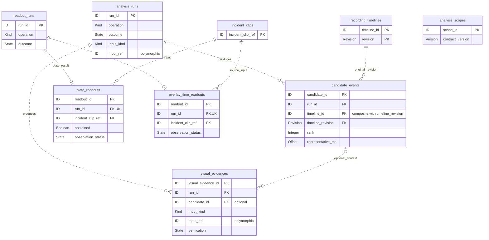
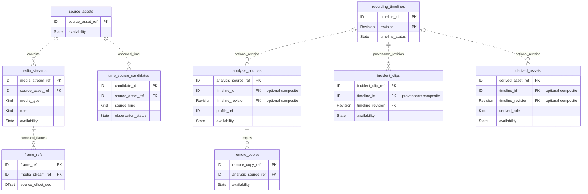

# 대신고 논리 ERD 및 Canonical Contract 저장 대응표

> 상태: **논리 설계 제안 — Owner 검토 전** · 수정일: 2026-09-12

## 1. 문서의 목표와 범위

이 문서는 **실제 테이블 후보, PK/FK 후보, 관계의 개수 조건, 핵심 상태**를 설명하는 논리 ERD다. MySQL의 컬럼 길이·정밀도·인덱스·물리 FK 적용·삭제 전파·DDL은 여기서 확정하지 않는다.

이전 초안의 포괄적인 `workflow`, `run_data`, `results`, `snapshot` JSON 묶음을 핵심 도표에서 제거했다. **관계를 설명하기 위해 상세 컬럼을 생략한 것과, 실제 JSON embed 저장을 제안한 것을 구분**한다. JSON 저장 제안은 §5 대응표에 구체적인 부모·필드와 함께 적었다.

테이블 수를 12개에 고정하지 않고 독립 참조·생명주기가 있는 기록을 분리하여 **25개 테이블 후보**를 제시한다. 이는 25개 모두 구현이 확정됐다는 뜻이 아니다. 업무 중심 관계도와 두 상세 관계도로 나누며, 반복된 테이블은 같은 테이블의 참조용 표시다.

| 표기 | 의미 |
| --- | --- |
| PK / FK / UK | 기본 키 / 참조 키 / 유일 키의 **논리 설계 후보**. 실제 DB 제약 생성은 별도 검토 |
| ID, Revision, State, Kind 등 | 의미를 나타내는 논리 타입. MySQL 타입 선언 아님 |
| optional | 관계가 없을 수 있음. 복합 참조는 구성 필드를 함께 채우거나 함께 비움 |
| `||` / `o|` / `o{` | 하나 / 없거나 하나 / 없거나 여러 개 |
| 도표의 점선 | 비식별관계: 부모 참조가 자식 PK에 포함되지 않음. JSON 저장 여부와 무관 |
| 상세 컬럼 생략 | 기존 계약 필드는 여전히 필요함. 생략만으로 JSON 저장을 뜻하지 않음 |

**검토 상태:** 계약의 의미·identity가 확정되어 있어도 persistence 방식이 확정된 것은 아니다. 아래 모든 독립 테이블·JSON embed 선택은 Owner 검토 전 제안이다. 확인할 근거가 부족한 항목은 `미정`으로 표시했다.

## 2. 업무 중심 논리 ERD — 사건·작업·증거·신고자료

- `case_rev`는 요청 시점 사건 버전, `selection_rev`는 후보 선택 문맥이다. 이 둘을 같은 카운터로 합치지 않는다. Case/Selection 이력 테이블은 내부 설계가 미정이므로 임의 FK를 그리지 않았다.
- 수정·시각 확정·증거·검사·신고자료의 `supersedes_id`는 같은 종류의 이전 레코드를 가리킨다. 순환·다른 사건으로의 잘못된 연결을 막아야 한다. 후속 분기 허용 여부는 확정하지 않아 UNIQUE를 붙이지 않았다.
- CorrectionRecord는 유효 수정 후 downstream 작업보다 먼저 append한다. 현재 유효한 수정은 같은 수정 문맥의 chain head로 판단한다. 타임스탬프 최댓값으로 대체하지 않는다.
- EvidenceRecord의 `time_resolution_id`는 원문 `occurred_at.time_resolution_ref`에서 추출한 선택적 참조다. TimeResolution은 미채택/UNKNOWN 결과도 독립 보존할 수 있도록 별도 테이블을 제안한다.
- ReportPackage는 연결한 RequirementReport가 `scope=FINAL_PACKAGE`, `overall ∈ {PASS,WARN}`이고 필수 자산·조립이 준비됐을 때만 생성한다. 두 객체가 같은 evidence를 가리키는지도 검사한다. Package 자체에 BUILDING 상태를 만들지 않는다.

## 3. 분석·판독 논리 ERD

- `CandidateEvent`, `VisualEvidence`, `PlateReadout`, `OverlayTimeReadout`를 실행 JSON에서 독립 테이블 후보로 분리했다. 다른 모듈이 ID로 재참조하고, 결과가 없는 실패에도 실행 기록은 남아야 하기 때문이다.
- 후보의 `(timeline_id, timeline_revision)`은 `recording_timelines(timeline_id, revision)`을 참조하는 **복합 FK 후보**다. rebase 후에도 기존 후보 좌표를 변경하지 않는다.
- 후보 span은 coarse 후보 창이다. 정밀 사건 구간과 혼동하지 않으며, `representative_ms`와 원문 start/end 좌표도 보존한다(도표에서는 상세 컬럼 생략).
- `VisualEvidence.candidate_id`는 optional이다. candidate-independent Fine을 막는 필수 FK를 만들지 않는다. run당 VisualEvidence 결과의 상한은 Owner 확인 전 제한하지 않는다.
- ReadoutRun당 결과는 **두 결과 테이블 합산 0~1건**이다. operation별 상호배타성은 두 UNIQUE(run_id)만으로 보장되지 않으므로 별도 검증한다. `FAILED`이면 결과 없음, `abstained=true`는 판독 실행 실패와 다르다.
- 결과 계약에 있는 `case_id`·`candidate_id` 문맥은 삭제하지 않는다. 독립 eval에서의 필수성·nullability가 명확하지 않아 두 readout 결과 테이블의 해당 FK는 미정으로 두고 도표에서 생략했다.

## 4. 영상 자산·시간축 논리 ERD

- `media_assets` 하나로 묶었던 자산을 SourceAsset / AnalysisSource / IncidentClip / DerivedAsset으로 분리 제안한다. 각 identity와 생성 목적이 다르다는 점을 관계도에서 드러내기 위함이다.
- `recording_timelines`의 기본 키는 `(timeline_id, revision)`이다. 분석·파생 자산의 시간축 참조는 없을 수 있으나, clip의 provenance 기준 revision은 반드시 보존한다.
- `SourceAsset → MediaStream`의 0개 표현은 probe 실패 등 미확인 상태를 차단하지 않는 넓은 후보 관계다. 정상 자산에서 빈 배열을 허용하는 조건은 recording 계약 Pending이므로 여기서 확정하지 않는다.
- frame은 원본 MediaStream과 source-local offset을 통해 재참조한다. opaque frame_ref를 유지하며 위치 문자열을 새 ID로 만들지 않는다.
- `RemoteCopy`는 만료 후 같은 source/provider의 새 사본이 생길 수 있다. `(analysis_source_ref, provider)` 전체 이력에 UNIQUE를 걸지 않는다.
- 자산의 직접 부모·원본 배치·클립 구성 구간은 배열 참조라 도표의 단일 FK로 축약하지 않았다. 저장 대응과 참조 검증은 아래 표를 따른다.

## 5. Canonical Contract → persistence 대응표

**분류:** `독립 테이블` / `JSON embed` / `projection·파생` / `미정`. 모든 저장 선택은 **제안**이며 각 행의 Owner 확인이 필요하다. 계약 문서가 Final이라는 사실을 저장 방식 승인으로 해석하지 않는다.

### 5.1 독립 identity가 있는 Contract

| Canonical Contract | 분류 | 테이블 후보 · 주요 연결 | 선택 이유 / Owner |
| --- | --- | --- | --- |
| SourceAsset | 독립 테이블 | `source_assets` · source_asset_ref | 원본 파일 identity / 정철원 |
| MediaStream | 독립 테이블 | `media_streams` · source_asset_ref FK | 파일 하나의 복수 stream / 정철원 |
| FrameRef | 독립 테이블 | `frame_refs` · media_stream_ref FK | 재조회 가능한 동일 프레임 / 정철원 |
| RecordingTimeline | 독립 테이블 | `recording_timelines` · (timeline_id, revision) PK | 과거 좌표 재현 / 정철원 |
| TimeSourceCandidate | 독립 테이블 | `time_source_candidates` · applies_to.source_asset_ref → FK | 시각 후보와 Source 위치 연결 / 정철원 |
| AnalysisSource | 독립 테이블 | `analysis_sources` · timeline id/revision 선택적 FK | 실제 분석 가능한 입력의 identity / 정철원 |
| RemoteCopy | 독립 테이블 | `remote_copies` · analysis_source_ref FK | provider 사본 재사용·만료 / 정철원 |
| IncidentClip | 독립 테이블 | `incident_clips` · provenance timeline id/revision FK | 원본 유래 사건 클립, 재처리 이력 / 정철원 |
| DerivedAsset | 독립 테이블 | `derived_assets` · timeline id/revision 선택적 FK | 신고 영상 등 파생 자산 / 정철원 |
| AnalysisScope | 독립 테이블 | `analysis_scopes` · job_records.scope_ref로 연결 | 별도 ID로 참조되는 입력. 생산자 case, eval 독립 사용 가능 / 유소연 |
| AnalysisRun | 독립 테이블 | `analysis_runs` · input_kind/input_ref | 탐색·검증 logical run / 서어진 |
| CandidateEvent | 독립 테이블 | `candidate_events` · run_id 및 timeline 복합 FK | 후보 선택·근거 참조의 대상 / 서어진 |
| VisualEvidence | 독립 테이블 | `visual_evidences` · run_id FK, candidate_id 선택적 FK | 관찰 근거 identity / 서어진 |
| ReadoutRun | 독립 테이블 | `readout_runs` · 결과 테이블이 run_id로 역참조 | 결과 없는 실패도 기록 / 신유민 |
| PlateReadout | 독립 테이블 | `plate_readouts` · run_id FK/UK, incident_clip_ref FK | 번호판 관찰 결과 identity / 신유민 |
| OverlayTimeReadout | 독립 테이블 | `overlay_time_readouts` · run_id FK/UK, incident_clip_ref FK | 화면 시각 관찰 결과 identity / 신유민 |
| TimeResolution | 독립 테이블 | `time_resolutions` · resolution_ref.ref → PK, supersedes FK | 미채택·UNKNOWN 포함 독립 확정 시도 / 김준영 |
| EvidenceRecord | 독립 테이블 | `evidence_records` · case/candidate/visual/time 참조 | 확정 정보의 immutable snapshot / 김준영 |
| RequirementReport | 독립 테이블 | `requirement_reports` · evidence FK, scope 구분 | 반복 검사·정책 근거 보존 / 김준영 |
| ReportPackage | 독립 테이블 | `report_packages` · evidence/report FK | 실제 handoff snapshot / 김준영 |
| JobRecord | 독립 테이블 | `job_records` · case FK, scope 선택적 FK | append-only 발주 의도 / 유소연 |
| JobExecution | 독립 테이블 | `job_executions` · job FK | 같은 Job의 복수 시도 / 김준영·구현 정철원 |
| UsageRecord | 독립 테이블 | `usage_records` · execution/case 선택적 FK, run 다형 참조 | 실제 호출 단위 비용 / 김준영 |
| CorrectionRecord | 독립 테이블 | `correction_records` · case FK, supersedes FK | typed 값 변경과 계보 / 유소연 |

### 5.2 값 객체·배열·projection·미정 항목

일부 행은 독립 Canonical Contract가 아니라 계약 내부 값 객체/배열이다. 저장 대응에서 빠지지 않도록 함께 적었다. 아래 JSON 컬럼명은 **내부 저장 제안**이며 공개 계약에 새 필드를 추가하지 않는다.

| Contract 또는 내부 구조 | 분류 | 저장 위치 후보 / 처리 | 근거·확인할 사항 / Owner |
| --- | --- | --- | --- |
| Case (아키텍처 내부 aggregate) | 독립 테이블 | `cases` | 현재 stage/user_reviewed/revision·선택 참조. 상세 schema 미정 / 유소연 |
| Selection 및 Case 변경 이력 | 미정 | case 내부 현재 포인터·이력 구조 검토 | 두 revision 증가 규칙·확인 유효 범위부터 결정 / 유소연 |
| AssetSpan | JSON embed | `incident_clips.source_provenance.asset_spans[]` | 독립 identity 금지. sequence와 두 범위·source/stream 참조 보존 / 정철원 |
| SpanResolution | 미정 | recording 호출 결과 snapshot의 저장 부모·내부 키 검토 | clip 생성 전·실패 결과도 있으므로 clip JSON 하나로 대체 불가 / 정철원 |
| TimeSourceCheck | 미정 | recording probe/시간 추출 결과 보존 위치 검토 | 시각 후보가 없는 이유를 후보 행 부재만으로 대체하지 않음 / 정철원 |
| DeletionReport | 미정 | 삭제 감사 저장소, 필요 시 내부 audit 키 | 공개 ID가 없고 Job 경계 밖. 반복 삭제·보관 정책 확인 / 정철원·김준영 |
| AssetFacts | projection·파생 | recording의 lookup에서 자산 사실 조립 | 확인 시각·availability를 포함. 당시 판정 입력 snapshot의 보존 위치는 별도 미정 / 정철원·김준영 |
| CaseView | projection·파생 | case가 상태·결과 참조에서 조립 | 독립 원본 테이블 아님. 필요 시 재생성 가능한 캐시는 후속 검토 / 유소연·신유민 |
| EvidenceNeeds | 미정 | evidence 평가 반환값; 저장 여부·평가 이력 부모 검토 | Need 자체 ID 없음. 발주 의도/중복 발주 방지는 case 책임 / 김준영·유소연 |
| Observation (판독 결과 내부) | JSON embed | `plate_readouts.observation`, `overlay_time_readouts.observation` | value/status/source/support_refs/produced_by 전체 보존 / 신유민 |
| Observation (GPS 등 recording 관찰) | 미정 | recording 관찰 결과의 저장 부모·조회 키 검토 | 판독 테이블로 억지 통합하지 않음 / 정철원 |
| EvidenceValue / Coordinate | JSON embed | `evidence_records.event`, `.vehicle_number`, `.location`의 중첩 필드 | 값·출처·needs_review·user_corrected 분리 보존 / 김준영 |
| TimeResolution 상세 값 | JSON embed | `time_resolutions.resolved`, `.considered`, `.conflict`, `.provenance`, `.post_stamp` | 선택하지 않은 입력과 UNKNOWN도 보존 / 김준영 |
| RequirementCheck[] | JSON embed | `requirement_reports.checks` | report에 종속된 검사 결과 배열 / 김준영 |
| ReportPackage 내부 묶음 | JSON embed | `report_packages.report_inputs`, `.report`, `.assets`, `.provenance`, `.handoff` | snapshot의 의도된 복제 유지, evidence 전체를 embed하지 않음 / 김준영 |
| AnalysisScope 범위·조건 | JSON embed | `analysis_scopes.time_ranges`, `.target_event_types`, `.hint`, `.budget` | scope의 상대 범위는 timeline id/revision 필수, 종류 혼합 금지 / 유소연 |
| Timeline 배치·시각 후보·빈 구간 | JSON embed | `recording_timelines.source_placements`, `.time_source_candidates`, `.gaps`, `.time_basis` | source/stream/time candidate 참조를 resolver로 검증 / 정철원 |
| 자산의 source_refs / media_stream_refs | JSON embed | 해당 `analysis_sources`, `incident_clips`, `derived_assets`의 계약상 배열 | 원문에 존재하는 배열만. direct parent와 평탄화 lineage 구분 / 정철원 |
| SourceAsset.media_stream_refs | projection·파생 | `media_streams.source_asset_ref`에서 재구성 | 역방향 배열을 별도 원본으로 이중 관리하지 않는 제안 / 정철원 |
| VisualEvidence 내부 관찰 | JSON embed | `visual_evidences.target`, `.primitives`, `.temporal_facts`, `.uncertainties` | 관찰 자체의 세부, frame refs 유지 / 서어진 |
| 판독 프레임·합의 상세 | JSON embed | `plate_readouts.frame_results`, `.best_frame`, `.consensus`, `.target_association`; `overlay_time_readouts.samples`, `.validation` | canonical frame_ref 검증; crop_ref는 readout 내부 ref / 신유민 |
| AnalysisRun 구현·요약 | JSON embed | `analysis_runs.implementation`, `.issues`, `.usage_summary` | 완료 시점 usage_summary는 immutable snapshot / 서어진 |
| JobExecution.produced | JSON embed | `job_executions.produced` | 종류가 다른 산출물 참조. 구체 연결은 §6 / 김준영·정철원 |
| AnalysisRun / ReadoutRun.usage_refs | projection·파생 | UsageRecord.run_kind/run_ref로 조회 | 정본은 UsageRecord.run_ref. 별도 양방향 원장 없음 / 김준영 |
| JobExecution.usage_refs | projection·파생 | UsageRecord.execution_ref로 재구성 제안 | 재구성 방식의 수락 여부 확인 / 김준영·정철원 |
| CorrectionRecord 수정 전후 값 | 미정 | `correction_records.previous_value`, `.new_value`의 구체 물리 저장 | target별 타입 검증은 확정. 공용 JSON 사용 여부는 미정 / 유소연 |
| ContractRef (공통 값 구조) | 미정 | 단일 대상은 §6의 FK 후보로, 다형 참조는 kind/ref로 표현. JSON 배열 속 참조는 해당 부모를 따름 | 필드별 변환과 구현 방식을 확인. 공통 ref 테이블은 제안하지 않음 / 각 Owner |
| Money (금액·통화 값 구조) | 미정 | UsageRecord.cost 등 부모의 상세 값 | 금액·통화는 보존하되 컬럼 분리/JSON과 물리 정밀도는 후속 결정 / 김준영 |
| 정책·가격표·profile·template 등 versioned artifact refs | 미정 | 소유 모듈의 versioned config/artifact와 연결 | 단순 ID 참조를 근거로 신규 DB 테이블을 만들지 않음 / 각 Owner |

## 6. FK로 표현한 참조와 다형 참조의 차이

### 단일 종류와 복합 참조

- `record_ref.ref → evidence_id`, `resolution_ref.ref → resolution_id`, `requirement_report_ref.ref → requirement_report_id`, `package_ref.ref → package_id`는 **내부 컬럼명 제안**이다. 공개 응답의 `{kind, ref}`는 유지한다.
- `run_ref.ref → run_id`, `basis.candidate_ref.ref → candidate_id`, `basis.visual_evidence_ref.ref → visual_evidence_id`도 kind를 검증한 뒤 단일 대상 FK 후보로 표현했다.
- 모든 timeline FK는 `(timeline_id, timeline_revision) → recording_timelines(timeline_id, revision)` 쌍이다. revision 없이 최신 row만 참조하지 않는다.
- `observation_status`, `situation_response`는 중첩 값의 핵심 상태를 보이기 위한 **논리적 추출 표기**다. 원문 observation/situation_response 객체의 나머지 정보는 생략하지 않는다. 실제 중복 컬럼 생성 여부는 미정이다.

### 다형 참조 — 단일 테이블 FK로 위장하지 않음

| 위치 | 허용 대상·관계 | 검증 방식 제안 |
| --- | --- | --- |
| AnalysisRun.input_kind/input_ref | CANDIDATE_SEARCH → AnalysisScope. 현재 Fine 제품/Mock 경로 → AnalysisSource | operation별 kind/ref 검사. 공개 계약 모양 유지, 복수 nullable FK로 펼칠지는 미정 |
| VisualEvidence.input_kind/input_ref | 현재 합의된 Fine 경로는 AnalysisSource | 실행 입력과 정합 검사. 과거 계약 예시와 현 결정의 차이는 Owner에게 확인 |
| UsageRecord.run_kind/run_ref | AnalysisRun 또는 ReadoutRun 또는 없음 | kind/ref 동시 null 규칙, 대상 존재 검사. 독립 eval의 case/execution 참조는 강제하지 않음 |
| JobExecution.produced[] | run, 파생 자산 등 산출물 ContractRef | 종류별 참조 검증. readout public 함수가 실제 호출되어 run을 생성한 실행의 연결 보존 |
| EvidenceRecord.basis.evidence_interval_ref | clip 준비 전 CandidateEvent, 준비 후 IncidentClip | 생성 단계별 대상 종류 검사; 무조건 clip FK로 만들지 않음 |
| TimeResolution 입력 / Evidence provenance | 시간 후보·판독·보정·관찰 근거 등 | 계약상 kind별 resolver. 문자열 접두어로 관계 추론 금지 |
| 자산 source_refs / external_source_ref | 직접 부모 자산 또는 외부 원본 ref | 원본 lineage 보존. 외부 원본은 내부 FK 대상이 없을 수 있음 |

다형 참조의 부모 배열을 JSON으로 저장하더라도 참조 무결성을 포기하는 것이 아니다. §5에서 JSON으로 제안한 배열은 생산 모듈의 write/조회 경계에서 kind·존재·revision을 검사한다. 모듈 간 직접 DB 조회를 허용하는 설계도 아니다.

## 7. 핵심 상태와 lifecycle

| 대상 | 상태·보존 규칙 |
| --- | --- |
| Case | INTAKE / SEARCHING / CANDIDATE_REVIEW / EVIDENCE_REVIEW / READY. user_reviewed는 별도 축 |
| JobRecord / JobExecution | 의도는 append-only, 인프라 재시도는 같은 job의 새 execution/attempt. 실행 상태는 QUEUED / RUNNING / SUCCEEDED / FAILED / STALE / CANCELLED |
| CANCELLED | 기존 부분 산출물을 남길 수 있지만 case는 PARTIAL로만 반영. 재개 Job identity는 case 결정 필요 |
| AnalysisRun / ReadoutRun | SUCCEEDED / PARTIAL / FAILED. 실행 상태와 domain outcome을 합치지 않음 |
| VisualEvidence | OBSERVED / NOT_OBSERVED / UNCERTAIN. legal_status는 항상 null |
| TimeResolution | OK / NEEDS_REVIEW / UNKNOWN. 채택된 결과만 저장하지 않음 |
| RequirementReport | PASS / WARN / BLOCK / UNKNOWN. EVIDENCE와 FINAL_PACKAGE 검사 이력 분리 |
| EvidenceRecord | 별도 readiness를 발명하지 않음. situation_response는 CONFIRMED / CORRECTED / USER_UNSURE; USER_UNSURE 단순 응답으로 CorrectionRecord 미생성 |
| UsageRecord | invocation 시작 시 기록. run_ref가 없으면 DIRECT_NO_RUN / RUN_NOT_PRODUCED 구분. 사건 비용은 case_id 기준이며 실패 비용도 포함 |

계약 버전·시각·출처·금액·입력 지문·상세 조건 등은 도표에서 생략했을 뿐 필수성을 변경하지 않는다. 핵심 상태를 제외한 enum·정밀도·컬럼 길이는 해당 Canonical Contract와 후속 구현 설계가 정한다.

## 8. Owner 검토 요청

| Owner | 이번 문서에서 확인할 것 |
| --- | --- |
| 유소연(case) | Case/Selection 이력과 자산 소속 관계의 persistence, AnalysisScope 저장 소유, 보정 chain 문맥·분기·타입 저장 |
| 정철원(recording) | 자산별 독립 테이블, timeline 복합 FK, 배열 embed, SpanResolution/TimeSourceCheck/GPS/삭제 감사 저장 위치 |
| 서어진(search) | 후보·VisualEvidence 독립 저장 및 run당 결과 수, Fine 입력 관계 |
| 신유민(readout) | run당 결과 상호배타성, 프레임 상세 embed, 독립 eval에서 case/candidate 문맥의 nullability |
| 김준영(evidence/common) | TimeResolution 독립 보존, EvidenceNeeds·당시 AssetFacts snapshot, 검사·Package 이력, 비용 다형 참조 |

**아직 모든 persistence 제안은 검토 전이다.** 특히 사건-자산 연결, 인증·권한, 삭제 정책, 미정 저장 부모를 해소하기 전에는 실행 가능한 완성 스키마로 간주하지 않는다. Owner 요청은 사용자 전달용이며 이 작업에서 별도로 발송하지 않았다.

## 9. 근거

- [모듈 구조](module-architecture.md), [Owner 배정](../management/ownership.md)
- [SourceAsset·MediaStream·FrameRef·AssetFacts](contracts/contract-source-asset-media-stream.md), [Timeline·AssetSpan·시간 후보](contracts/contract-recording-timeline-asset-span.md), [AnalysisSource·RemoteCopy·IncidentClip·DerivedAsset·삭제](contracts/contract-analysis-source-derived.md)
- [AnalysisScope](contracts/contract-analysis-scope.md), [AnalysisRun·CandidateEvent](contracts/contract-analysis-run-candidate-event.md), [VisualEvidence](contracts/contract-visual-evidence.md), [후보 span 결정](../modules/search/decisions/candidate-span-semantics-2026-09-10.md)
- [ReadoutRun](contracts/contract-readout-run.md), [PlateReadout·OverlayTimeReadout](contracts/contract-plate-overlay-readout.md), [Observation](contracts/contract-observation.md)
- [TimeResolution](contracts/contract-time-resolution.md), [EvidenceRecord·EvidenceNeeds](contracts/contract-evidence-record-needs.md), [RequirementReport·ReportPackage](contracts/contract-requirement-report-package.md)
- [JobRecord·CaseView](contracts/contract-job-record-case-view.md), [JobExecution](contracts/contract-job-execution.md), [UsageRecord](contracts/contract-usage-record.md), [CorrectionRecord](contracts/contract-correction-record.md), [최근 접합 결정 기록](../mock/CONTRACT_CONFLICTS.md)
