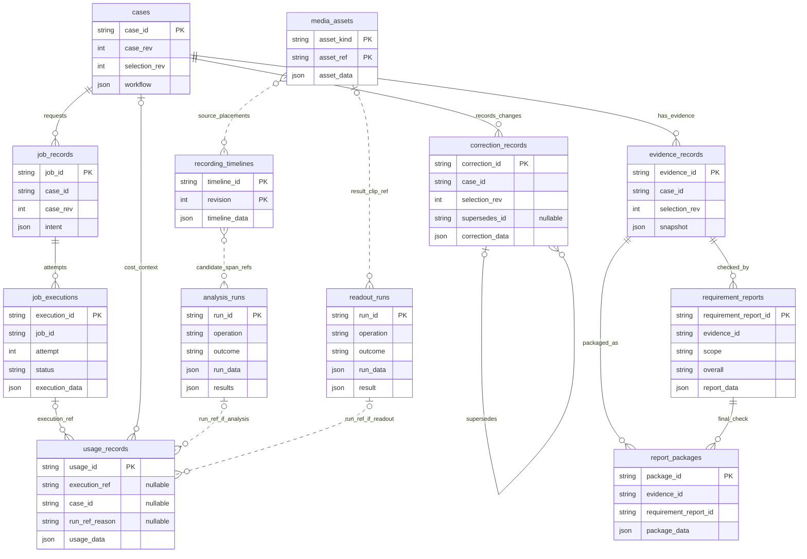

# 대신고 핵심 ERD 초안

**1. `cases` — 신고를 준비하는 사건 한 건**

사용자가 어떤 일을 신고하려고 하는지, 현재 어디까지 진행했는지를 관리합니다.

| 컬럼 | 설명 |
| --- | --- |
| `case_id` | 사건의 고유 번호 |
| `case_rev` | 사건 상태가 어느 버전인지 표시. 오래된 분석 결과가 현재 상태를 덮어쓰는 것을 막는 데 사용 |
| `selection_rev` | 후보 선택 문맥의 버전. 어떤 후보를 선택한 상태에서 수정·확인이 이루어졌는지 구분 |
| `workflow` | 기억 단서, 현재 단계, 선택한 후보, 사용자 확인 여부, 관련 영상·결과 참조 |

`case_rev`와 `selection_rev`가 언제 증가하는지는 case Owner와 구체화해야 합니다.

**2. `media_assets` — 사용하는 영상과 이미지의 목록**

원본 영상부터 분석용 영상, 사건 클립, 신고용 영상까지 구분합니다.

| 컬럼 | 설명 |
| --- | --- |
| `asset_kind` | 원본인지, 분석 입력인지, 사건 클립인지, 신고용 파생 자산인지 구분 |
| `asset_ref` | 해당 자산을 가리키는 식별자 |
| `asset_data` | 크기·길이·사용 가능 여부·어떤 원본에서 만들어졌는지 등의 상세 정보 |

여기서는 **영상 파일 자체보다 영상에 대한 정보와 참조를 저장하는 구조**를 제안한 것입니다. 실제 파일 저장 위치는 recording 내부 설계에서 정합니다.

**3. `recording_timelines` — 여러 영상을 하나의 시간 흐름으로 해석한 기록**

블랙박스 파일이 여러 개일 때, 각 파일이 전체 시간축의 어디에 놓이는지 관리합니다.

| 컬럼 | 설명 |
| --- | --- |
| `timeline_id` | 시간축의 고유 번호 |
| `revision` | 시간축 해석의 버전 |
| `timeline_data` | 파일별 배치, 기준 시각, 시각의 출처, 영상이 비어 있는 구간 |

촬영 기준 시각이 수정되더라도 **이전 분석이 어떤 시간축을 사용했는지 남기기 위해 버전을 보존**합니다.

**4. `job_records` — 작업 요청서**

“이 범위에서 사건을 찾아라”, “번호판을 다시 읽어라”처럼 **무엇을 시켰는지** 기록합니다.

| 컬럼 | 설명 |
| --- | --- |
| `job_id` | 작업 요청의 고유 번호 |
| `case_id` | 어느 사건에서 요청한 작업인지 |
| `case_rev` | 사건의 어느 버전에서 요청했는지 |
| `intent` | 작업 종류, 탐색 범위 참조, 입력 구분값, 강제 재실행 여부, 요청 시각 |

입력 구분값인 `fingerprint`는 이전에 같은 입력으로 성공한 결과를 재사용할 수 있는지 판단하는 데 사용합니다.

**5. `job_executions` — 작업 실행 일지**

요청받은 작업을 **실제로 몇 번 시도했고 어떻게 끝났는지** 기록합니다.

| 컬럼 | 설명 |
| --- | --- |
| `execution_id` | 실행 시도 한 번의 고유 번호 |
| `job_id` | 어떤 작업 요청을 실행한 것인지 |
| `attempt` | 같은 작업의 몇 번째 실행 시도인지 |
| `status` | 대기·실행 중·성공·실패·작업자 응답 두절·사용자 중단 상태 |
| `execution_data` | 실행 시각, 실패 원인, 만들어진 결과의 참조 |

설명용 예로, 서버 문제로 같은 작업을 다시 시도하면 **작업 요청은 하나이고 실행 기록은 여러 개**가 됩니다. 사용자가 조건을 바꿔 새로 요청하는 것은 새 작업입니다.

**6. `analysis_runs` — 사건 탐색과 장면 검증 기록**

영상에서 사건 후보를 찾고, 후보 장면에서 무엇이 보이는지 분석한 기록입니다.

| 컬럼 | 설명 |
| --- | --- |
| `run_id` | 분석 한 번의 고유 번호 |
| `operation` | 사건 후보 탐색인지, 시각적 근거 검증인지 |
| `outcome` | 분석의 성공·부분 성공·실패 |
| `run_data` | 분석 입력, 사용한 구현·모델 버전, 실행 정보, 사용량 요약 등 |
| `results` | 후보 목록 또는 장면에서 관찰한 근거 |

**후보 구간은 사건이 있을 법한 넓은 탐색 창**입니다. 최종 사건의 정확한 시작·종료 구간과 같다고 설명하면 안 됩니다.

**7. `readout_runs` — 번호판과 화면 시각을 읽은 기록**

분석이 “무슨 장면인가”를 다룬다면, 판독은 “화면에 어떤 값이 적혀 있는가”를 다룹니다.

| 컬럼 | 설명 |
| --- | --- |
| `run_id` | 판독 한 번의 고유 번호 |
| `operation` | 번호판 판독인지, 화면 시각 판독인지 |
| `outcome` | 판독 실행의 성공·부분 성공·실패 |
| `run_data` | 실행 시각, 실패 원인 등 실행 상세 |
| `result` | 읽은 값, 사용한 클립·프레임, 불확실성 등. 완전 실패하면 결과가 없을 수 있음 |

**“읽을 수 없다고 판단했다”와 “시스템 실행이 실패했다”는 다릅니다.** 이 차이를 기록에 남깁니다.

**8. `correction_records` — 사용자가 고친 내역**

사용자가 실제로 바꾼 값을 기록합니다.

| 컬럼 | 설명 |
| --- | --- |
| `correction_id` | 수정 기록의 고유 번호 |
| `case_id` | 어느 사건을 수정했는지 |
| `selection_rev` | 어떤 후보 선택 문맥에서 수정했는지 |
| `supersedes_id` | 이번 수정이 대체하는 이전 수정 기록. 최초 수정이면 없음 |
| `correction_data` | 수정 종류, 대상 필드, 수정 전후 값, 수정 시각 |

사용자가 같은 값을 다시 고치면 이전 기록을 지우지 않고 연결합니다. **현재 유효한 수정은 시간만 비교하는 것이 아니라 수정 연결의 마지막 기록으로 판단**합니다.

단순히 “잘 모르겠어요”라고 응답한 것은 값 수정이 아니므로 별도로 구분합니다.

**9. `evidence_records` — 신고에 사용할 증거 정보**

AI가 관찰한 값에서 출처·정책·사용자 수정 등을 반영해 정리한 증거 기록입니다.

| 컬럼 | 설명 |
| --- | --- |
| `evidence_id` | 증거 묶음의 고유 번호 |
| `case_id` | 어느 사건의 증거인지 |
| `selection_rev` | 어떤 후보 선택 문맥을 기준으로 만들었는지 |
| `snapshot` | 번호판·시각·위치, 각 값의 출처, 확인 필요 여부, 사용자 상황 응답, 이전 증거 참조 |

여기서 **“확정 증거”는 법적으로 위반이 확정됐다는 뜻이 아닙니다.** 불확실하거나 사용자 확인이 필요한 상태도 함께 보존합니다.

**10. `requirement_reports` — 신고 준비 점검표**

증거가 다음 단계로 넘어갈 수 있는지, 완성된 신고자료를 사용자에게 제공할 수 있는지 검사합니다.

| 컬럼 | 설명 |
| --- | --- |
| `requirement_report_id` | 검사 기록의 고유 번호 |
| `evidence_id` | 어떤 증거를 검사했는지 |
| `scope` | 증거 단계 검사인지(`EVIDENCE`), 최종 신고자료 검사인지(`FINAL_PACKAGE`) |
| `overall` | 통과(`PASS`), 주의하며 진행 가능(`WARN`), 진행 불가(`BLOCK`), 판단 정보 부족(`UNKNOWN`) |
| `report_data` | 항목별 검사 결과, 사용한 정책, 근거 자산, 검사 시각 등 |

**증거 검사 통과와 최종 신고자료 준비 완료는 별개**라서 검사 단계를 구분합니다.

**11. `report_packages` — 사용자에게 건네줄 완성 신고자료**

신고문과 영상·이미지 등 최종 전달 자료를 묶습니다.

| 컬럼 | 설명 |
| --- | --- |
| `package_id` | 신고자료 묶음의 고유 번호 |
| `evidence_id` | 어떤 증거를 바탕으로 만들었는지 |
| `requirement_report_id` | 어떤 최종 검사를 근거로 준비 완료됐는지 |
| `package_data` | 신고문, 제출용 정보, 영상·이미지 참조, 이전 자료 참조 |

이 기록은 **준비 완료됐을 때 생성**합니다. 생성됐다는 것이 안전신문고에 실제 접수됐다는 뜻은 아닙니다.

**12. `usage_records` — 호출별 사용량과 비용 장부**

실제로 시작된 호출의 사용량과 비용을 남깁니다.

| 컬럼 | 설명 |
| --- | --- |
| `usage_id` | 사용량 기록 한 건의 고유 번호 |
| `execution_ref` | 어떤 실행 시도에서 발생했는지. 연결된 실행이 없으면 비워둘 수 있음 |
| `case_id` | 어느 사건에 속한 비용인지. 독립 평가 등에서는 없을 수 있음 |
| `run_ref_reason` | 분석·판독 run 참조가 없는 이유 |
| `usage_data` | run 참조, 토큰 사용량, 처리 시간, 금액·통화·적용 가격표 등 |

`run_ref_reason`은 다음처럼 구분합니다.

| 값 | 의미 |
| --- | --- |
| `DIRECT_NO_RUN` | 원래 분석·판독 run이 없는 호출 |
| `RUN_NOT_PRODUCED` | 호출은 시작했지만 실패 등으로 run 기록이 만들어지지 못함 |
| `null` | 연결된 run이 있음 |

**실패했더라도 실제 호출이 시작됐다면 비용 기록이 필요할 수 있습니다.** 따라서 사건 전체 비용은 성공한 run만 더하지 않고 `case_id` 기준으로 집계합니다.

| 테이블 | 왜 필요한가? | 없거나 다른 정보와 섞이면 생기는 문제 | owner |
| --- | --- | --- | --- |
| **`cases`** 사건 관리 | 여러 영상·작업·결과를 **사용자가 신고하려는 사건 하나로 묶고 현재 진행 상태를 관리**하기 위해 필요합니다. | 어떤 결과가 어느 사건에 속하는지, 사용자가 어디까지 확인했는지 관리하기 어렵습니다. | 유소연 |
| **`media_assets`** 영상 자산 | **원본·분석용 영상·사건 클립·신고용 영상의 구분과 출처**를 보존하기 위해 필요합니다. | 어떤 원본에서 만든 자료인지 추적하기 어렵고, 원본과 삭제 가능한 파생물을 혼동할 수 있습니다. | 정철원 |
| **`recording_timelines`** 시간축 | 여러 파일을 연결하고 **분석 당시 사용한 시간 기준을 재현**하기 위해 필요합니다. | 기준 시각이 수정되면 이전 후보가 실제로 어느 장면을 가리켰는지 달라질 수 있습니다. | 정철원 |
| **`job_records`** 작업 요청 | **무엇을 어떤 조건으로 요청했는지** 남기고, 기존 결과 재사용과 새 작업을 구분하기 위해 필요합니다. | 조건 변경에 따른 재분석과 단순 재시도를 구분하기 어렵고, 같은 작업을 불필요하게 반복할 수 있습니다. | 유소연 |
| **`job_executions`** 실행 시도 | 같은 요청에 대한 **실행 상태·재시도·실패·중단을 각각 기록**하기 위해 필요합니다. | 재시도할 때 이전 실패가 덮어써지거나, 요청은 있었지만 실행되지 않은 상황을 파악하기 어렵습니다. | 김준영 / 구현 정철원 |
| **`analysis_runs`** 탐색·검증 | **어떤 입력과 구현으로 분석해 어떤 후보·관찰 근거를 얻었는지** 보존하기 위해 필요합니다. | 분석 결과의 생성 과정을 재현하거나 성능을 비교하기 어렵고, 후보가 없는 정상 결과와 분석 실패를 혼동할 수 있습니다. | 서어진 |
| **`readout_runs`** 번호판·시각 판독 | **번호판이나 화면 시각만 다시 읽고, 판독 실패와 판독 불가를 구분**하기 위해 필요합니다. | 번호판 하나를 다시 읽기 위해 사건 탐색까지 반복하거나, 결과가 없는 판독 시도의 실패 원인이 사라질 수 있습니다. | 신유민 |
| **`correction_records`** 사용자 수정 | **사용자가 실제로 무엇을 고쳤는지와 현재 유효한 수정의 계보**를 보존하기 위해 필요합니다. | AI가 제시한 값과 사용자가 고친 값을 구분하기 어렵습니다. 후속 처리 실패 시 사용자 수정까지 잃을 수 있습니다. | 유소연 |
| **`evidence_records`** 증거 정리 | **AI 관찰에 출처·정책·사용자 수정 등을 반영한 증거 상태**를 별도로 남기기 위해 필요합니다. | AI가 추정한 값을 바로 신고 정보로 사용하거나, 수정 전후 어떤 근거로 자료를 만들었는지 설명하기 어렵습니다. | 김준영 |
| **`requirement_reports`** 요건 검사 | **어떤 증거·자료를 어떤 정책으로 검사했고 왜 통과·보류했는지** 기록하기 위해 필요합니다. | ‘준비 완료’ 표시만 남고 그 이유를 확인할 수 없습니다. 증거 단계 검사와 최종 자료 검사를 혼동할 수 있습니다. | 김준영 |
| **`report_packages`** 완성 신고자료 | **사용자에게 제공할 신고문·영상·입력값을 한 시점의 묶음으로 고정**하기 위해 필요합니다. | 이후 증거 수정으로 신고문과 영상이 서로 다른 버전을 가리키거나, 제공한 자료를 재현하기 어려워집니다. | 김준영 |
| **`usage_records`** 사용량·비용 | **성공·실패 여부와 별개로 실제 호출에 사용된 자원과 비용**을 집계하기 위해 필요합니다. | 실패·중단된 호출의 비용이 빠져 실제 사건 처리 비용을 과소평가할 수 있습니다. | 김준영 |