# web 와이어프레임 — 화면 스냅샷

현재 설계 상태를 GitHub 안에서 바로 볼 수 있게 이미지로 남긴다.
`DESIGN-stage1-mockups.html`이 시각 디자인 원본이라면, 이 폴더는 **지금 합의 중인 화면 흐름**이다.

| | |
| --- | --- |
| 기준일 | 2026-09-22 |
| 원본 | Figma 「대신고 — 화면 시트 · UX 리뷰 9-14」 |
| 정리 | 김대원 |
| 토큰 | `apps/web/src/styles/tokens.css` 값을 그대로 사용 |

> **두 갈래가 있습니다.** 아래 **1부가 팀 기준**이고, **2부는 멘토 피드백을 더 밀어붙인 검토안**입니다. 2부는 아직 채택된 안이 아닙니다.

---

# 1부 — 팀 기준 흐름

## 전체 흐름

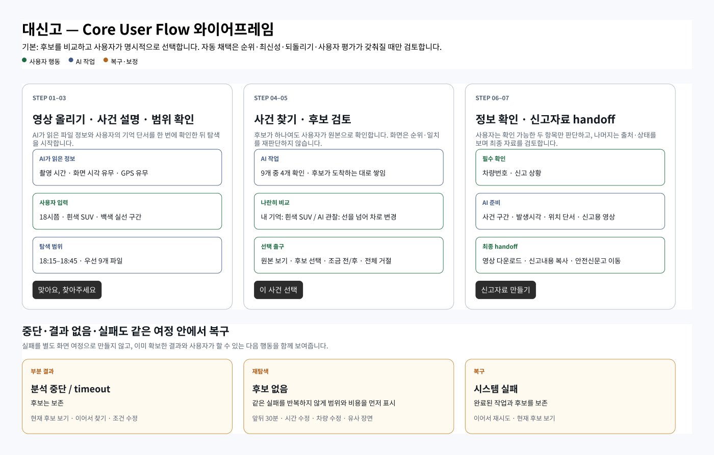

**기본은 후보를 비교하고 사용자가 명시적으로 선택하는 것이다.** 자동 채택은 순위·최신성·되돌리기·사용자 평가가 갖춰질 때만 검토한다.

7단계를 세 묶음으로 끊는다.

| 묶음 | 단계 | 끝내는 행동 |
| --- | --- | --- |
| STEP 01–03 | 영상 올리기 · 사건 설명 · 범위 확인 | 「맞아요, 찾아주세요」 |
| STEP 04–05 | 사건 찾기 · 후보 검토 | 「이 사건 선택」 |
| STEP 06–07 | 정보 확인 · 신고자료 handoff | 「신고자료 만들기」 |

중단 · 결과 없음 · 실패를 **별도 여정으로 만들지 않는다.** 이미 확보한 결과와 다음 행동을 같은 화면에서 함께 보여준다.

## 화면별

### ① 홈
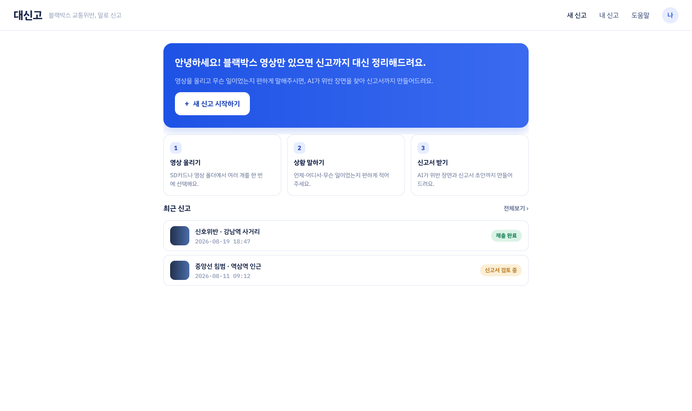

서비스 소개와 시작점. 내 기록(`01_MyRecord`)·도움말·로그인이 여기서 갈린다.

### ② 영상 올리기

블랙박스 영상을 드래그로 받는다. 폴더째 받을 수 있고 촬영 시각은 파일에서 자동으로 읽는다. **같은 화면에 기억 단서를 적는 칸이 있다** — 「예: 6시 반쯤, 흰색 SUV, 실선 침범, 미금역 근처」.

> 멘토 질문 — 「SD카드에서 영상 뽑고 넣은 다음」까지는 동의한다고 하셨다. **이 화면에서 읽어야 하는 글자가 몇 줄인가?**

### ③ 사건 설명
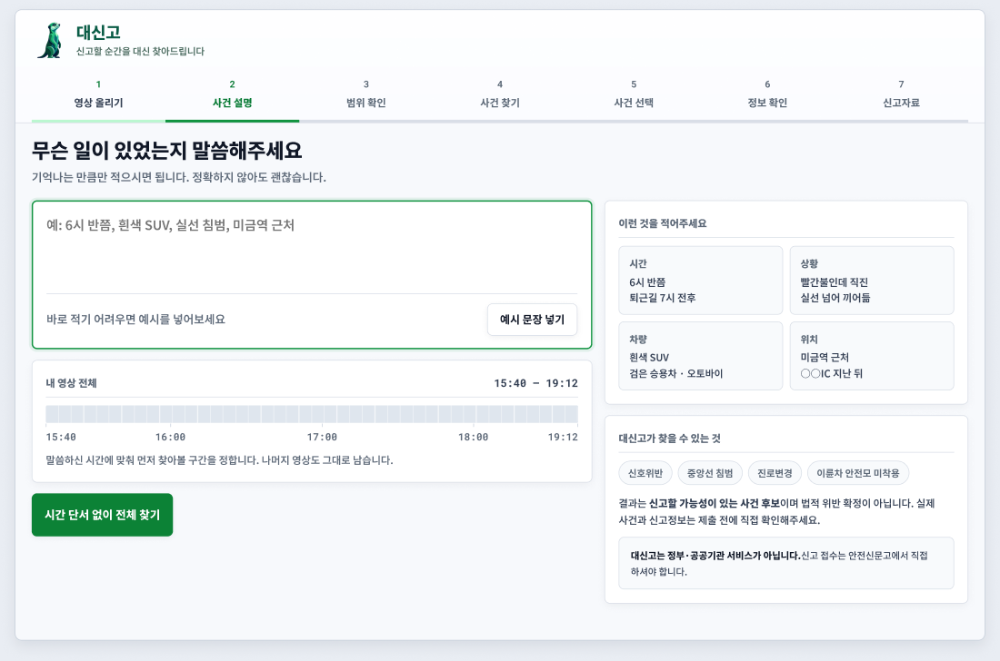

자유 문장 하나를 받는다. 옆에 「이런 것을 적어주세요」 예시(시간·상황·차량·위치)와 「대신고가 찾을 수 있는 것」(신호위반·중앙선 침범·진로변경·이륜차 안전모 미착용)을 둔다. 아무것도 안 적고 「시간 단서 없이 전체 찾기」로 넘어갈 수 있다.

> 멘토 질문 — 「몇시쯤 …한 상황이 있었어」만 넣어주면 된다고 하셨다. **멘토가 생각하는 입력은 이 화면 하나뿐이다.**
> **이 화면 이후 모든 단계를 사용자 확인 없이 진행하면 무엇이 깨지는가?** (= 간편신고의 정의)

### ④ 범위 확인
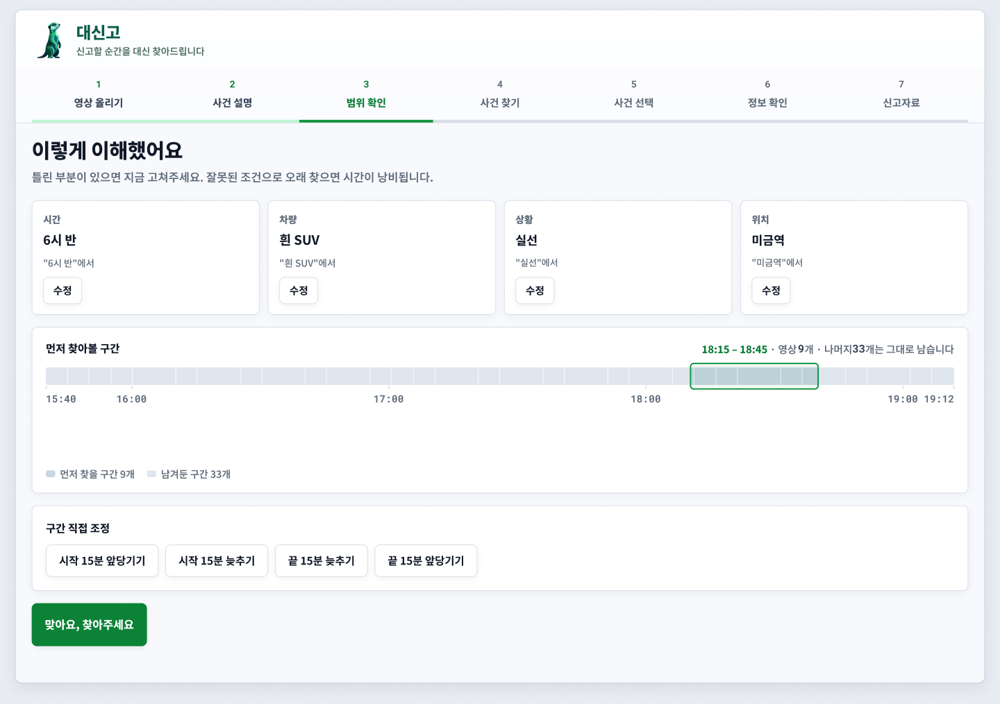

「이렇게 이해했어요」 — AI가 읽은 단서를 카드로 보여주고 틀린 것을 고치게 한다. 먼저 찾아볼 구간을 정하되 나머지 영상도 남긴다.

### ⑤ 사건 찾기
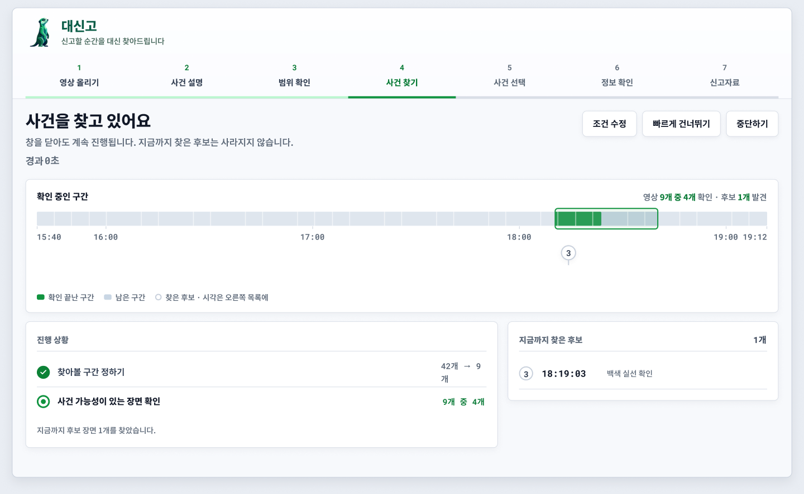

훑은 구간이 채워지고, 찾은 후보가 끝나기 전에 미리 나타난다.

> 멘토 질문 — 「자고 일어나면 알아서 신고가 되어 있으면 좋겠다」고 하셨다. **사용자가 이 화면을 지켜봐야 하는가?**

### ⑥ 후보 검토
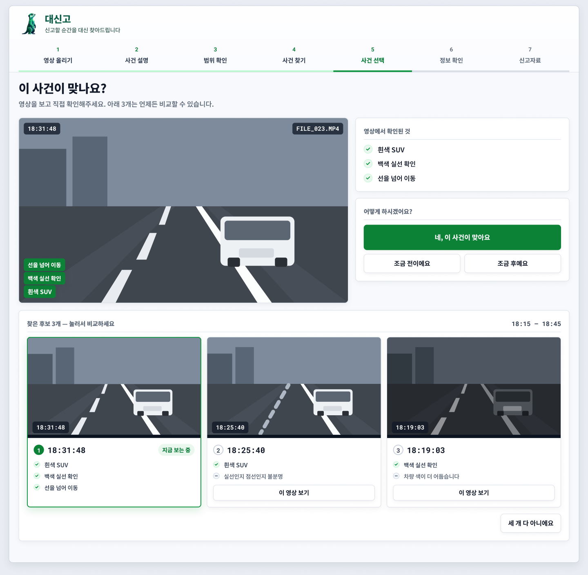

**후보가 하나여도 사용자가 원본으로 확인한다.** 화면은 순위·일치를 재판단하지 않는다. 내 기억과 AI 관찰을 나란히 놓고, 원본 보기 · 후보 선택 · 조금 전/후 · 전체 거절로 빠져나간다.

> 멘토 질문 — **후보가 1개뿐일 때도 이 화면을 거쳐야 하는가?**

### ⑦ 정보 확인
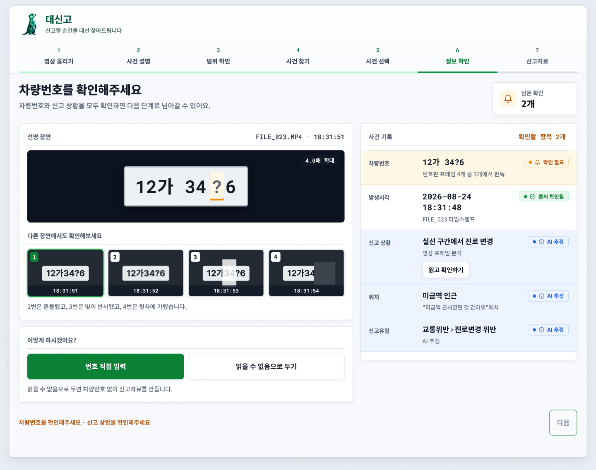

번호판을 확정하지 못한 상태가 이 화면의 기본값이다. 사용자가 직접 읽어 채운다.

> 멘토 질문 — **번호판이 안 읽힐 때만 이 화면이 뜨면 되는데 지금은 항상 뜬다. 맞나?**

### ⑧ 최종 검토
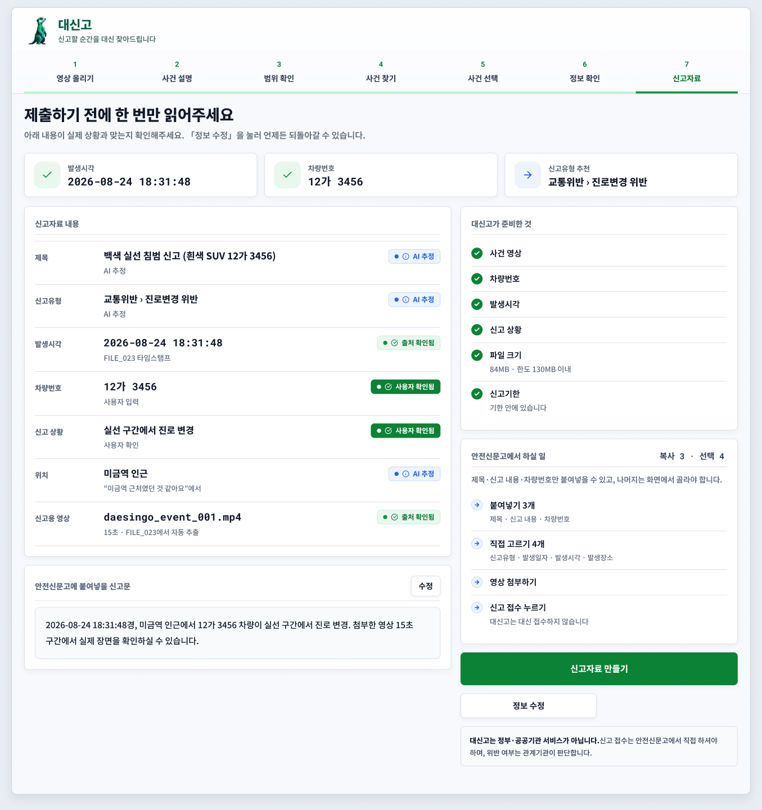

신고문 · 첨부 · 체크리스트를 마지막으로 읽는 화면.

### ⑨ 신고자료 handoff

제목·신고 내용·차량번호는 복사해서 붙여넣고, 나머지는 안전신문고 화면에서 직접 골라야 한다. 발생장소만 검색어를 붙여넣은 뒤 지도에서 핀을 놓는다.

> 멘토 질문 — **「자고 일어나면 신고 완료」와 이 화면의 거리가 정확히 얼마인가?**

### ⑩ 결과 없음
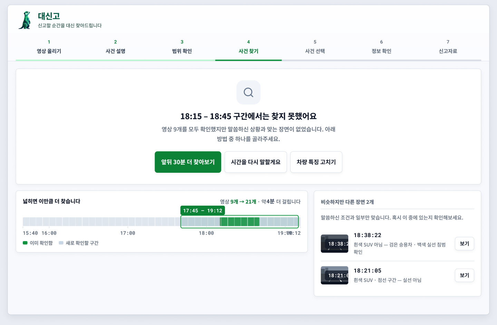

후보 0건. **실패가 아니라 정상 결과**임을 먼저 말하고, 같은 실패를 반복하지 않게 범위와 비용을 먼저 보여준 뒤 조건을 넓히게 한다.

### ⑪ 시스템 실패
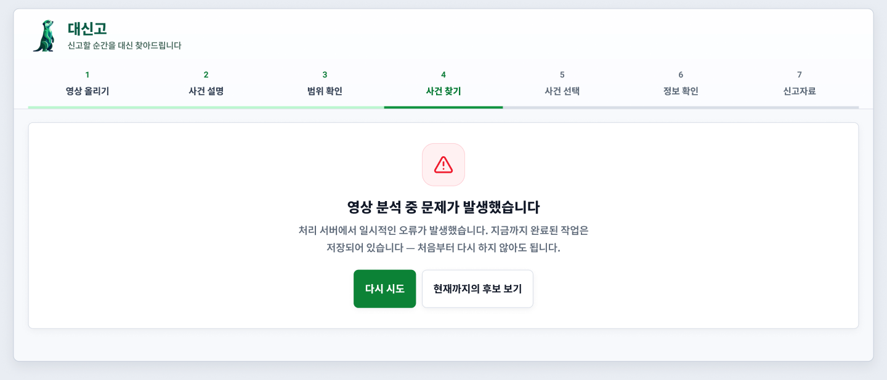

완료된 작업과 후보를 보존한다. 「이어서 재시도」 · 「현재 후보 보기」로 여정 안에서 복구한다.

---

# 2부 — 검토안: 사용자 개입 최소화 (미채택)

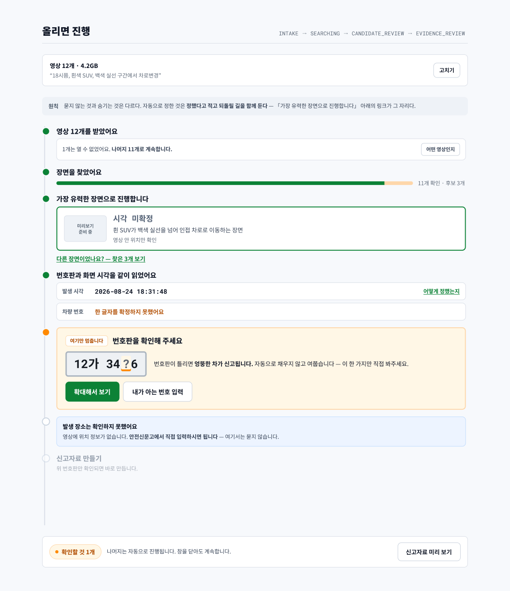

멘토님의 「자고 일어나면 알아서 신고가 되어 있으면 좋겠다」를 **끝까지 밀어붙이면 화면이 어떻게 되는지** 그려본 것이다. 1부와 **경쟁 관계이고 아직 채택되지 않았다.**

받기 · 찾기 · 후보 자동 채택 · 판독을 **하나의 스레드**로 합쳤다. 사용자가 멈추는 지점을 7개에서 1개로 줄인다.

| 1부에서 멈추던 곳 | 검토안 |
| --- | --- |
| 사건 설명 | 선택 사항 — 영상만 올려도 진행 |
| 범위 확인 | 자동 |
| 후보 선택 | **자동 채택** + 「다른 장면이었나요?」 되돌리기 링크 |
| 시각 확인 | 확정값 사용 + 「어떻게 정했는지」로 근거 공개 |
| 장소 입력 | 안전신문고로 넘김 |
| **번호판 확인** | **남긴다** |
| 자료 받기 | 마지막 1회 |

**번호판 하나만 남긴 이유** — 틀리면 엉뚱한 차가 신고된다. 개입 최소화가 여기까지 오면 안 되는 지점이다.

관통하는 원칙은 **「묻지 않는 것과 숨기는 것은 다르다」**. 자동으로 정한 것은 정했다고 적고 되돌릴 길을 함께 둔다.

## 이 안이 채택되려면 필요한 것

`00-flow.png`가 적어 둔 조건(순위·최신성·되돌리기·사용자 평가)이 그대로 걸린다. 그중 **순위는 계약에 없다.**

- `CandidateEvent`에는 `rank`가 필수로 있다
- `CaseView.candidates[]`에는 `rank`도, 배열 순서 규정도 없다

화면이 순위를 계산하면 판정 재계산이라 금지되므로, 「가장 유력한」을 말할 근거가 지금은 없다 → [#122](https://github.com/kakaotechcampus-4/ktc4-chonnam-2/issues/122)

---

# 읽으실 때 참고

**빨강을 후보에 쓰지 않는다.** AI가 찾은 사건 후보에 빨강을 쓰면 대신고가 위반을 *판정하는* 제품이 된다. 기억 단서가 어긋나는 항목도 오렌지까지만 쓴다.

**값마다 상태가 다르다.** 번호판은 OCR이 읽었고 시각은 파일명에서 추정했고 위치는 사용자가 말한 것이다. 한 화면에 확신도가 다른 값이 섞이므로 5종 배지로 구분한다 — 사용자 확인됨 / 출처 확인됨 / AI 추정 / 확인 필요 / 알 수 없음.

**「알 수 없음」을 빈 칸으로 두지 않는다.** 처리 중인지, 못 읽었는지, 원본에 없는지를 구분해 적고 어디서 채우면 되는지까지 쓴다.

**대신고는 신고를 대신 접수하지 않는다.** 정부·공공기관 서비스가 아니고, 결과는 「신고할 가능성이 있는 사건 후보」이지 법적 위반 확정이 아니다.

---

# 아직 못 만드는 것 — 계약 공백

와이어프레임에 그려는 뒀지만 `CaseView` 계약에 값이 없어 구현할 수 없는 것들이다. 계약에 없는 값으로는 버튼을 만들지 않는다.

| 화면 | 없는 것 | 이슈 |
| --- | --- | --- |
| 후보 검토 | 고른 후보를 보내는 경로 | [#106](https://github.com/kakaotechcampus-4/ktc4-chonnam-2/issues/106) |
| 후보 검토 | 후보 순위 · 기억 단서 대조의 판단 근거 | [#122](https://github.com/kakaotechcampus-4/ktc4-chonnam-2/issues/122) |
| 후보 검토 | 썸네일 이미지 | — |
| 정보 확인 | 번호판 프레임을 가리키는 필드 | [#47](https://github.com/kakaotechcampus-4/ktc4-chonnam-2/issues/47) |

---

# 구현 진행

| 화면 | 상태 |
| --- | --- |
| 후보 검토 — 나란히 놓기 | [PR #124](https://github.com/kakaotechcampus-4/ktc4-chonnam-2/pull/124) |
| 후보 검토 — 내 기억 / AI 관찰 대조 표시 | [PR #125](https://github.com/kakaotechcampus-4/ktc4-chonnam-2/pull/125) |
| 그 밖 | 미착수 |

---

# 이미지 갱신

화면이 바뀌면 **같은 파일명으로 덮어쓴다.** 파일명이 README의 순서를 함께 고정하므로 새 이름을 만들지 않는다.

| 파일 | 화면 | Figma |
| --- | --- | --- |
| `00-flow.png` | 전체 흐름 | `00_유민_깃허브기준(0922)_flow` |
| `01-home.png` | 홈 | `01_Home` |
| `02-upload.png` | 영상 올리기 | `02_UploadBasic` |
| `03-describe.png` | 사건 설명 | `03-describe · 화면` |
| `04-scope.png` | 범위 확인 | `04-scope · 화면` |
| `05-searching.png` | 사건 찾기 | `05-searching · 화면` |
| `06-candidates.png` | 후보 검토 | `06-candidates · 화면` |
| `07-prepare.png` | 정보 확인 | `07-prepare-needs-review · 화면` |
| `08-review.png` | 최종 검토 | `08-review · 화면` |
| `09-handoff.png` | 신고자료 handoff | `09-handoff · 화면` |
| `10-no-result.png` | 결과 없음 | `10-no-result · 화면` |
| `11-failed.png` | 시스템 실패 | `14-failed · 화면` |
| `90-alt-flow.png` | 개입 최소화 검토안 | `03_Main_Flow` |

Figma 시트에는 19개 화면과 변형(재탐색·부분 결과·판독 실패 등)이 더 있다. 여기에는 흐름을 이해하는 데 필요한 것만 옮겼다.

---

# 관련 문서

| 무엇 | 어디 |
| --- | --- |
| 시각 디자인 원본 | `docs/design/DESIGN-stage1-mockups.html` |
| 화면 흐름 규정 | `docs/product/core-user-flow.md` §8 · §12 |
| 값 상태 표시 규칙 | `docs/modules/web/ux/value-state-display.md` |
| `CaseView` 계약 | `docs/architecture/contracts/contract-job-record-case-view.md` B절 |
