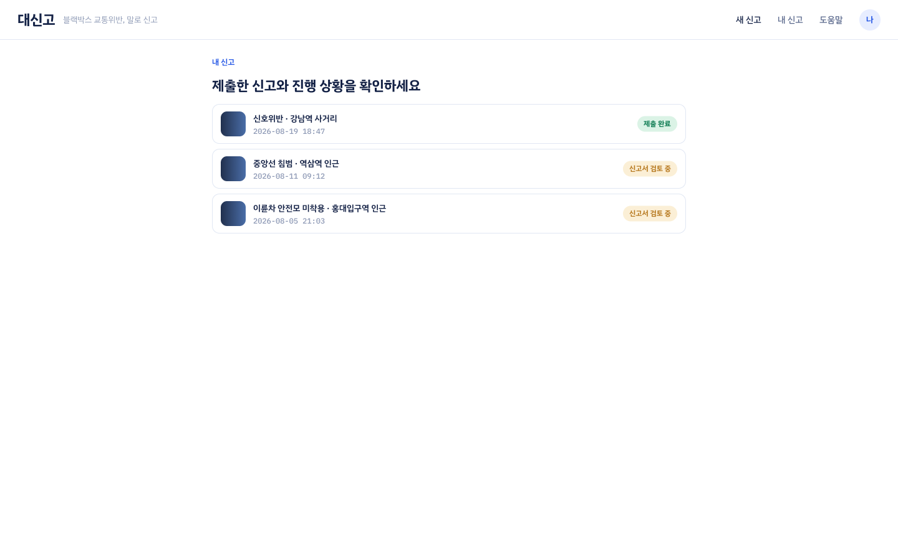
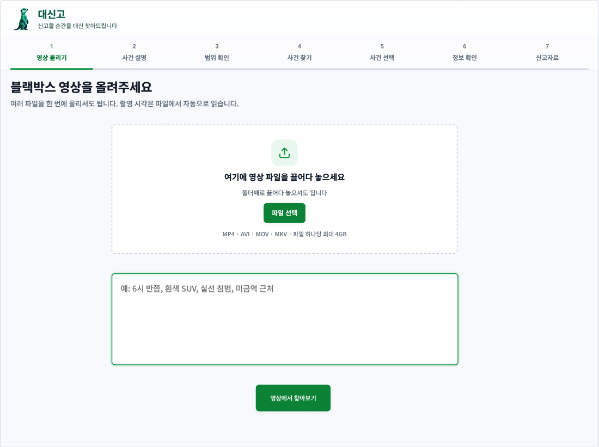
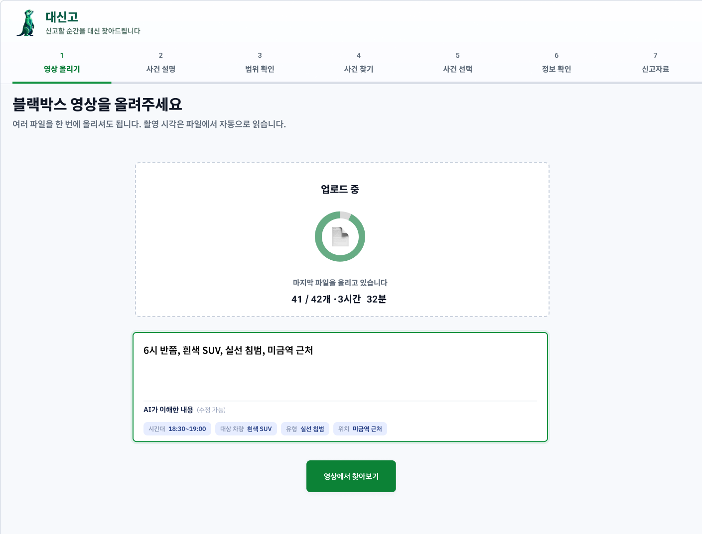
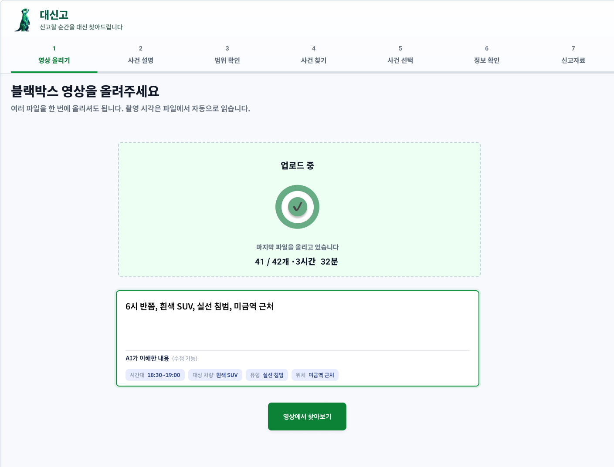
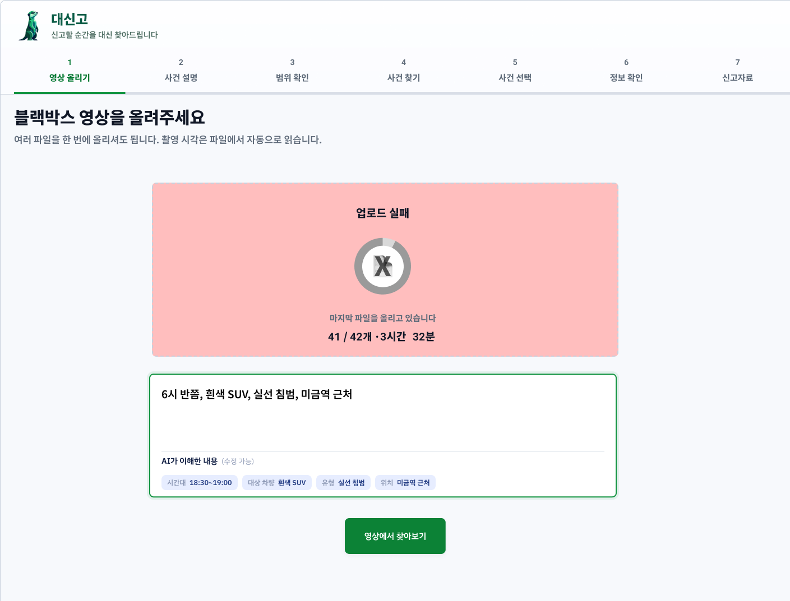
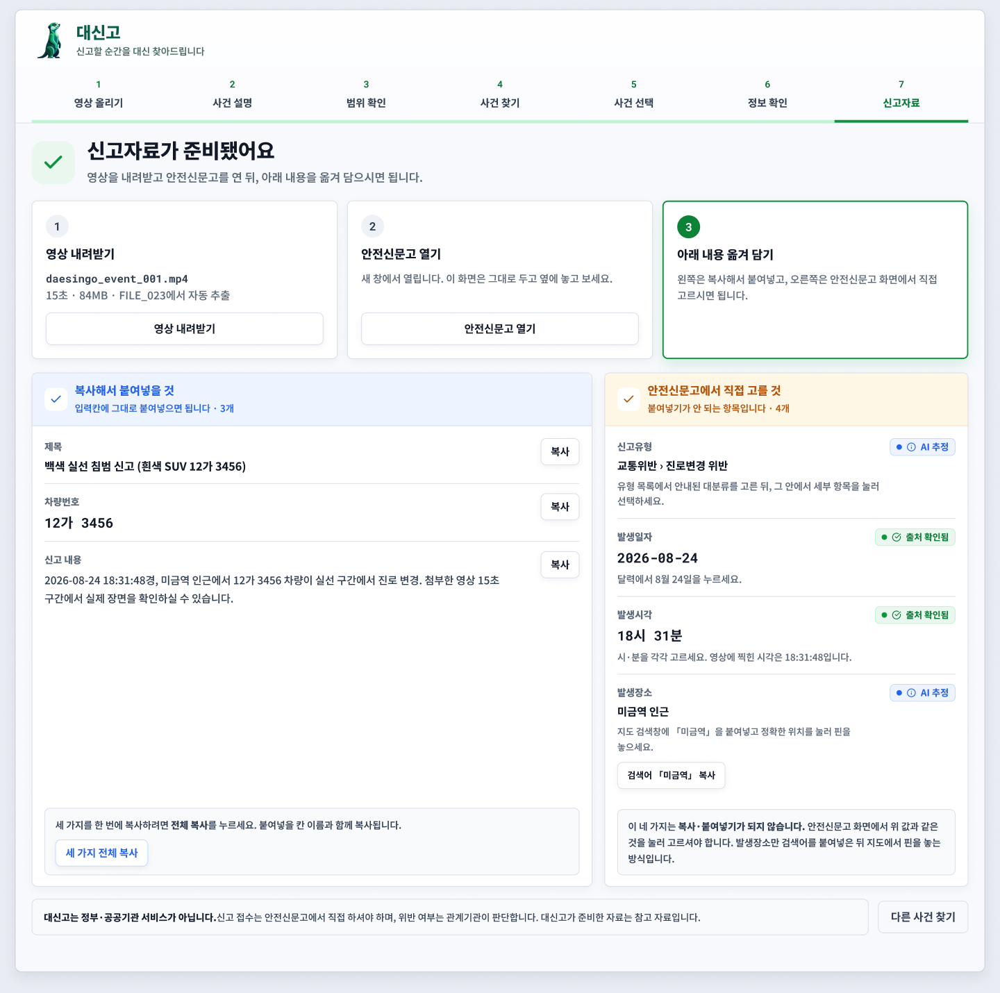

# web 와이어프레임 — 화면 스냅샷

현재 설계 상태를 GitHub 안에서 바로 볼 수 있게 이미지로 남긴다.
`DESIGN-stage1-mockups.html`이 시각 디자인 원본이라면, 이 폴더는 **지금 만들고 있는 화면 흐름**이다.

| | |
| --- | --- |
| 기준일 | 2026-09-22 |
| 원본 | Figma 「대신고 — 화면 시트 · UX 리뷰 9-14」 하단 작업 영역 |
| 정리 | 김대원 |
| 토큰 | `apps/web/src/styles/tokens.css` 값을 그대로 사용 |

> Figma 상단의 4레인 19화면은 **2026-09-12 UX 리뷰용 시트**다. 이 문서는 그 뒤에 다시 그린 **하단 작업 영역**을 옮긴 것이고, 신고자료 화면만 상단 시트에서 가져왔다(하단에 아직 없다).

---

## 전체 흐름

**기본은 후보를 비교하고 사용자가 명시적으로 선택하는 것이다.** 자동 채택은 순위·최신성·되돌리기·사용자 평가가 갖춰질 때만 검토한다.

7단계를 세 묶음으로 끊는다.

| 묶음 | 단계 | 끝내는 행동 |
| --- | --- | --- |
| STEP 01–03 | 영상 올리기 · 사건 설명 · 범위 확인 | 「맞아요, 찾아주세요」 |
| STEP 04–05 | 사건 찾기 · 후보 검토 | 「이 사건 선택」 |
| STEP 06–07 | 정보 확인 · 신고자료 handoff | 「신고자료 만들기」 |

중단 · 결과 없음 · 실패를 **별도 여정으로 만들지 않는다.** 이미 확보한 결과와 사용자가 할 수 있는 다음 행동을 함께 보여준다.

---

## 1. 홈

서비스 소개와 시작점. 상단에서 새 신고 · 내 기록 · 도움말 · 로그인이 갈린다.

## 2. 내 기록

지난 신고 준비를 다시 연다. 한 번에 끝나지 않는 작업이라 돌아올 자리가 필요하다.

## 3. 영상 올리기

블랙박스 영상을 드래그로 받는다. 폴더째 받을 수 있고, 촬영 시각은 파일에서 자동으로 읽는다. MP4 · AVI · MOV · MKV, 파일 하나당 최대 4GB.

**같은 화면 아래에 기억 단서를 적는 칸이 있다** — 「예: 6시 반쯤, 흰색 SUV, 실선 침범, 미금역 근처」. 자유 문장 하나면 되고, 비워 둬도 넘어간다.

> 7단계 머리띠는 남아 있지만 **2단계(사건 설명)와 3단계(범위 확인)가 이 화면 안으로 접혔다.** 올리기와 설명을 한 화면에서 끝낸다.

## 4. 올리는 중

여러 파일을 순서대로 올린다. 남은 개수와 전체 길이를 센다.

## 5. 올리기 완료

`41 / 42개 · 3시간 32분`처럼 **무엇이 몇 개 끝났는지**를 센다. 남은 시간을 숫자로 약속하지 않는다.

적어 넣은 문장에서 뽑아낸 **「AI가 이해한 내용 (수정 가능)」** 이 칩으로 붙는다 — `시간대 18:30~19:00` · `대상 차량 흰색 SUV` · `유형 실선 침범` · `위치 미금역 근처`. 틀리면 여기서 고친다. 이것이 예전 「범위 확인」 단계를 대신한다.

[영상에서 찾아보기]로 넘어간다.

## 6. 올리기 실패

실패한 파일을 따로 세우고 나머지로 계속 간다. **일부 실패를 전체 실패로 만들지 않는다.**

## 7. 진행 · 후보 · 판독

받기 · 찾기 · 후보 · 판독이 한 스레드로 흐르고, 질문이 필요할 때만 카드가 끼어들어 멈춘다.

자동으로 정한 것은 **정했다고 적고 되돌릴 길을 함께 둔다** — 「가장 유력한 장면으로 진행합니다」 아래의 「다른 장면이었나요?」가 그 자리다.

번호판은 자동으로 채우지 않는다. **틀리면 엉뚱한 차가 신고되기 때문이다.** 확정하지 못한 자리를 오렌지로 남기고 사람이 읽는다.

발생 장소를 못 구하면 여기서 묻지 않고 안전신문고로 넘긴다 — 지도를 보며 찍는 편이 정확하다.

> **미결.** 이 화면은 후보를 자동 채택하는 쪽으로 그려져 있고, 위 전체 흐름은 명시적 선택을 기본으로 둔다. 어느 쪽으로 갈지 정해야 한다 → [#122](https://github.com/kakaotechcampus-4/ktc4-chonnam-2/issues/122) · [#123](https://github.com/kakaotechcampus-4/ktc4-chonnam-2/issues/123)

## 8. 신고자료 — 템플릿으로 제출

> 하단 작업 영역에 아직 없어서 **상단 시트에서 가져왔다.** 다시 그릴 때 갱신한다.

마지막 화면이다. **대신고가 만든 것을 안전신문고 서식에 옮겨 담는 자리**이고, 제출 버튼은 여기에 없다.

세 걸음으로 안내한다 — ① 영상 내려받기 ② 안전신문고 열기(새 창) ③ 아래 내용 옮겨 담기. 「이 화면은 그대로 두고 옆에 놓고 보세요」라고 적어 둔다.

그리고 **붙여넣을 수 있는 것과 없는 것을 갈라 놓는다.** 이 구분이 이 화면의 핵심이다.

| | 항목 | 어떻게 |
| --- | --- | --- |
| **복사해서 붙여넣을 것** (3) | 제목 · 차량번호 · 신고 내용 | 항목마다 [복사], 아래에 [세 가지 전체 복사] |
| **안전신문고에서 직접 고를 것** (4) | 신고유형 · 발생일자 · 발생시각 · 발생장소 | 붙여넣기가 안 되는 입력이라 값을 보여주고 **같은 것을 누르게** 한다 |

오른쪽 항목에도 값 상태 배지가 그대로 붙는다 — 발생일자·발생시각은 `출처 확인됨`, 신고유형·발생장소는 `AI 추정`. 어느 값을 그대로 믿고 어느 값을 다시 볼지 마지막 순간까지 구분해 준다.

발생장소는 붙여넣기도 고르기도 아니다. **[검색어 「미금역」 복사]** 로 검색어만 넘기고, 지도에서 핀은 사용자가 놓는다.

**대신고는 신고를 대신 접수하지 않는다.** 정부·공공기관 서비스가 아니고, 위반 여부는 관계기관이 판단한다. 대신고가 준비한 자료는 참고 자료다.

---

## 읽으실 때 참고

**빨강을 후보에 쓰지 않는다.** AI가 찾은 사건 후보에 빨강을 쓰면 대신고가 위반을 *판정하는* 제품이 된다. 기억 단서가 어긋나는 항목도 오렌지까지만 쓴다.

**값마다 상태가 다르다.** 번호판은 OCR이 읽었고, 시각은 파일명에서 추정했고, 위치는 사용자가 말한 것이다. 한 화면에 확신도가 다른 값이 섞이므로 5종 배지로 구분한다 — 사용자 확인됨 / 출처 확인됨 / AI 추정 / 확인 필요 / 알 수 없음.

**「알 수 없음」을 빈 칸으로 두지 않는다.** 처리 중인지, 못 읽었는지, 원본에 없는지를 구분해 적고 어디서 채우면 되는지까지 쓴다.

**화면이 판정을 다시 계산하지 않는다.** 후보 순위 · 시각 우선순위 · 증거 충분 여부는 `case`가 소유한다. 화면은 받은 순서를 그대로 그리고, 왜 그렇게 됐는지만 옮겨 적는다.

---

## 아직 못 만드는 것 — 계약 공백

와이어프레임에 그려는 뒀지만 `CaseView` 계약에 값이 없어 구현할 수 없다. 계약에 없는 값으로는 버튼을 만들지 않는다.

| 화면 | 없는 것 | 이슈 |
| --- | --- | --- |
| 후보 | 고른 후보를 보내는 경로 | [#106](https://github.com/kakaotechcampus-4/ktc4-chonnam-2/issues/106) |
| 후보 | 순위 · 기억 단서 대조의 판단 근거 | [#122](https://github.com/kakaotechcampus-4/ktc4-chonnam-2/issues/122) |
| 후보 | 썸네일 이미지 | — |
| 판독 | 번호판 프레임을 가리키는 필드 | [#47](https://github.com/kakaotechcampus-4/ktc4-chonnam-2/issues/47) |

---

## 구현 진행

| | 상태 |
| --- | --- |
| 후보를 나란히 놓기 | [PR #124](https://github.com/kakaotechcampus-4/ktc4-chonnam-2/pull/124) |
| 내 기억 / AI 관찰 나란히 표시 | [PR #125](https://github.com/kakaotechcampus-4/ktc4-chonnam-2/pull/125) |
| 그 밖 | 미착수 |

---

## 이미지 갱신

화면이 바뀌면 **같은 파일명으로 덮어쓴다.** 파일명이 README의 순서를 함께 고정하므로 새 이름을 만들지 않는다.

| 파일 | 화면 | Figma |
| --- | --- | --- |
| `00-flow.png` | 전체 흐름 | `00_유민_깃허브기준(0922)_flow` |
| `01-home.png` | 홈 | `01_Home` |
| `02-my-record.png` | 내 기록 | `01_MyRecord` |
| `03-upload.png` | 영상 올리기 | `02_UploadBasic` |
| `04-upload-ing.png` | 올리는 중 | `02_UploadIng` |
| `05-upload-done.png` | 올리기 완료 | `02_UploadComplete` |
| `06-upload-fail.png` | 올리기 실패 | `02_UploadFail` |
| `07-main-flow.png` | 진행 · 후보 · 판독 | `03_Main_Flow` |
| `08-handoff.png` | 신고자료 | `09-handoff · 화면` (상단 시트) |

Figma 상단 시트에는 19개 화면과 변형(재탐색 · 부분 결과 · 판독 실패 · 값 공백)이 더 있다. 그쪽은 2026-09-12 리뷰용이라 여기에 옮기지 않았다.

---

## 관련 문서

| 무엇 | 어디 |
| --- | --- |
| 시각 디자인 원본 | `docs/design/DESIGN-stage1-mockups.html` |
| 화면 흐름 규정 | `docs/product/core-user-flow.md` §8 · §12 |
| 값 상태 표시 규칙 | `docs/modules/web/ux/value-state-display.md` |
| `CaseView` 계약 | `docs/architecture/contracts/contract-job-record-case-view.md` B절 |
