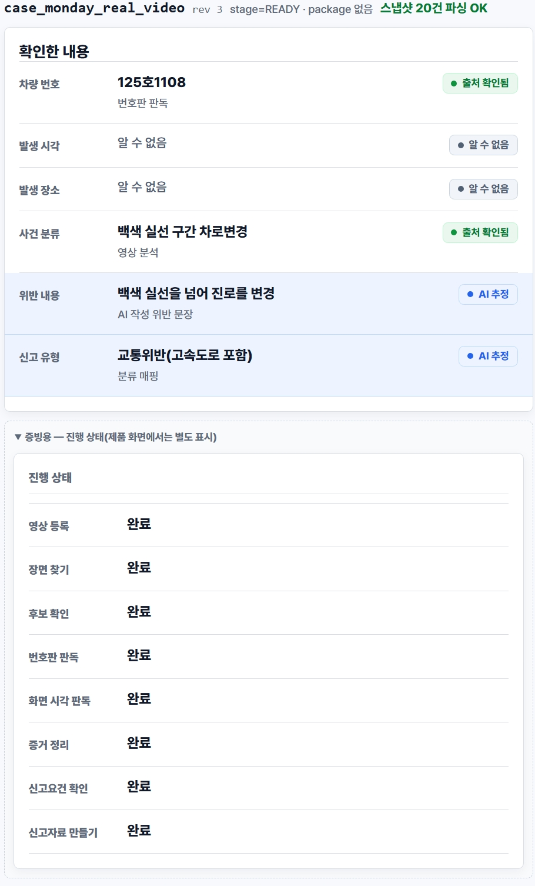

# Real E2E 실행 기록 — 첫 Positive 결과 (`youtube_clip_01.mp4`)

**날짜:** 2026-09-23 · **실행자:** 유소연(Claude Code 보조) · **브랜치:** `fix/case-search-stream-context-wiring`

**관련 문서:** `real-e2e-20260923-positive-candidate-miss.md`(후보 1, `YT_0002_C00.mp4`,
NOT_OBSERVED) · `real-e2e-20260923-yt0003-solid-line-miss.md`(후보 2, `YT_0003_C05.mp4`,
3회 크롭 전부 NOT_OBSERVED)

**결론 먼저 — 이번엔 `OBSERVED`가 나왔다.** 프로젝트 전체를 통틀어 real Coarse/Fine이
실제 위반을 확인하고, real PaddleOCR이 실제 번호판을 읽어내고, `EvidenceRecord`가
조립되어 `CaseView`가 `stage=READY`로 실제 값과 함께 나온 **첫 사례**다. 이 과정에서
새로운 실제 코드 버그 1건(`occurred_at` KeyError)도 발견·수정했다.

## 입력 영상

`youtube_clip_01.mp4` (로컬 경로 `doc/`, git 미커밋). 사용자가 유튜브에서 직접 화면
녹화해 만든 클립 — **처음부터 끝까지 위반 장면만 담겨 있다**(1920x1080·30fps·5.53초).
이전 두 후보(`YT_0002_C00`, `YT_0003_C05`)와 달리 **번호판이 모자이크되어 있지 않다.**

영상 내용(육안 확인, 프레임 추출): 터널 진입 전 정체 구간에서 흰색 세단이 갓길 쪽
가장자리선(백색 실선)을 넘어 대기 줄을 추월한 뒤 다시 차로로 끼어드는 장면.
`SOLID_LINE_LANE_CHANGE`로 분류해 실행했다.

## 실행

```
python scripts/dump_real_video_caseview.py \
  --video doc/youtube_clip_01.mp4 \
  --out data/real/case/real_e2e_youtube_clip_01.json \
  --target-event-types SOLID_LINE_LANE_CHANGE
```

5.53초짜리라 자르지 않고 원본 그대로 사용(60초 `RunDeadline`에 여유 충분 — 이전
`YT_0003_C05` 문서에서 정리한 것과 같은 기준).

### 1차 실행 — 코드 버그로 크래시

```
coarse span: start_ms=500 end_ms=3200 representative_ms=1800
...
KeyError: 'occurred_at'
```

`case/service.py::build_view_from_adapter()` → `case/view.py::_field_states()`에서
`evidence_record["occurred_at"]`를 하드 인덱싱하다가 크래시. **처음으로 Fine이
`ASSEMBLE`(OBSERVED) 판정을 내려 evidence 조립까지 실제로 진행됐다**는 뜻이기도 했다 —
지금까지 시도한 영상 4개(`20260620_141956_EVT_1`·`YT_0002_C00`·`YT_0003_C05` 3회)는
전부 `NOT_OBSERVED`로 이 코드 경로 자체를 탄 적이 없었다.

## 발견·수정한 버그 — `occurred_at` 키 부재 미처리

`src/daesingo/evidence/assembly.py`의 `assemble_evidence()`는 `TimeResolution.status
== "UNKNOWN"`이면 `EvidenceRecord`에 `occurred_at` 키를 아예 만들지 않는다(§230-231,
evidence 모듈 소유 설계 — 없는 시간을 만들어내지 않는다는 원칙). 이 영상은 유튜브
화면녹화라 **블랙박스 오버레이 타임스탬프도, 파일명 시각 규칙도 없어** 시간 출처가
전혀 없다 — 정확히 이 조건에 처음 걸렸다.

`case/view.py`는 이미 같은 종류의 문제를 `vehicle_number`(번호판 abstain)와
`location`(위치 미확보)에 대해 `.get()` + None-safe 처리로 고쳐둔 전례가 있었는데
(각각 주석에 "과거엔 KeyError를 던졌다"고 남아 있음), `occurred_at`만 그 처리가
빠져 있었다. 동일 패턴으로 두 곳 수정:

1. `_field_states()` — `occurred_at = evidence_record.get("occurred_at")`,
   `source_label_key`를 `occurred_at is not None` 조건부로.
   (`occurred_at_info_state(None)`은 이미 `"INFO_UNKNOWN"`을 반환하도록 되어 있어
   그 함수 자체는 손댈 필요 없었다.)
2. `_build_evidence_view()` — 같은 패턴. `event_time_display`는 `location_display`가
   이미 쓰던 원칙(§19 "완결 안 되는 게 정상" — 실패 표시 대신 값 없음을 그대로 표현)을
   그대로 따라 `value`/`source_label_key`를 `None`으로, `info_state`는
   `INFO_UNKNOWN`으로 둔다.

**검증:** `pytest tests/case -q` — 96 passed.

## 2차 실행 — 성공

수정 후 재실행(같은 커맨드, Coarse/Fine 재호출 — 결과 재현됨: `verification=OBSERVED`).

```
fine disposition: decision=ASSEMBLE verification=OBSERVED reason_code=None
stage=READY · candidates=1 · package=없음
```

### CaseView 핵심 값

| 필드 | 값 |
| --- | --- |
| `case_type_display` | `SOLID_LINE_LANE_CHANGE` — "백색 실선 구간 차로변경" |
| `violation_display` | "백색 실선을 넘어 진로를 변경" |
| `plate_display.value` | **`"125호1108"`** — 실제 PaddleOCR 판독값, `INFO_SOURCE_VERIFIED` |
| `event_time_display` | `null` / `INFO_UNKNOWN` (시간 출처 없음 — 위 버그 수정 후 정상적으로 "없음"으로 표시) |
| `location_display` | `null` / `INFO_UNKNOWN` (GPS/위치 단서 없음 — 알려진 단순화) |
| `requirements_evidence.readiness` | `UNKNOWN` (occurred_at 미확보로 TIME 체크가 UNKNOWN) |
| `requirements_package.readiness` | `UNKNOWN` |
| `package` | `null` — `PackageNotReady`(situation_response·occurred_at 미확보. `real_e2e.py` 모듈 docstring의 "알려진 단순화 2"와 정확히 일치, 실패 아님) |
| `progress[]` | 8단계 전부 `DONE` — 이번엔 실제로 전부 실행됐다(허위 아님, 지난 `view.py` progress 버그 수정 이후 정상 동작 확인) |

## Web 렌더 + 스크린샷

`apps/web`을 로컬 dev 서버(`npm run dev`, Vite)로 띄워 확인. `import.meta.glob()`이
`data/real/case/*.json`을 그대로 읽으므로 별도 배선 없이 떴다.

**주의 — 스냅샷 선택 버튼 3개가 전부 같은 라벨(`real_e2e_monday_video #1`)로
뜬다.** 위 「남은 gap」에 적은 대로 `scenario_id`/`case_id`가 세 실행(YT_0002·
YT_0003·youtube_clip_01) 전부 동일한 상수라서 버튼 텍스트만으로는 구분이 안 된다.
실제로는 `EvidenceScreen.tsx`가 `view.evidence === null`이면 "증거 정리 전"만 띄우게
되어 있어서, NOT_OBSERVED 두 건(YT_0002·YT_0003)은 그 문구가 뜨고 이 영상
(youtube_clip_01)만 실제 값이 뜬다 — 그걸로 구분해서 찾았다.



화면에서 확인되는 값:

- `case_monday_real_video` / rev 3 / `stage=READY · package 없음`
- 차량 번호: **125호1108** (출처 확인됨)
- 사건 분류: 백색 실선 구간 차로변경 (출처 확인됨)
- 위반 내용: 백색 실선을 넘어 진로를 변경 (AI 추정)
- 신고 유형: 교통위반(고속도로 포함) (AI 추정)
- 발생 시각·발생 장소: 알 수 없음 (알려진 단순화, 정상)
- 진행 상태 8단계 전부 "완료" — 이번엔 실제로 전부 실행됐다(허위 DONE 아님)

**케이스 식별자 관련 한계:** PM 프로토콜 §9가 요구하는 "case_id·영상 파일명·실행
시각 중 최소 하나"는 화면에 찍힌 `case_monday_real_video`(case_id)로 문자 그대로는
충족한다. 다만 이 case_id는 세 실행 모두 동일해서 **이 스크린샷 하나만으로는
어떤 영상에서 나온 결과인지 구분되지 않는다** — 이 문서와 나란히 두는 것으로
연결한다(스크린샷 파일명에 `youtube-clip-01`을 넣어 매칭).

## PM 프로토콜(`doc/real-e2e-protocol.md`) 최소 완료 기준 대비

PM이 명시한 최소 완료 기준: **"실제 영상 → 실제 AI/OCR → CaseView → Web 렌더 →
스크린샷"**.

```
[x] 실제 영상 파일 등록
[x] ffprobe/ffmpeg 실제 실행
[x] AnalysisSource 실제 생성
[x] Elice ML API Coarse 실제 호출
[x] Candidate 실제 생성 (1건)
[x] Elice ML API Fine 실제 호출               — verification=OBSERVED (최초)
[x] VisualEvidence 실제 생성
[x] IncidentClip 실제 생성
[x] Recording 실제 frame 추출
[x] PaddleOCR 실제 실행                       — 번호판 "125호1108" 실제 판독
[x] 번호판 Readout 생성
[x] Overlay time Readout 생성                 — 시도했으나 시간 출처 없음(정상, UNKNOWN)
[x] 실제 TimeSourceCandidate 연결              — 빈 결과였지만 실제로 연결·시도됨
[x] TimeResolution 생성                       — status=UNKNOWN으로 생성(정상)
[x] EvidenceRecord 생성
[x] Requirement 평가
[x] CaseView 생성                             — `data/real/case/real_e2e_youtube_clip_01.json`
[x] Web에서 Real CaseView 렌더                — `apps/web` dev 서버에서 확인
[x] UI 육안 확인                              — 번호판·위반유형·진행상태 정상 렌더 확인(사용자)
[x] UI 스크린샷 저장                          — `real-e2e-20260923-youtube-clip-01-evidence-screenshot.jpeg`(사용자 촬영)
```

**PM이 명시한 최소 완료 기준("실제 영상 → 실제 AI/OCR → CaseView → Web 렌더 →
스크린샷")을 이 영상으로 전부 충족했다.**

`ReportPackage`는 §11 원칙대로 별도 기록: **Real pipeline OBSERVED·Evidence PASS,
Final ReportPackage BLOCKED(원인: occurred_at·situation_response 미확보, 알려진
단순화)** — 이건 실패로 세지 않는다.

## 프로토콜 대비 미충족 항목 (이유 포함)

PM이 명시한 **최소** 완료 기준은 위에서 전부 충족했다. 다만 `doc/real-e2e-protocol.md`가
"가능하면" 조건으로 요청한 항목 중 하나는 이번에도 못 했다 — 사유를 남긴다.

### §8 스트레치 목표 — 브라우저에서 영상 업로드 → Backend → 분석 → UI

**미충족.** 최소 목표("Real E2E 실행 → `data/real/case` JSON → Web 렌더")는 충족했지만,
그 위의 "가능하면" 목표(브라우저 업로드까지 붙이기)는 손대지 않았다.

**이유 — case 모듈 혼자 끝낼 수 있는 일이 아니다.**

1. **`api`(FastAPI composition root) 자체가 비어 있다.** `src/daesingo/api/README.md`가
   이미 자리를 잡아뒀지만 "아직 코드가 없다. Owner(김준영)가 채운다"고 명시돼 있다 —
   `POST /cases` 같은 HTTP 엔드포인트가 이 레포 어디에도 없다.
2. **긴 작업을 위한 job queue/worker가 없다.** 같은 README가 이미 "긴 작업은 HTTP
   요청 안에서 끝내지 않는다 — `JobIntent`를 큐에 넣고 `202 Accepted`"라고 설계
   원칙을 박아뒀다. Coarse+Fine 실제 호출은 5~30초 이상 걸려 "즉시 처리" 대상이
   아닌데, 그 큐/worker 실행기 자체가 프로젝트 어디에도 없다(`case/jobs.py`의
   `issue_*` 함수들은 `JobRecord`만 만들 뿐 실제로 실행하는 코드가 없다는 것도 이번
   세션에서 다시 확인했다).
3. **`apps/web`(신유민 소유)도 손대야 한다.** 지금 앱은 라우터도 서버 호출도 없이
   `import.meta.glob()`으로 정적 JSON만 읽는다(`App.tsx` 주석에 명시). 파일 업로드
   input, 분석 시작 버튼, fetch 호출을 새로 붙여야 한다.

PM 문서 자체도 "제대로 된 큐 방식 대신 통합용 얇은 endpoint 하나 정도는 괜찮다"고
지름길을 이미 허용해뒀지만, 그래도 `api`/`web` 두 모듈 소유 폴더를 건드려야 하는 건
같다. `CLAUDE.md`("다른 모듈의 문서·폴더를 고치지 않는다 — 각 모듈은 Owner가
관리한다")에 따라 case 쪽에서 먼저 그 폴더에 코드를 넣지 않기로 했다 — Owner 확인
후 착수하는 게 맞다고 판단했다.

**결론: 기술적으로 막힌 게 아니라, 모듈 경계 때문에 case 단독으로는 못 끝내는
일이다.** 필요하면 `api`(김준영)·`web`(신유민) 두 분 호출이 다음 단계다.

## 남은 gap

- 모델명·latency·token usage를 여전히 자동 기록하지 않는다(`YT_0002_C00` 문서에서
  이미 남긴 gap과 동일 — `real-e2e-usage-log.jsonl`에 연결 안 됨).
- `scripts/dump_real_video_caseview.py`의 `scenario_id`/`case_id`가 모든 실행에서
  동일한 상수(`real_e2e_monday_video`/`case_monday_real_video`)라, `data/real/case/`에
  여러 real 영상 결과가 쌓여도 Web의 스냅샷 선택 버튼(`App.tsx`)이 전부 같은 라벨
  ("real_e2e_monday_video #1")로 표시되어 **버튼만 보고는 어느 실행 결과인지 구분이
  안 된다.** `source_video`/`generated_at`이 JSON 파일 최상위에는 있지만 `CaseView`
  객체 자체엔 없어서 Web 화면 어디에도 노출되지 않는다 — 스크린샷 증빙에서 "영상
  파일명/실행 시각 확인 가능"을 만족시키려면 이 문서로 JSON 파일을 직접 연결하는
  수밖에 없다(다음 절 참고). 스크립트가 `case_id`에 영상 파일명을 반영하도록 고치면
  해결되지만 이번엔 손대지 않았다.

## 변경/생성된 파일

- `src/daesingo/case/view.py` — `occurred_at` None-safe 처리 2곳(`_field_states()`,
  `_build_evidence_view()`)
- `data/real/case/real_e2e_youtube_clip_01.json` — 이번 실행 산출물(첫 OBSERVED CaseView)
