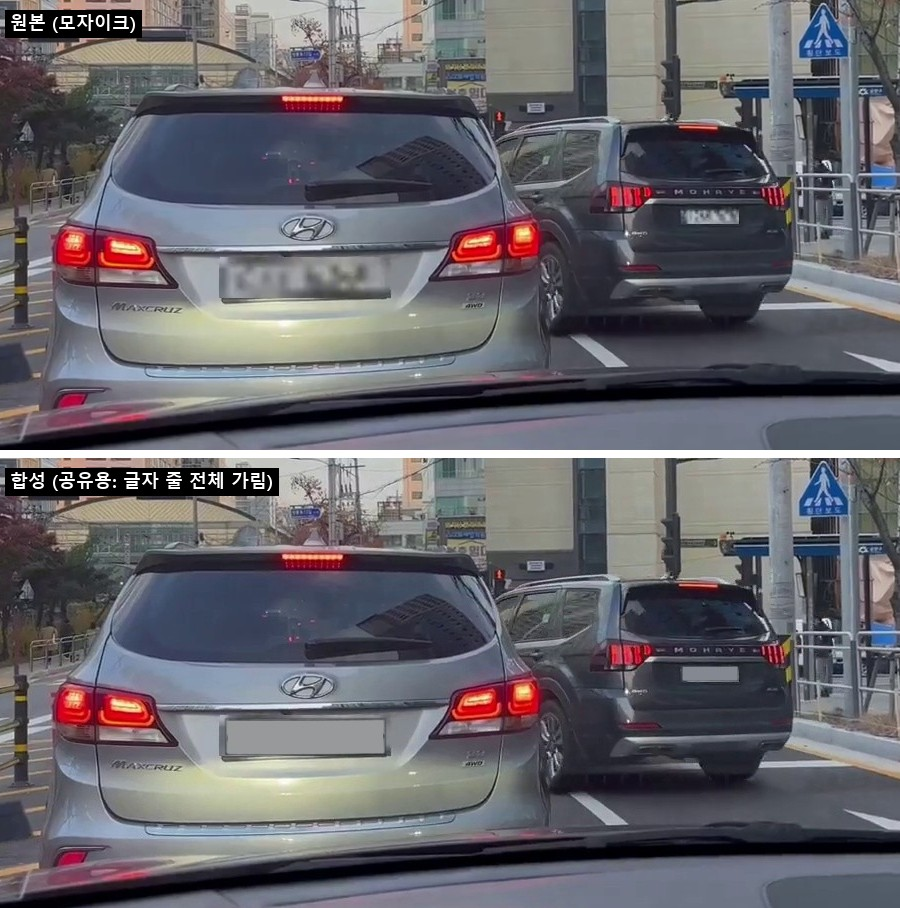
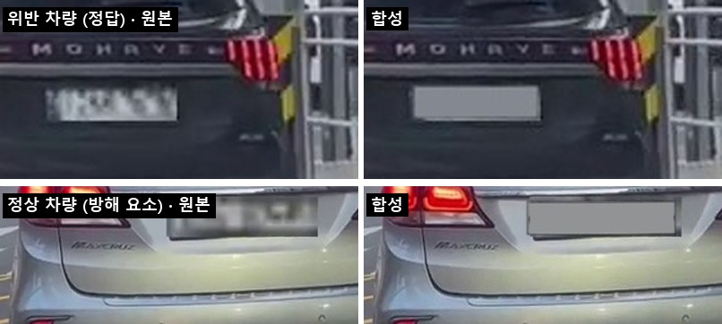
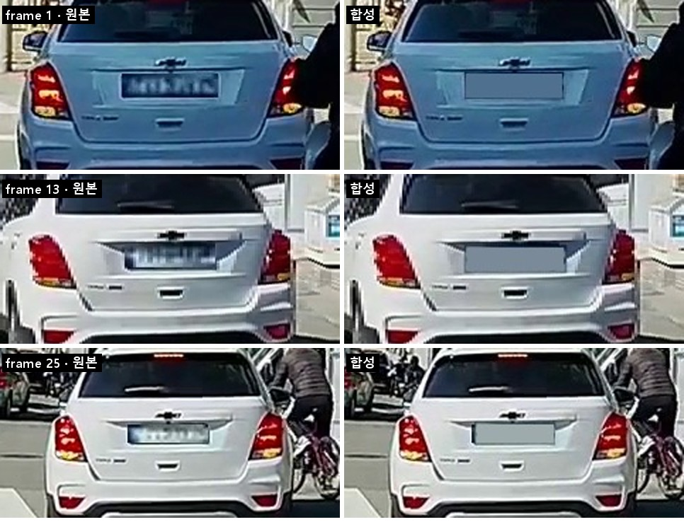
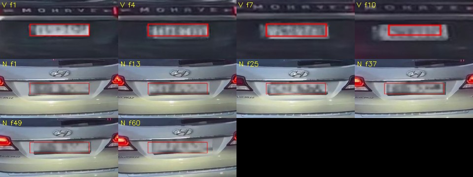

# [readout] 228 위반 영상에 번호판 합성 — 「대상 차량 번호판 판독」 평가셋 시제품 (2026-10-01)

> 성격: **실험·제안**이다. 제품 코드·계약·eval 코드는 바꾸지 않았다. 이 문서가 정하는 결정은 없다.
> 관련: #179(대상 차량 트랙 선택) · #215(번호판 인식기 미세조정, GT 71) · PR #223(이 문서의 리뷰)
> 개인정보: 실제 번호는 **본문에 한 글자도 적지 않고 별칭(`P1`–`P3`)만 쓴다.** 그림의 합성 번호판은 **글자 줄 전체를 가렸다**(§8). 합성 프레임과 원본 데이터는 레포에 넣지 않았다.
> 원본: 이 README가 원본이다. `report.pdf`는 이 README를 그대로 내보낸 것이다.

## 0. 한 줄

1. **AI Hub 228 위반 영상의 모자이크 번호판 자리에 정답 번호가 있는 번호판 크롭을 붙인다.** 그러면 「정상 차량이 옆에 있을 때 위반 차량 번호판을 골라 읽는가」를 처음부터 끝까지 한 번에 채점할 수 있다.
2. 정상 차량에도 번호를 붙이므로 오답을 **「다른 차를 읽음」과 「맞는 차를 잘못 읽음」으로 나눠 셀 수 있다.** 지금 채점기는 이 둘을 구분하지 못한다.
3. **판독 정확도(OCR)의 근거로는 쓰지 않는다.** 붙인 판은 미세조정 데이터와 같은 출처라 판독률이 부풀려진다. 판독률은 계속 실측 블랙박스 GT로 잰다.
4. 클립 2개(85프레임)로 시제품을 만들었고, 프레임 JSON과 클립 GT 형식까지 확인했다.

## 1. 배경 — 지금 readout 평가가 못 재는 것

| 단계 | 지금 재는 방법 | 결과 | 한계 |
| --- | --- | --- | --- |
| 대상 차량 선택 | AI Hub 228(`aihub71555`) 클립. **번호판이 모자이크라 「고른 차」만 채점** | 트랙 방식 holdout 47.9%. **틀린 경우의 78%가 정상 차량을 고름.** 천장 81% (#179) | 고른 차의 번호판을 읽었는지는 못 잰다 |
| 번호판 판독 | AI Hub 번호판 크롭 + 블랙박스 GT 71건(전체 판독 43건) | 남은 오답: 한글, 2줄 윗줄 지역명, 줄 앞 쓰레기 글자 (#215) | 대상 차를 「골라서」 읽는 상황이 아니다. GT 한 건 차이가 노이즈 범위다 |
| 채점기 `eval/scorers/plate.py` | `value == true_text`, `wrong_accept` | — | **정상 차량 번호판을 정확히 읽어도 그냥 오답.** 대상 차를 잘못 고른 것인지 OCR이 틀린 것인지 구분하지 못한다 |

**대상 차량 선택과 판독을 따로 잴 뿐, 둘을 이은 경로는 아무도 재지 않는다.** 사용자에게 실제로 피해를 주는 오류는 「정상 차량 번호판을 자신 있게 읽어 확정하는」 경우다. #179가 말하는 조용한 오답이 번호판 값으로까지 이어지는 경우다.

## 2. 제안

- 장면, 차량, 위반 라벨, 프레임 흐름은 **228 원본 그대로**다. 검출기·트래커·대상 선택은 실제 픽셀 위에서 돈다.
- 번호판 픽셀만 합성이다. 원천은 AI Hub 「자동차 차종·연식·번호판 인식용 영상」 번호판 OCR 크롭(정답 번호 있음)이다. **위반 차량과 정상 차량 모두** 번호를 알 수 있다.
- 228 Validation에만 224,859장이 있다. 위반 차량과 정상 차량이 둘 다 크게 찍힌 클립은 신호위반 앞쪽 120클립만 훑어도 **최소 25개**(두 차량 모두 폭 180px 이상) 나왔다.

## 3. 시제품

| 클립 | 구성 | 의미 |
| --- | --- | --- |
| `20230223_적색신호시직진_0000011923` (60프레임) | 바로 앞 **정상 차량** `DISTRACTOR_P3`(번호판 폭 약 157px) · 옆 차로 **위반 차량** `TARGET_P2`(57→30px, 1–12프레임 후 사라짐) | **어려운 사례.** 정상 차량 번호판이 더 크고 선명하고 오래 보인다. 「가장 잘 읽히는 번호판」을 고르면 틀린다 |
| `20230223_적색신호시직진_0000011919` (25프레임) | 위반 차량 `TARGET_P1` 한 대 | 기본 사례. 다른 차량 번호판은 작거나 측면이라 읽을 수 없다 |

`P1`–`P3`은 붙인 번호판 크롭 세 개의 별칭이다. 셋 다 신형 1줄 번호판이다. 실제 번호는 레포 밖 로컬 파일에만 있다(§8).

> 그림 1–3의 「합성」 칸은 공유용 가림 처리본이다. 붙인 번호판의 **글자 줄 전체를 판 바탕색으로 덮었다.** 판 테두리, 위치, 크기, 밝기만 남는다. 「원본」 칸은 AI Hub 228이 처리한 모자이크 그대로다.



*그림 1. 11923 3번 프레임. 앞의 정상 차량 번호판이 옆 차로 위반 차량 번호판보다 훨씬 크다.*



*그림 2. 위: 위반 차량(정답, 3번 프레임). 아래: 정상 차량(방해 요소, 41번 프레임).*



*그림 3. 11919 — 차량이 움직이는 동안 같은 번호판이 위치·크기·밝기를 따라간다.*

> 그림 3 메모: 이전 판의 그림 3에는 붙인 판 글자 앞에 `-` 모양 흔적이 보였다. 원천 크롭을 확인해 보니 **실제 번호판의 왼쪽 고정 볼트**였다. 오른쪽 볼트도 크롭에 있다. 문서를 만들다 생긴 흔적도, 합성 단계에서 생긴 흔적도 아니다. 합성 데이터는 바꾸지 않았다. 지금 그림은 글자 줄 전체와 함께 이 볼트도 가렸다.

### 만든 방법 (결정적 합성 — 생성 모델 없음)

1. **번호판 위치:** 228 라벨에는 번호판 박스가 없다(차량 박스만 있음). 첫 프레임에서 모자이크 위치를 사람이 찍고, 이후 프레임은 **차량 박스 IoU로 트랙을 잇고 템플릿 매칭으로 번호판을 따라간다.** 정합 점수는 대부분 0.85 이상이고, 낮게 나온 몇 프레임은 눈으로 위치를 확인했다. 가려져 점수가 0.7 아래로 떨어지면 거기서 끊는다.
2. **붙이기:** 크롭에서 번호판 네 모서리를 펴서 정면 사각형(520×110)으로 만들고, 목표 위치로 원근 변환한다. 4배 해상도로 그린 뒤 `INTER_AREA`로 줄여 블랙박스의 해상도 손실을 흉내 낸다.
3. **색·화질:** 모자이크는 블록 평균이라 원래 판의 밝기와 색이 남아 있다. 평균을 거기에 맞추고 대비는 0.85배로 낮춘다. 이어서 블러(σ 0.7), 노이즈(σ 2), 경계 페더링을 넣고 프레임 전체를 JPEG q90으로 다시 압축한다.



*그림 4. 원본 프레임 위의 추적 결과(빨간 박스). V=위반 차량, N=정상 차량.*

> 그림 4 메모: V f10의 박스는 모자이크 중심에서 오른쪽 위로 벗어나 있고 모자이크보다 작다. **실험 당시의 추적 결과 그대로다.** 그림을 다시 만들면서 박스를 옮기지 않았다. 합성 프레임 JSON의 위반 차량 번호판 polygon도 10–12번 프레임에서 같은 방향으로 밀려 있다. 그래서 이 세 프레임은 붙인 판이 모자이크를 다 덮지 못했다. 위반 차량 트랙이 끝나기(12번 프레임) 직전에 템플릿 매칭이 밀린 것으로 보인다. 그림 4에는 228 원본 모자이크만 나오고 합성 번호판은 나오지 않는다.

## 4. GT·JSON 형식

**프레임 JSON:** 228 원본 구조(`Meta` / `condition` / `Annotation`)를 그대로 두고 annotation을 덧붙인다.

```json
{
  "Annotation Type": "polygon",
  "Object Name": "번호판(합성)",
  "Polygon": [[782.4, 458.8, 837.3, 458.8, 837.3, 472.1, 782.4, 472.1]],
  "Plate Text": "<P2>",
  "Owner Annotation ID": "3",
  "Owner Original Object Name": "신호 위반 차량(이륜차 포함)",
  "Track Role": "VIOLATOR",
  "Is Target": true,
  "Plate Width Px": 54.9
}
```

최상위에는 `Synthetic` 블록(생성기 버전, 번호판 원천 파일, seed, 파라미터)을 넣어 재현할 수 있게 했다.

**클립 GT `gt_plate_synth.json`:** eval `gt_plate.json`의 `readout_id` / `true_text` / `legibility`에 **`distractors`** 필드를 더한 형태다.

```json
{
  "readout_id": "20230223_적색신호시직진_0000011923_target",
  "true_text": "<P2>",
  "legibility": "READABLE",
  "distractors": [{ "role": "NORMAL", "text": "<P3>", "legibility": "READABLE" }],
  "target_frames": ["…프레임별 번호판 박스·폭…"],
  "distractor_frames": ["…"]
}
```

두 예시의 `<P2>`·`<P3>` 자리에는 실제 파일에서 번호 문자열 전체가 들어간다. 그래서 프레임 JSON과 클립 GT는 레포에 넣지 않는다(§8).

## 5. 이걸로 재는 것 / 재지 않는 것

### 제안 지표 — 판독 결과를 넷으로 나눈다

| 분류 | 조건 | 의미 |
| --- | --- | --- |
| 정답 | `value == true_text` | — |
| **다른 차를 읽음** | `value ∈ distractors[].text` | 대상 차량 선택 실패가 확정값으로 이어진 경우. **가장 위험한 오답** |
| 판독 오류 | 위 둘 다 아니고 기권하지 않음 | 맞는 차를 잘못 읽었거나 위치를 잘못 잡았다 |
| 기권 | `abstained` | — |

현재 `plate.py` 교차표에 「다른 차를 읽음」 한 칸만 추가하면 된다. `target_association.status`별(`LOW_CONFIDENCE` 등)로 같은 표를 다시 나누면, #179가 미결로 둔 **임계값과 오답률의 교환**을 번호판 값 기준으로 볼 수 있다.

### 역할 분담

| 측정 대상 | 합성셋 | 실측 블랙박스 GT |
| --- | --- | --- |
| 정상 차량이 섞였을 때 대상 차량 선택 → 판독까지 | **주력** | 보조 |
| 파이프라인 회귀 테스트 (바꾼 뒤 나빠졌나) | **주력** | 보조 |
| **판독 정확도 (한글, 윗줄 지역명 등)** | **쓰지 않음** | **유일한 근거** |

**판독률을 합성셋으로 말하면 안 되는 이유:**
- 붙인 크롭은 #215 미세조정에 쓴 AI Hub 번호판 데이터와 같은 출처로 보인다. #215에 따르면 같은 차가 분할을 넘어 겹친다(Validation 이미지의 37%가 번호 중복). → **번호판 번호 단위로 학습 데이터와 중복을 제거해야 한다.**
- 실제 블랙박스의 모션 블러, 야간 반사, 저비트레이트 압축이 없다. 합성 판은 이미 카메라를 한 번 거친 깨끗한 크롭이다.
- 검출기 천장(81%)은 실제 픽셀이라 그대로 잰다. 다만 개선되는 것은 아니다.

## 6. 만들면서 확인한 주의사항

1. **위반 차량에만 붙이면 평가가 무너진다.** 「선명한 번호판이 하나뿐」이라는 단서로 쉽게 맞힌다. **보이는 정상 차량 번호판에도 반드시 붙인다.**
2. **228 프레임 라벨에 잡음이 있다.** 11919에서 같은 위반 차량이 16–22번 프레임에서 「정상 차량」으로 표기된다. 11923은 한 클립 안에서 날씨가 눈→비→맑음, 주야간이 주간→야간으로 바뀐다(실제 영상은 맑은 낮). → **대상 정답은 트랙 단위로 정한다.** 조건별 성능 분석에 `condition`을 그대로 쓰면 안 된다.
3. **선명도 차이가 티가 날 수 있다.** 흐린 장면이나 가까운 차에서는 붙인 판이 주변보다 약간 선명하다. 블러를 프레임별로 맞추는 작업이 남아 있다.
4. **이륜차는 만들 수 없다.** 차종 데이터의 이륜차 라벨에는 번호가 없다. 안전모미착용 시나리오는 이 방식으로 다룰 수 없다.
5. **원본 비식별 처리에 빈틈이 있다.** 11923의 13번 프레임에서 위반 차량 모자이크가 불완전해 원래 번호 일부가 비친다. 이 문서의 그림에서는 그 프레임을 뺐다. 합성셋을 공유하기 전에 같은 검수가 필요하다.
6. **첫 위치 지정이 병목이다.** 지금은 사람이 찍는다. 늘리려면 자동화가 먼저다(§9).

## 7. 생성형(LLM·이미지 편집 모델)으로 붙이는 것에 대해

**이번에는 시험하지 않았다**(작업 환경에 이미지 생성 API 키가 없었다). 생성형을 쓰더라도 **글자는 생성 모델에 맡기지 않는 것**을 권한다.

- 글자를 조금만 다르게 그려도 GT가 틀린다. 한글 한 글자 오류는 readout이 지금 싸우고 있는 바로 그 오류 유형이다.
- 프레임마다 글자 모양이 흔들려서 다중 프레임 투표 경로를 공정하게 평가할 수 없다.
- 쓴다면 **글자는 결정적으로 붙이고, 생성 모델은 마스크 영역의 조명·선명도 보정에만 약하게 쓴다.** 그 뒤 판독기와 사람이 원래 글자가 유지됐는지 확인한다.

## 8. 개인정보 처리

| 대상 | 처리 |
| --- | --- |
| 합성에 쓴 번호판 번호 (AI Hub 공개 데이터지만 실제 차량 번호) | 본문·표·JSON 예시는 **별칭(`P1`–`P3`)만 쓴다.** 실제 번호는 일부(앞자리, 한글, 끝자리)도 적지 않는다. **그림은 붙인 판의 글자 줄 전체를 판 바탕색 단색으로 덮었다.** 판 테두리, 위치, 크기, 밝기만 남는다 |
| 스크립트 안의 번호 | 크롭을 별칭(`P1`–`P3`)으로 부른다. 실제 파일명은 실험 작업 폴더의 `plate_sources.local.json`에만 둔다. 형식 예시 `plate_sources.example.json`의 번호는 지어낸 값이다. 스크립트는 이 레포에 넣지 않았다(§10) |
| 228 원본에 남아 있던 번호 (비식별 빈틈) | 해당 프레임(11923 위반 차량 13번 이후)을 그림에서 제외 |
| 합성 프레임, 프레임 JSON, 클립 GT, 원본 데이터, 글자가 보이는 그림·영상 | **레포에 넣지 않는다.** 정답 번호가 그대로 들어 있고 AI Hub 이용 조건 대상이다. 로컬에서 스크립트로 다시 만든다 |
| 장면 속 다른 차량 번호판·사람 | 228 원본의 비식별 처리를 그대로 둔다(번호판 모자이크). 그림에 나온 보행자·운전자는 원거리라 얼굴을 알아볼 수 없다 |

처음 올린 판(PR #223 첫 커밋)은 끝 두 자리만 가렸었다. 본문에는 앞자리와 한글이, 그림에는 앞쪽 글자가 남아 있었다. 리뷰(readout·eval Owner)를 반영해 위와 같이 바꿨다.

## 9. 다음 단계 제안

| 순서 | 작업 | 비고 |
| --- | --- | --- |
| 1 | 모자이크 번호판 **위치 자동 검출** | 차종 데이터 원본 프레임 `plate.bbox`로 검출기를 학습하고, 학습 이미지에 모자이크를 입힌다. 첫 위치 지정이 병목이다 |
| 2 | 후보 클립 자동 선별 + 블러를 프레임별로 맞추기 | 위반 차량·정상 차량 크기 조건으로 거른다. 블러는 주변 선명도에 맞춘다 |
| 3 | 원천 번호판 중복 제거 | 미세조정에 쓴 번호와 겹치지 않게 한다 |
| 4 | 채점기에 「다른 차를 읽음」 추가 | §5 |
| 5 | 배치마다 실측 GT로 방향 확인 | 예: 「트랙 > 프레임 방식」 같은 비교 결론이 실측 GT에서도 같은 방향으로 나오는지 본다. 같지 않으면 합성셋을 믿지 않는다 |

### readout에 확인하고 싶은 것

- 「다른 차를 읽음」 지표를 eval 채점기에 넣을지, readout 실험 스크립트에만 둘지
- 합성셋을 `eval/manifests/`의 새 tier(`SYNTHETIC`)로 둘지, readout `experiments/`에만 둘지
- 미세조정에 쓴 AI Hub 번호 목록(중복 제거용)을 공유받을 수 있는지

위 질문에 대한 Owner 의견은 PR #223 리뷰에 있다. 이 문서는 그 의견을 결정으로 옮기지 않는다. 채점기, tier, 정답지 형식은 여기서 정하지 않고 미결로 둔다.

## 10. 파일과 재현

**이 폴더(레포)에 있는 것**

| 경로 | 내용 |
| --- | --- |
| `README.md` | 이 문서 (원본) |
| `report.pdf` | 이 README를 그대로 내보낸 PDF |
| `images/` | 그림 1–4. 그림 1–3은 합성 번호판 글자 줄 전체를 가린 판, 그림 4는 228 원본 모자이크 위 추적 박스 |

**레포에 없는 것 — 실험 작업 폴더(로컬) 기준**

아래 `scripts/` 경로와 명령은 실험을 한 로컬 작업 폴더 기준이다. **이 레포에는 없다.** 스크립트가 228 원본과 번호판 OCR 원천 데이터를 로컬 경로에서 직접 읽고, 실제 번호가 든 `plate_sources.local.json`이 있어야 돌기 때문이다. 기록용으로 이름과 역할만 남긴다.

| 경로 (실험 작업 폴더) | 내용 |
| --- | --- |
| `scripts/plate_quad.py` | 크롭 읽기, 번호판 4점 자동 검출 시도(30장 중 24장 성공, 품질 낮음 — 이번에는 수동 4점 사용) |
| `scripts/track.py` · `track23.py` | 차량 트랙 연결 + 번호판 템플릿 추적 |
| `scripts/composite.py` | 원근 변환, 슈퍼샘플링, 색·화질 맞춤 |
| `scripts/make_clip.py` · `make_clip23.py` | 클립 합성, 프레임 JSON, 클립 GT 생성 |
| `scripts/mask_frames.py` · `figs.py` | 공유용 가림 처리, 문서 그림 생성. 가림은 글자 줄 전체를 판 바탕색으로 덮는다(정규화 판 520×110 기준 x 1.5–98.5%, y 5–95%) |

```bash
# 준비: 228 Validation과 번호판 OCR 데이터가 로컬에 있어야 한다 (경로는 스크립트 상단).
#       plate_sources.example.json → plate_sources.local.json 으로 복사하고 실제 크롭 파일명을 채운다.

# 11919: 위반 차량 번호판 추적 → 합성
python track.py
python make_clip.py

# 11923: 위반·정상 두 트랙 추적 → 합성
CLIP=20230223_적색신호시직진_0000011923 python track23.py
CLIP=20230223_적색신호시직진_0000011923 python make_clip23.py

# 공유용 가림 처리 → 문서 그림
python mask_frames.py
python figs.py <출력 폴더>
```

데이터 출처: AI Hub 「교통법규 위반 상황 데이터」 Validation · AI Hub 「자동차 차종·연식·번호판 인식용 영상」 번호판 OCR Training.
