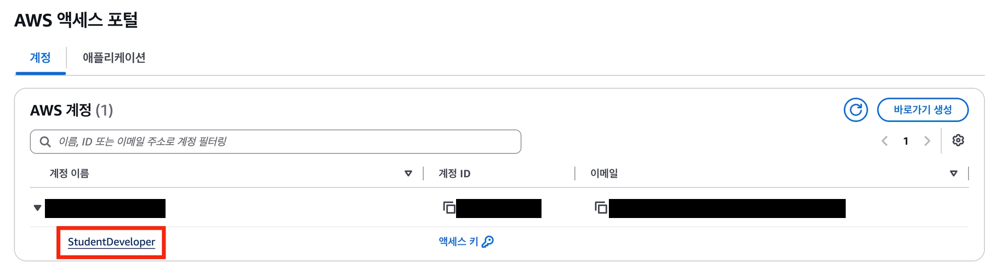
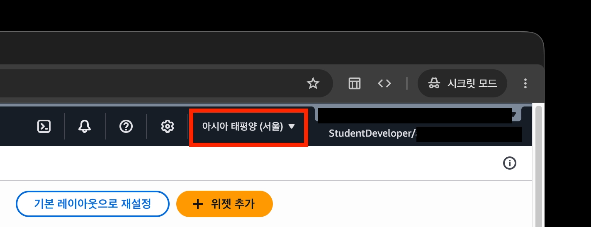
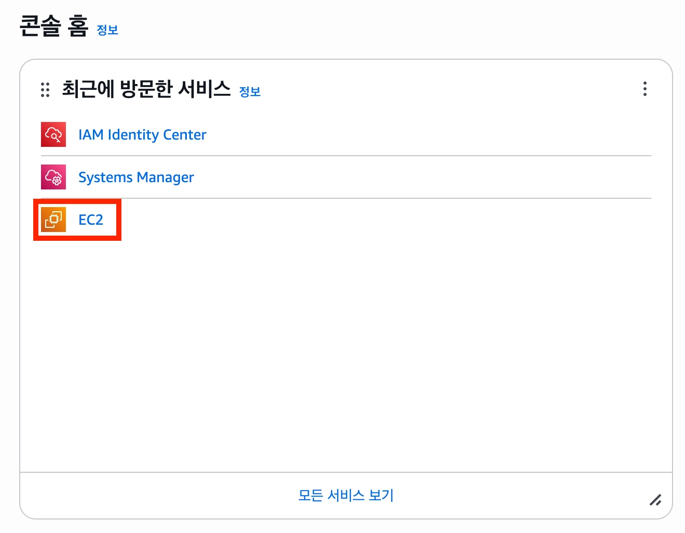
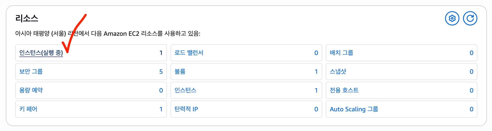
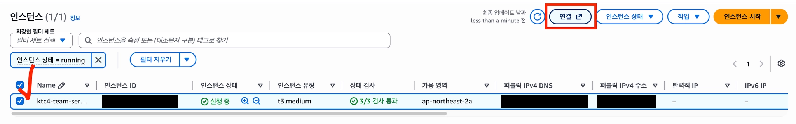
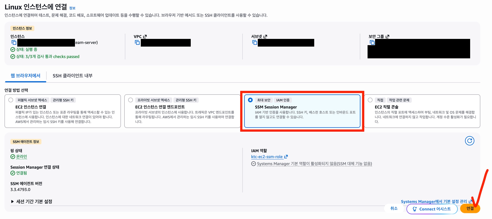

# 카테캠 지원 AWS 환경

**Status:** Input — 카테캠 운영진 공지 요약  
**Source:** 카테캠 운영진 AWS 실습환경 공지 (비공개) + 팀 AWS 실환경 조회  
**Notice date:** 확인 필요  
**Captured:** 2026-10-02  
**Maintainer:** common/runtime — 김준영  
**Router:** [Official Inputs](./README.md)

> 공지 원문은 비공개이므로 싣지 않는다. §1–§4는 카테캠 고유 조건을 **사실만 요약**했고, §5–§7은 공지가 안내한 접속·운영 절차를 **표준 AWS 절차로 재서술**했다. §8은 2026-10-02 팀 AWS에서 직접 확인한 실환경 snapshot이다. 스크린샷과 본문에는 계정·사용자·리소스 식별자를 싣지 않는다.
>
> 이 문서는 외부 입력이며 결정이 아니다. Runtime 배포·용량 결정은 [`ops-spec.md`](../ops-spec.md)에 기록하고 이 문서를 근거로 가리킨다.

## 1. 제공 환경

| 항목 | 내용 |
| --- | --- |
| 단위 | 팀당 독립 AWS 계정 1개 + EC2 서버 1대 (팀원 공유) |
| 서버 | t3.medium — 2 vCPU / 4 GB RAM |
| OS | Ubuntu 24.04 LTS |
| 디스크 | 50 GB SSD (암호화) |
| 리전 | 서울 `ap-northeast-2` 만 사용 |
| 제공 기간 | 2026-08-31 ~ 2026-11-20 |
| 로그인 | 팀원 각자 개인 SSO 계정 (카테캠 이메일) + MFA 필수. 자격증명 공유 금지 |
| 서버 접속 | SSM Session Manager. SSH 키·22번 포트 불필요 |

## 2. 제한 사항

차단된 작업은 권한 오류가 난다.

| 구분 | 불가 | 요청 시 검토 |
| --- | --- | --- |
| 서버 | 추가 생성, 사양 변경, 종료(삭제) | 사양 상향 |
| 스토리지 | 디스크 확장, 추가 볼륨 | 디스크 확장 |
| 네트워크·관리형 | Elastic IP, RDS, ALB, 고비용 서비스(NAT Gateway·EKS·Redshift·SageMaker·ElastiCache 등) | RDS, ALB, Elastic IP, 기타 차단 서비스 |
| 계정·보안 | 서울 외 리전, IAM 사용자·액세스 키 생성, CloudTrail 변경, Spot·Auto Scaling | — |

자유롭게 할 수 있는 것:

- 서버 중지·시작·재부팅
- 보안그룹 규칙 편집 (서비스 포트 개방 등)
- 서버 내부 패키지·런타임·Docker 설치와 구성
- S3, DynamoDB, Lambda, CloudWatch, ECR, API Gateway, SQS/SNS 사용

## 3. 사용 범위와 감시

- 허용: 2단계 팀프로젝트의 개발·빌드·테스트·배포, 데모·발표용 서비스 운영, 교육 관련 실습.
- 금지: 채굴, 외부 공격·스캔, 불법 콘텐츠·파일 공유 서버, 상업적·유료 서비스, 자격증명의 팀 외부 공유, 교육 무관 개인 사용, 스팸·프록시/VPN 운영. 위반 시 계정 즉시 정지.
- 감시: 모든 활동이 CloudTrail에 기록되고 GuardDuty 위협 탐지와 예산 모니터링이 상시 동작한다. 이상 사용은 자동 제한될 수 있다.
- 22번 포트를 `0.0.0.0/0`으로 열면 보안 모니터링에 탐지된다.

## 4. 증설·예외 요청

§2의 「요청 시 검토」 항목은 카테캠 인프라 담당에게 요청한다. 예산과 교육 목적을 함께 검토한 뒤 처리하며, 우회 시도는 금지다.

요청에 포함할 내용:

- 팀 (학교 / 팀 번호)
- 필요한 항목
- 필요한 이유 (어떤 기능을 위해)
- 예상 사용 기간

## 5. 콘솔 접속 절차

표준 IAM Identity Center + Session Manager 흐름이다. 포털 URL은 공지 원문을 따른다.

1. **SSO 로그인** — AWS 액세스 포털에 카테캠 이메일로 로그인한다. 첫 로그인 때 이메일 인증 코드로 비밀번호를 정하고 MFA를 등록한다. 로그인하면 팀 계정 타일과 권한 세트가 보인다.

    

2. **리전을 서울로 전환** — 콘솔은 기본 리전(미국)으로 열린다. 우측 상단 리전 선택기에서 `ap-northeast-2`를 고른다. 다른 리전에서는 리소스가 비어 보이거나 권한 오류가 나는 것이 정상이다.

    

3. **EC2 인스턴스 열기** — 콘솔 홈 → EC2 → 인스턴스.

    

    

4. **Session Manager로 연결** — 인스턴스 선택 → 연결 → Session Manager 탭 → 연결. 브라우저 터미널이 `ubuntu` 사용자로 열린다.

    

    

참고: [AWS Systems Manager Session Manager](https://docs.aws.amazon.com/systems-manager/latest/userguide/session-manager.html)

## 6. 로컬 SSH 접속 (선택)

22번 포트를 열지 않고 Session Manager 터널 위로 SSH를 쓴다. `scp`·`rsync`·VS Code Remote-SSH도 동작한다.

1. **도구 설치** — AWS CLI v2와 Session Manager plugin.
2. **SSO 프로필 설정** — `aws configure sso`에 포털 URL을 넣어 프로필을 만든다.
3. **SSH 키 준비** — 둘 중 하나.
    - **팀 공용 키:** 팀 서버의 키 페어 개인키가 Parameter Store `/ec2/keypair/<KeyPairId>`에 보관돼 있다. `aws ec2 describe-key-pairs`로 ID를 확인하고 `aws ssm get-parameter --with-decryption`으로 받는다.
    - **개인 키 (권장):** 로컬에서 `ssh-keygen -t ed25519`로 만들고, 공개키를 브라우저 세션에서 `~/.ssh/authorized_keys`에 추가한다.
4. **`~/.ssh/config` 등록** — 인스턴스 ID를 HostName으로 두고 SSM 문서 `AWS-StartSSHSession`을 ProxyCommand로 쓴다.

    ```text
    Host ktc-server
      HostName <인스턴스 ID>
      User ubuntu
      IdentityFile <개인키 경로>
      ProxyCommand sh -c "aws ssm start-session --target %h --document-name AWS-StartSSHSession --parameters 'portNumber=%p' --profile <SSO 프로필>"
    ```

개인키(`.pem`, `id_ed25519`)는 커밋하거나 공유하지 않는다.

참고: [Install the Session Manager plugin](https://docs.aws.amazon.com/systems-manager/latest/userguide/session-manager-working-with-install-plugin.html) · [Allow SSH connections through Session Manager](https://docs.aws.amazon.com/systems-manager/latest/userguide/session-manager-getting-started-enable-ssh-connections.html) · [Configure IAM Identity Center authentication with the AWS CLI](https://docs.aws.amazon.com/cli/latest/userguide/cli-configure-sso.html)

## 7. 공지가 함께 안내한 운영 팁

- **디스크 부족:** 가장 흔한 원인은 Docker 빌드 캐시 누적이다. `docker system df`로 확인하고 `docker system prune`·`docker volume prune`으로 정리한다. 그래도 부족하면 §4로 확장을 요청한다.
- **외부 공개:** 보안그룹에서 서비스 포트(예: 80/443/8080)를 열고 서버 공인 IP로 접속한다. HTTPS는 Caddy 등으로 Let's Encrypt 인증서를 발급한다. 고정 IP(Elastic IP)는 기본 차단이므로 §4 요청 대상이다.


## 8. 2026-10-02 실환경 검증 snapshot

공지의 지원 범위와 실제 팀 AWS 환경이 일치하는지 **조회 위주로 검증**했다. 아래 값은 설계 결정이나 영구 보장이 아니라, Runtime/Ops baseline을 잡기 위한 당일 관측값이다. 계정 ID, 사용자 이메일, 인스턴스/VPC/서브넷/보안그룹 ID, public IP/DNS, SSO start URL 등 식별값은 공개 레포에 기록하지 않는다.

### EC2 / OS / storage

| 항목 | 실측 |
| --- | --- |
| Instance type | `t3.medium` |
| CPU | 2 vCPU |
| Memory | OS에서 약 3.7 GiB usable |
| OS | Ubuntu 24.04.4 LTS |
| Root EBS | gp3, 50 GiB |
| EBS performance | 3,000 IOPS / 125 MiB/s |
| Encryption | EBS 암호화 활성, AWS-managed EBS KMS key |
| Swap | 기본 상태 0 B |
| Network | public subnet, 실행 중 public IPv4 할당, Elastic IP 없음 |
| Security Group | 검증 시 inbound rule 0개, outbound 허용 |
| Provisioning | VPC·public subnet·Internet Gateway·route table·security group·EC2·key pair가 CloudFormation StackSet 계열로 provision됨 |

`Swap 0 B`와 현재 SG 상태는 운영 권장값이 아니라 **초기 환경 관측값**이다. 메모리·disk guardrail과 서비스 ingress는 Runtime 구현/P2 capacity smoke 결과를 보고 Ops Spec에서 결정한다.

### SSM / CloudWatch

- SSM Agent는 snap 설치본으로 `enabled / active` 상태였고, 브라우저 Session Manager와 로컬 AWS CLI의 `start-session` 양쪽에서 실제 접속을 확인했다.
- EC2 instance role에는 SSM managed-instance 기능과 CloudWatch Agent server 권한이 준비되어 있다.
- CloudWatch Agent systemd service는 검증 시 서버에 설치되어 있지 않았다. 따라서 IAM 권한 존재와 OS metric agent 설치 여부를 구분한다.
- EC2 기본 CloudWatch metric은 콘솔에서 확인 가능했다. Runtime의 RSS·disk working set 같은 OS/process metric 수집 방식은 별도 Ops 결정이다.

### IAM / GitHub Actions OIDC

- IAM Identity Center는 서울 리전에서 동작하고, 팀원은 개별 SSO + MFA로 접근한다.
- GitHub Actions용 OIDC provider와 deploy role이 이미 provision되어 있다.
- deploy role의 trust는 이 프로젝트 repository 범위로 제한된 구성이 확인되었다.
- EC2/deploy role에는 AWS managed policy와 카테캠 guardrail이 함께 적용된다. 화면에 `PowerUserAccess`가 보여도 **Organizations SCP / guardrail이 최종 권한 상한**이므로, 정책 이름만으로 사용 가능 서비스를 추론하지 않는다.
- 실제로 일부 IAM 분석 기능은 SCP explicit deny를 반환했다. 차단 작업을 우회하지 않고 §4 요청 경로를 사용한다.

### 현재 생성된 관리형 리소스

2026-10-02 로컬 AWS CLI에서 현재 계정/서울 리전을 조회했을 때 다음 리소스는 **생성된 항목이 관측되지 않았다**.

| 서비스 | 관측 결과 |
| --- | --- |
| S3 bucket | 없음 |
| ECR repository | 없음 |
| RDS DB instance | 없음 |
| ELBv2 (ALB/NLB) | 없음 |
| CloudWatch Log Group | 없음 |

이는 **현재 생성 상태**일 뿐 §2의 사용 가능/요청 필요 정책을 바꾸지 않는다. 예를 들어 S3·ECR·CloudWatch는 사용 가능 서비스지만 현재 리소스가 없고, RDS·ALB는 요청 검토 대상이면서 현재 리소스도 없다.

### 로컬 제어 경로 검증

개발 PC에서 AWS CLI v2 + Session Manager plugin + IAM Identity Center SSO 조합으로 다음 경로를 실제 확인했다.

```text
local terminal
→ AWS CLI SSO profile
→ StudentDeveloper permission set
→ EC2 describe
→ SSM start-session
→ team EC2 shell
```

내부 SSO URL, 계정/사용자 식별자, 실제 instance ID·public IP와 개인 키 설정은 공개 레포에 두지 않는다. 팀원이 따라 하는 구체적인 로컬 설치·로그인·접속 절차는 내부 협업 문서에서 관리한다.

### 아직 공지만으로 닫히지 않은 항목

다음은 콘솔/CLI 조회만으로 지원 상한을 확정할 수 없으므로 필요 시 카테캠 인프라 담당에게 문의한다.

- EC2 상향 시 지원 가능한 최대 CPU/RAM 사양
- GPU EC2 지원 가능 여부와 가능한 instance family
- EBS 증설 가능 상한
- RDS 요청 시 지원 가능한 engine / instance class / storage 범위
- ALB / Elastic IP 지원 조건
- 팀별 AWS 예산 또는 비용 상한
