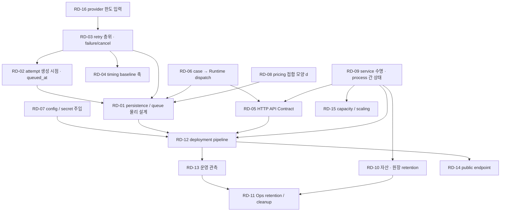

# Runtime/Ops Open Decision Register

**Status:** Working — Open Decision Register\
**Owner:** common/runtime — 김준영\
**Collected at:** 2026-10-02 · `origin/develop` `9ebb55f` (PR #238 merge 직후)\
**Workflow step:** [`runtime-ops-workflow.md`](./runtime-ops-workflow.md) §2 Open Decision 전수 수집\
**Input:** [§0 정합성 검수](./reviews/runtime-ops-consistency-audit-2026-10-02.md) D-01~D-17 · [Tech Spec](./runtime-tech-spec.md) §6·§7·§11·§18 · [Ops Spec](./ops-spec.md) §23 · [Runbook](./deployment-runbook.md) §8 · 관련 Contract/ADR/Owner 결정 · GitHub Issue 상태

> 이 문서는 Runtime/Ops의 **아직 닫히지 않은 결정**을 추적한다.
>
> **이 문서 자체는 Decision의 답을 정하지 않는다.** 각 항목은 「무엇을 정해야 하는가 · 왜 아직 열려 있는가 · 어디까지는 이미 닫혔는가 · 누가 관여하는가 · 무엇과 의존하는가」까지만 적는다.
>
> 답이 확정되면 Contract · Runtime Tech Spec · Ops Spec · Accepted Decision · ADR 중 적절한 SoT로 승격하고, 이 문서에서는 해당 항목을 `CLOSED`(승격 위치 링크) 또는 `SUPERSEDED`로 표시한다. 이 문서를 근거로 직접 규칙을 확정하지 않는다.

## 읽는 법

- **Timing candidate**는 §3 정식 분류 전의 **현재 후보값**이다. A = 구현 전 필수 · B = Provisional Baseline으로 구현 가능 · C = 구현 후 실측 · D = MVP 보류 가능 (workflow §3.2). 후보가 근거 없이 붙은 경우는 없지만 확정 판정도 아니다.
- **Already fixed / Do not reopen**은 이미 Contract · ADR · Owner 결정으로 닫힌 것이다. 논의가 그쪽으로 되돌아가면 이 칸을 먼저 본다.
- **Issue needed**는 `YES` / `NO` / `LATER`만 표시한다. 이번 단계에서 Issue를 만들지 않는다(§5에서 처리).
- **Research needed**는 조사할 질문만 적는다. 실제 조사는 workflow §4다.
- 「Source candidates」의 D-xx는 §0 검수 보고서의 후보 번호다. 줄 번호는 인용하지 않는다(문서가 계속 바뀐다). 절 번호로만 가리킨다.

---

## Summary

| 항목 | 값 |
| --- | --- |
| Open Decision Group | **16** |
| Sub-decisions | **90** |
| Timing A 후보 (group 기준) | 6 — RD-01 · RD-02 · RD-03 · RD-05 · RD-06 · RD-07 |
| Timing B 후보 | 7 — RD-04 · RD-08 · RD-09 · RD-11 · RD-12 · RD-13 · RD-16 |
| Timing C 후보 | 1 — RD-15 |
| Timing D 후보 | 2 — RD-10(단 pre-deploy 전 필수) · RD-14 |
| B/C group 안의 A 후보 sub-decision | RD-08d · RD-09d |

| ID | Decision Group | Owner | Timing | Source candidates |
| --- | --- | --- | --- | --- |
| [RD-01](#rd-01--runtime-persistence--queue-physical-design) | Runtime Persistence / Queue Physical Design | common/runtime | A | D-01 · D-05 · D-06 |
| [RD-02](#rd-02--retry-attempt-생성-시점과-queued_at-의미) | Retry attempt 생성 시점 · `queued_at` 의미 (B-02) | common/runtime | A | D-02 · B-02 |
| [RD-03](#rd-03--retry-책임-층위--failure--cancel-lifecycle) | Retry 책임 층위 · Failure / Cancel lifecycle | common/runtime | A | D-03 · 신규(cancel) |
| [RD-04](#rd-04--execution-timing-provisional-baseline의-축과-제약) | Execution timing Provisional Baseline의 축과 제약 | common/runtime | B | D-04 |
| [RD-05](#rd-05--http-api-contract와-transport-담당) | HTTP API Contract와 transport 담당 | 확정 필요 (api ↔ web) | A | D-08 |
| [RD-06](#rd-06--case--runtime-dispatch-port와-결과-반영-경로) | case → Runtime dispatch port와 결과 반영 경로 | case + common/runtime | A | D-09 |
| [RD-07](#rd-07--runtime-configuration--secret-주입) | Runtime configuration / secret 주입 | common/runtime | A | D-10 |
| [RD-08](#rd-08--pricing--fx-artifact) | Pricing / FX artifact | common/runtime + search | B (d는 A) | D-07 |
| [RD-09](#rd-09--worker-service-수명--analysissource-저장재사용--process-간-recording-상태) | Worker service 수명 · AnalysisSource 저장·재사용 · process 간 recording 상태 | recording + common/runtime | B (d는 A) | D-11 · 신규(process 간 상태) |
| [RD-10](#rd-10--자산--원장-retention과-purge-범위-제품정책) | 자산 · 원장 retention과 purge 범위 (제품/정책) | recording | D (pre-deploy 전) | D-12a |
| [RD-11](#rd-11--ops-retention--cleanup) | Ops retention / cleanup | common/runtime | B | D-12b |
| [RD-12](#rd-12--deployment-pipeline-세부) | Deployment pipeline 세부 | common/runtime | B | D-13 |
| [RD-13](#rd-13--운영-관측-수단) | 운영 관측 수단 | common/runtime | B | D-14 |
| [RD-14](#rd-14--public-endpoint--domain--tls) | Public endpoint / domain / TLS | common/runtime | D | D-15 |
| [RD-15](#rd-15--capacity--scaling-선택) | Capacity / scaling 선택 | common/runtime | C | D-16 |
| [RD-16](#rd-16--선정-providermodel의-운영-한도-입력) | 선정 provider/model의 운영 한도 입력 | search + common/runtime | B → C | D-17 |

---

## RD-01 — Runtime Persistence / Queue Physical Design

**Status:** OPEN\
**Owner:** common/runtime — 김준영(결정) · 정철원(구현)\
**Consult:** case — 유소연(JobRecord 저장 위치·조회) · eval — 김대원(execution/usage 집계) · search — 서어진(usage 노출 모양)\
**Source candidates:** D-01 · D-05 · D-06 (+ Tech Spec §18의 heartbeat persistence · UsageRecord persistence shape)

### Question

Final Contract가 정한 JobExecution · UsageRecord의 논리 의미와 Runtime이 필요로 하는 queue metadata(`available_at` · claim owner · lease)를 MySQL에 **어떤 물리 구조로 두고, 어떤 transaction으로 claim · 전이 · 원장 append를 하는가**.

### Why this is open

- 논리 의미는 닫혔다: JobExecution 필드·enum·불변조건(Contract §4~§9), UsageRecord 기록 대상(Contract §8-14).
- 물리 구현은 상위 문서가 의도적으로 열어뒀다: [ERD ↔ Runtime ADR](../architecture/contracts/adr/adr-erd-runtime-alignment-2026-09-19.md) §5·§6·§7·§10 Non-decisions, Contract §11 「DB 구조 — Runtime 구현 세부」, Tech Spec §4.2 「table 분할·column 이름은 첫 DB 구현에서 고정」.
- develop에는 DB driver · migration · claim query가 하나도 없어(검수 C-01) 선례로 닫힌 것도 없다.

### Already fixed / Do not reopen

- MySQL 8.4 LTS / InnoDB 기반 DB Queue, FastAPI 1 + Worker 1 (Architecture §1-7 A3)
- Redis / Celery / RabbitMQ / SQS / 별도 DLQ는 baseline이 아니다 (Tech Spec §4.1 · §8, Ops §22)
- JobRecord = Intent, Queue row와 같은 개념이 아니다 · JobRecord에 status/attempt/lease/cost를 넣지 않는다 (JobRecord Contract A§3·§10-4)
- JobExecution = 실행 1회분 · status 6값 · 허용 전이 (JobExecution Contract §6)
- 자동 infra retry = same `job_id` + new `execution_id` + `attempt+1`, 기존 row 미부활 (Contract §9-1·2, ADR D7)
- queue scheduling metadata를 Final JobExecution Contract 필드로 승격하지 않는다 (Tech Spec §4.2)
- `produced: ContractRef[]` · `usage_refs: ID[]`는 논리 필드로 확정, 두 방향을 독립 authoritative 원장으로 이중 관리하지 않는다 (ADR D5·D6)
- UsageRecord: 실제 invocation이 시작된 호출만 기록 대상, dispatch 전 cancel/fail은 row 없음, append-only, raw payload 미보존 (Contract §8)
- claim 요구사항 5개 (Tech Spec §4.3), Runtime Integration acceptance 8개 (Tech Spec §16)

### Sub-decisions

- **RD-01a** — queue metadata · JobExecution · JobRecord의 table 분할과 관계(Queue row ↔ JobRecord ↔ JobExecution의 물리 연결)
- **RD-01b** — claim transaction의 exact query · lock 범위 · ORDER BY/LIMIT · commit 시점, claim과 `JobExecution(RUNNING)` 생성의 transaction 경계
- **RD-01c** — `JobExecution.produced` 물리 저장 — JSON vs `job_execution_products` (ADR D5)
- **RD-01d** — `JobExecution.usage_refs` materialization — 별도 저장 vs `UsageRecord.execution_ref` projection (ADR D6)
- **RD-01e** — UsageRecord persistence 시점 — invocation 시작 시 incomplete row 선기록 여부 · final append 시점 (ADR D4)
- **RD-01f** — Worker 소멸 시 in-flight invocation의 UsageRecord 복구 방식과 호출 1건당 중복 append 방지(idempotency 키)
- **RD-01g** — UsageRecord row 물리 shape — `pricing_context` · `token_usage` · `Money`(정밀도·column 분리/JSON, ERD §5.2 「Money 미정」)
- **RD-01h** — heartbeat / lease 기록 방식(어느 row에 어떤 주기로 갱신하는가의 구조. 주기 숫자는 RD-04)
- **RD-01i** — correlation metadata(`trace_id`)를 queue/execution 쪽에 둘지와 위치 (Ops §6-1 「첫 DB Queue/Worker 구현에서 정함」)
- **RD-01j** — DB 접근 계층과 migration 방식(driver · ORM 사용 여부 · migration tool). 현재 `pyproject.toml` 의존성에 DB 계층이 없다

### Dependencies

- **선행:** RD-02(다음 attempt를 언제 만드는지가 queue row · execution row 모양을 바꾼다) · RD-03a/b(retry 단위가 provider in-call인지 execution인지가 RD-01e/f를 바꾼다) · RD-06a/b(JobRecord가 어디에 저장되고 같은 transaction에 들어가는지가 RD-01a를 바꾼다)
- **막는 것:** Worker claim · retry · lease · stale sweep 구현, Final UsageRecord persistence, RD-12(migration 절차), RD-13(queue/lease metric 출처)

### Current evidence

- Contract: [JobExecution](../architecture/contracts/contract-job-execution.md) §4~§11 · [UsageRecord](../architecture/contracts/contract-usage-record.md) §4·§8·§10 · [JobRecord/CaseView](../architecture/contracts/contract-job-record-case-view.md) A§3·§10
- ADR: [ERD ↔ Runtime](../architecture/contracts/adr/adr-erd-runtime-alignment-2026-09-19.md) D4~D6 · §10 Non-decisions (`runtime-db-schema.md`는 「후속 고려」)
- ERD: [`erd-draft.md`](../architecture/erd-draft.md) §5.2 `JobExecution.produced` · `usage_refs` · `Money` 행
- Spec: Tech Spec §4 · §7.4 · §11.1 · §11.4 · §18
- Code: `src/daesingo/common/job_execution.py` — `InMemoryJobExecutionStore`만 존재. `search/ledger.py`의 `UsageRecord`는 Final Contract와 다른 타입 (검수 C-04)

### Implementation impact

닫히지 않으면 MySQL Runtime persistence · migration · Worker claim loop · lease/heartbeat · stale sweep · Final UsageRecord append를 시작할 수 없다. workflow §7 Implementation Plan 우선순위 1·2가 전부 여기에 걸린다.

### Timing candidate

**A** (RD-01h의 주기 값과 RD-01j의 tool 세부는 B 가능)

### Follow-up needs

- **Issue needed:** LATER — 대부분 Runtime 단독 결정이다. RD-01a의 JobRecord 관계는 RD-06과 함께 case 확인이 필요하다
- **Research needed:** MySQL 8.4 InnoDB `SELECT … FOR UPDATE SKIP LOCKED`의 lock 범위 · gap lock · isolation level 영향 · ORDER BY/LIMIT 조합 · 동시 Worker failure mode / JSON column vs 관계 테이블의 조회·검증 tradeoff
- **Pre-implementation spike:** 가능 — 동시 claim 중복 없음 검증
- **Experiment:** 아니오 (P2는 이 결정 뒤의 운영 검증)
- **ADR 후보:** 예 — ADR Non-decision의 `runtime-db-schema` 후속과 연결

---

## RD-02 — Retry attempt 생성 시점과 `queued_at` 의미

**Status:** OPEN\
**Owner:** common/runtime — 김준영\
**Consult:** case — 유소연(CaseView projection) · web — 신유민(진행 표시) · eval — 김대원(queue 대기·latency 집계)\
**Source candidates:** D-02 · 검수 B-02

### Question

자동 retry가 필요할 때 **다음 attempt의 JobExecution을 언제 만드는가**(이전 attempt를 terminal로 기록하는 시점 / `available_at`이 도래한 시점 / 기타), 그리고 그 선택에서 `JobExecution.queued_at`이 무엇을 뜻하는가.

### Why this is open

두 SoT 문장이 동시에 참일 수 없는 상태가 남아 있다.

- Tech Spec §6.3: 「현재 execution terminal 기록 → `available_at` 계산 → 대기 → **시간이 된 뒤 새 JobExecution 생성**」. §0 처리 때 이 순서에 Open Decision 표지를 붙였고 확정 순서가 아니라고 적었다.
- JobRecord/CaseView Contract A§10-6: 대표 execution = attempt 최댓값이며 「attempt 1이 STALE로 판정된 순간에도 `progress[]`는 곧바로 FAILED로 깜빡이지 않는다」. 매핑 STALE→FAILED (B절 §13).
- Tech Spec 순서대로면 backoff 동안 attempt 최댓값이 STALE/FAILED라 대표 상태가 FAILED로 투영된다.

검수 B-02는 해소 경로 후보를 둘 적었다(같은 transaction에서 다음 attempt를 QUEUED로 생성 / projection이 「재시도 예정」을 아는 Contract 변경). **이 Register는 그중 하나를 고르지 않는다.**

### Already fixed / Do not reopen

- 대표 execution = attempt 최댓값, 같은 kind 대표 job = `requested_at` 최신 (Contract A§10-6·§10-7, ADR D3)
- STALE→FAILED · CANCELLED→PARTIAL 매핑 (Contract B§13)
- Worker는 backoff 동안 `sleep()`으로 실행 슬롯을 붙잡지 않는다 (Tech Spec §6.3 첫 문장)
- `available_at`은 Final Contract 필드가 아니다 (JobExecution Contract §10-2, Tech Spec §4.2)
- `queued_at` · `started_at` · `ended_at` 3점으로 queue 대기와 실행 시간을 분리한다는 목적 (Contract §10-2)

### Sub-decisions

- **RD-02a** — 다음 attempt JobExecution의 생성 시점
- **RD-02b** — `queued_at`이 backoff 대기를 포함하는지와 eval latency 집계에서의 의미
- **RD-02c** — RD-02a 선택이 Contract 문구 명확화(JobExecution §10-2 또는 CaseView A§10-6)를 필요로 하는지, 필요하면 개정 경로(Consumer 확인 범위)

### Dependencies

- **선행:** RD-03b(어떤 terminal 상태가 자동 retry 대상인지가 정해져야 「retry 예정」 구간이 정의된다)
- **막는 것:** RD-01a·b(queue row와 execution row의 생성 순서·claim 대상) · CaseView projection 구현(case `get_job_executions` 경로)

### Current evidence

- Spec: Tech Spec §6.3 Open Decision 표지 · §7.2 · §9 · §18
- Contract: [JobRecord/CaseView](../architecture/contracts/contract-job-record-case-view.md) A§10-6 · B§13, [JobExecution](../architecture/contracts/contract-job-execution.md) §10-2
- Review: [§0 검수](./reviews/runtime-ops-consistency-audit-2026-10-02.md) B-02 · §11 「B-02 미결정 유지 → §2」
- Fixture: `scenario_infra_failure_001` 두 스냅샷이 A§10-6과 일치한다고 Contract가 적는다

### Implementation impact

닫히지 않으면 queue schema(RD-01a)와 claim query(RD-01b)를 확정할 수 없고, Worker retry 경로와 CaseView 진행 표시가 서로 다른 가정으로 구현된다.

### Timing candidate

**A**

### Follow-up needs

- **Issue needed:** YES — CaseView 대표 상태 계약(case · web)과 eval 지표가 걸린 공동 확인
- **Research needed:** 아니오
- **Pre-implementation spike:** 아니오
- **Experiment:** 아니오
- **ADR 후보:** Contract 명확화가 필요해지면 예

---

## RD-03 — Retry 책임 층위 · Failure / Cancel lifecycle

**Status:** OPEN\
**Owner:** common/runtime — 김준영\
**Consult:** search — 서어진(provider in-call retry · failure taxonomy) · case — 유소연(timeout · 재개 정책) · readout — 신유민(1-call 불변조건)\
**Source candidates:** D-03 · 신규(cancel 전이 경로 — §0 후보 목록에 없던 항목, 검수 A-08 Impact에서 언급)

### Question

provider adapter 안의 재시도, Runtime의 execution 재시도, case의 timeout/재개 정책이 **각각 어느 실패를 맡는가**, 그리고 사용자 중단(CANCELLED)이 실행 중인 execution에 **어떻게 전달되고 어떤 의미를 갖는가**.

### Why this is open

- Search는 이미 슬롯 안에서 `sleep` 재시도를 한다(`search/config.py` `max_retries=3` · `retry_base_sec=5`, `search/retry.py` `call_with_retry` — 429/5xx만). case timeout 잠정값 150s/70s는 그 대기(최대 35초)를 예산에 포함해 계산됐다([`timeout-fallback.md`](../modules/case/decisions/timeout-fallback.md) 잠정값 표).
- Tech Spec §6은 Runtime execution retry를 「sleep으로 슬롯을 붙잡지 않는다」로 정의한다. 두 층의 관계는 어디에도 적혀 있지 않다.
- JobExecution Contract 머리말의 「같은 `job_id`·새 `attempt`는 자동 인프라 재시도(`STALE`)에 한정한다」가 FAILED(일시 장애) 자동 retry를 배제하는 한정인지, 사용자 Intent와 구분하려는 예시인지 문서가 닫지 않았다. Tech Spec §6.2는 「timeout · 일시 장애 · rate limit은 retry 후보」라고 쓴다.
- CANCELLED는 Contract v1.1이 status와 전이(`QUEUED→CANCELLED` · `RUNNING→CANCELLED`)만 열었다. 사용자 중단이 Runtime에 도달하는 경로, RUNNING execution을 실제로 멈추는지, case의 「timeout 때는 진행 중 Job을 강제 취소하지 않는다」(`timeout-fallback.md`)와 어떻게 공존하는지는 정해지지 않았다. `case-command/v0` Draft에는 중단 command가 없다.

### Already fixed / Do not reopen

- 사용자 재실행 · 이어서 찾기 · 재검색 · 재판독 = 새 JobRecord / 새 `job_id` ([`job-resume-identity-policy.md`](../modules/case/decisions/job-resume-identity-policy.md), Contract A§7)
- timeout 발생 여부 · 중단/계속 정책 · timeout 수치는 case 소유 (cross-cutting A-1, `timeout-fallback.md`). 수치는 runtime 머신 재측정 대기
- search 실행 상한의 단일 권위는 `AnalysisScope.budget.max_latency_sec` (#149 · #180, `timeout-fallback.md`)
- failure code taxonomy는 각 모듈이 소유하고 Runtime은 retryable/non-retryable 정책으로 매핑한다 (Tech Spec §6.2, Contract §6 `failure_kind`)
- readout worker는 1 execution 안에서 readout public 함수를 정확히 1회 호출 · STALE이면 `produced=[]` 허용 (JobExecution Contract §9-9)
- provider 호출은 `search/providers` 경계에서만 (Architecture A4)
- CANCELLED 상태 의미 · 허용 전이 · CANCELLED `produced`는 PARTIAL로만 반영 (Contract §6 · §9-3)
- 자동 retry가 사용자 Intent를 대신 만들지 않는다 (Contract 머리말 2026-09-13 명확화)

### Sub-decisions

- **RD-03a** — provider in-call retry(Search adapter)와 Runtime execution retry의 책임 분담: 어떤 실패를 어느 층이 재시도하는가, 두 층이 겹칠 때의 상한
- **RD-03b** — 자동 execution retry 대상 상태: STALE만인지 FAILED(일시 장애)도 포함하는지 — Contract 머리말 문구 해석 포함
- **RD-03c** — case timeout(`RUN_DEADLINE_EXCEEDED` 등 deadline 계열 실패)을 Runtime이 retry 대상으로 보는지, 「이어서 찾기 = 남은 클립만 새 Job」 정책과의 경계
- **RD-03d** — readout 계열 job에서 retry와 「1 execution : public 호출 1회」 불변조건의 조합(provider in-call retry가 readout 경로에도 존재하는지 포함)
- **RD-03e** — retryable mapping이 놓이는 곳: 모듈 taxonomy → Runtime policy 매핑 표의 위치와 Runtime override 허용 여부 (Tech Spec §6.4 「runtime override 여부」)
- **RD-03f** — provider in-call retry 시 실패 attempt마다 UsageRecord가 남도록 adapter가 usage를 노출하는 모양 (Contract §8-14 「시작된 invocation마다 row」 ↔ 현재 `call_with_retry`는 실패 attempt를 기록하지 않음)
- **RD-03g** — CANCELLED 전이의 trigger 경로: 사용자 중단이 case command → Runtime으로 도달하는 방식 (case-command 표면 확장 여부는 case 소유)
- **RD-03h** — RUNNING execution 중단 semantics: 협조적 중단 · 완료 대기 · 즉시 종료 중 무엇이며, 이미 시작된 invocation의 UsageRecord와 부분 `produced` 처리

### Dependencies

- **선행:** RD-16(provider timeout · rate limit · 실패 과금 사실이 retryable 판단의 입력)
- **막는 것:** RD-02(retry 대상이 정해져야 retry 예정 구간이 정의됨) · RD-01e/f(usage append 단위) · RD-04(retry 대기가 어느 층에 있는지가 lease/STALE 축을 바꿈) · Worker handler와 failure taxonomy 구현

### Current evidence

- Code: `src/daesingo/search/retry.py` `call_with_retry` · `search/config.py` retry 값 · `case/real_e2e.py` timeout 전달
- Spec: Tech Spec §6.2·§6.4 · §12 · §16 #7
- Contract: [JobExecution](../architecture/contracts/contract-job-execution.md) 머리말 · §6 · §9-3 · §9-9, [UsageRecord](../architecture/contracts/contract-usage-record.md) §8-14
- Owner decision: [`timeout-fallback.md`](../modules/case/decisions/timeout-fallback.md) · [`job-resume-identity-policy.md`](../modules/case/decisions/job-resume-identity-policy.md)
- Contract Draft: [`contract-case-command.md`](../modules/case/contracts/contract-case-command.md) §2 (command 4종, 중단 없음)
- Product: [`core-user-flow.md`](../product/core-user-flow.md) 「사용자가 분석을 중단한 경우」
- Issue: #72 OPEN(timeout/retry 수치 환류) · #149 CLOSED(`max_latency_sec` 단일 권위)

### Implementation impact

닫히지 않으면 Worker handler의 실패 분류 · retry 정책 · UsageRecord 단위가 provider 쪽 retry와 이중으로 구현되거나 case timeout과 충돌한다. 중단 버튼의 실제 동작도 구현 기준이 없다.

### Timing candidate

**A** — 책임 층위와 failure/cancel 모양. retry 수치는 RD-04(B)

### Follow-up needs

- **Issue needed:** YES — search · case · readout 공동 결정
- **Research needed:** 아니오 (provider 사실은 RD-16)
- **Pre-implementation spike:** 아니오
- **Experiment:** 아니오
- **ADR 후보:** 예 — 여러 모듈에 장기 영향

---

## RD-04 — Execution timing Provisional Baseline의 축과 제약

**Status:** OPEN\
**Owner:** common/runtime — 김준영 · 정철원(구현)\
**Consult:** case — 유소연(timeout 잠정값과의 호환)\
**Source candidates:** D-04

### Question

retry max · backoff · jitter · lease duration · heartbeat interval · STALE threshold · sweep interval · polling interval 중 **Provisional Baseline으로 어떤 축을 config로 두고, 축 사이 · case timeout과의 제약 관계를 어떻게 정의하는가**. 초기값 숫자 자체는 workflow §6, 최종값은 실측이다.

### Why this is open

- Contract는 값을 Runtime 구현 세부로 위임했다(JobExecution Contract §11).
- Tech Spec §6.4 · §7.4는 값을 열어두고 기존 「최대 3회 · 2s→4s→8s」를 확정값으로 쓰지 않는다고 명시한다.
- case timeout 잠정값(Coarse 150s · Fine 70s, provider 재시도 대기 포함)은 lease · STALE threshold가 job wall보다 짧으면 정상 실행을 STALE로 오판할 수 있다는 제약을 만든다(검수 A-08). 이 관계는 아직 어디에도 적혀 있지 않다.

### Already fixed / Do not reopen

- 값은 Contract 필드가 아니며 Runtime config로 둔다 (Tech Spec §15)
- Worker startup 1회 + loop periodic stale sweep, 별도 reaper 없음 (Tech Spec §7.3)
- case timeout 수치는 case 소유, Runtime 문서에 복제하지 않는다 (Tech Spec §7.4)
- 근거 없는 운영 threshold를 만들지 않는다 (workflow §6)

### Sub-decisions

- **RD-04a** — Provisional Baseline에 포함할 config 축 목록(Tech Spec §15 후보 중 실제로 필요한 것)
- **RD-04b** — lease duration · STALE threshold와 case job wall(timeout + provider 재시도 대기)의 제약 관계
- **RD-04c** — heartbeat interval과 lease duration의 관계 규칙
- **RD-04d** — backoff 계산 규칙의 모양(curve 종류 · jitter 유무 · 상한), `available_at` 계산 규칙
- **RD-04e** — Worker polling interval과 stale sweep interval을 독립 축으로 둘지
- **RD-04f** — 각 Provisional 값에 붙일 검증 실험과 변경 조건(workflow §6 형식)의 연결 대상

### Dependencies

- **선행:** RD-03a(retry 대기가 어느 층에 있는지) · RD-01h(heartbeat 기록 구조) · RD-16a(provider timeout)
- **막는 것:** Worker loop 구현의 기본값 · P2 baseline config

### Current evidence

- Spec: Tech Spec §6.4 · §7.4 · §15 · §18
- Contract: [JobExecution](../architecture/contracts/contract-job-execution.md) §11
- Owner decision: [`timeout-fallback.md`](../modules/case/decisions/timeout-fallback.md) 잠정값 · 「runtime 머신 재측정」
- Experiment: [P2 plan](./experiments/elice-runtime-capacity-smoke-plan.md) Planned

### Implementation impact

축과 제약이 없으면 구현자가 숫자를 임의로 고르게 된다. 숫자 자체는 B baseline이면 구현을 막지 않는다.

### Timing candidate

**B** (최종값 C — P2)

### Follow-up needs

- **Issue needed:** NO — Runtime 단독 reversible. case timeout과의 제약(RD-04b)만 case 확인
- **Research needed:** 아니오
- **Pre-implementation spike:** 아니오
- **Experiment:** 예 — P2에서 조정
- **ADR 후보:** 아니오 (tuning)

---

## RD-05 — HTTP API Contract와 transport 담당

**Status:** OPEN\
**Owner:** 확정 필요 — `api` composition root Owner 김준영(`src/daesingo/api/README.md`) ↔ web 신유민(#106에서 transport 진행 합의)\
**Consult:** case — 유소연(`get_view` · `handle_command` 진입점) · recording — 정철원(upload 입력)\
**Source candidates:** D-08

### Question

Web ↔ Backend HTTP 경계의 **경로 · 응답 모양 · 비동기 작업 조회 방식 · upload 방식**을 무엇으로 하고, 그 계약과 transport 구현을 **누가 소유하는가**.

### Why this is open

- HTTP API 계약 문서가 없다. `case-command/v0` Draft §2는 transport(HTTP 경로 · 인증 · 직렬화)를 범위 밖으로 둔다.
- 담당이 두 곳에 적혀 있다.
  - `api/README.md`: `api/` Owner 김준영.
  - [`design-refinement-w7-baseline.md`](../modules/case/design-refinement-w7-baseline.md) 6순위 · #106 코멘트(2026-09-30): web 구현 일정 때문에 「이번에는 신유민(web)이 진행」.
  - #106 종료 코멘트(2026-10-02): HTTP transport는 Runtime/Ops workflow의 **HTTP API Contract / API composition root**로 추적한다.
- 현재 web에는 HTTP 호출이 없다(fixture 기반, PR #224 OPEN도 화면 흐름). 아직 불일치가 생길 수는 없지만 계약 부재는 그대로다.

### Already fixed / Do not reopen

- FastAPI 1 · 긴 작업은 요청 안에서 끝내지 않고 `202 Accepted` (Architecture §1-5 · A3)
- FastAPI `BackgroundTasks`를 영상 처리 queue로 쓰지 않는다 (Tech Spec §13)
- web은 CaseView projection만 읽는다 · read 진입점 `case.get_view()` · write 진입점 `case.handle_command()` (`case-command/v0` Draft, PR #216)
- transport에 판단을 넣지 않는다 · case 공개 함수만 부른다 · 긴 작업을 요청 안에서 돌리지 않는다 (#106 case 조건 3개)
- command 요청·응답·error code 모양은 case 소유 Draft (`contract-case-command.md`)
- polling은 MVP baseline이지만 polling interval은 Runtime Contract가 아니다 · WebSocket/SSE는 baseline이 아니다 (Tech Spec §9, Ops §22)

### Sub-decisions

- **RD-05a** — HTTP API Contract와 transport 구현의 Owner 확정(`api/` composition root ↔ web 진행분의 관계)
- **RD-05b** — endpoint 집합: CaseView 조회 · command 제출 · upload · 별도 job 상태 조회의 필요 여부
- **RD-05c** — `202 Accepted` 응답 모양과 반환하는 조회 식별자(`case_id` · `case_rev` · `job_id` 중 무엇)
- **RD-05d** — polling 계약(클라이언트가 무엇을 다시 부르는가). interval 숫자는 계약 밖
- **RD-05e** — upload endpoint 방식(요청 형식 · 크기 한도 전달 · 업로드 완료와 source 등록의 관계)
- **RD-05f** — HTTP 수준 직렬화 · error 표현과 case `error.code`의 관계(HTTP status 매핑)
- **RD-05g** — HTTP API Contract 문서의 위치와 Status(Draft → Final 경로)

인증 방식(Architecture A2 「별도 결정」)은 이 group에서 정하지 않는다. RD-05의 경로 설계가 인증을 전제해야 하면 그 의존만 기록한다.

### Dependencies

- **선행:** RD-06c(dispatch 직후 돌려줄 식별자) · RD-09d(upload된 파일을 Worker가 어떻게 읽는가)
- **막는 것:** API composition root 구현 · web 실연동 · deployment smoke endpoint(RD-12) · `/health/*` 외 외부 smoke 경로

### Current evidence

- Code: `src/daesingo/api/README.md`(코드 없음) · `apps/web`(HTTP 호출 0건)
- Contract Draft: [`contract-case-command.md`](../modules/case/contracts/contract-case-command.md) §2·§3
- Owner decision: [`design-refinement-w7-baseline.md`](../modules/case/design-refinement-w7-baseline.md) 6순위
- Spec: Tech Spec §2 · §13 · §14, Architecture §1-5 · §1-7 A2
- Issue/PR: #106 CLOSED(2026-10-02, transport는 Runtime 추적으로 이관) · PR #206 · #216 merged · PR #224 OPEN

### Implementation impact

닫히지 않으면 API composition root와 web 실연동이 서로 다른 경로·응답을 가정한다. web이 이미 진행 중이라 늦을수록 재작업 비용이 커진다.

### Timing candidate

**A** (workflow §5가 Baseline 전 처리 예시로 명시)

### Follow-up needs

- **Issue needed:** YES — api ↔ web Owner 확정과 Contract 합의
- **Research needed:** 아니오
- **Pre-implementation spike:** 아니오
- **Experiment:** 아니오
- **ADR / Contract 후보:** 예 — HTTP API Contract

---

## RD-06 — case → Runtime dispatch port와 결과 반영 경로

**Status:** OPEN\
**Owner:** case — 유소연 + common/runtime — 김준영\
**Consult:** web — 신유민(재선택 가드 표시) · recording — 정철원(export kind dispatch)\
**Source candidates:** D-09

### Question

case가 append한 JobRecord가 **어떤 port로 Runtime queue에 도달하고**, Worker가 만든 결과가 **어떤 경로로 case domain state에 반영되는가**. JobRecord · Case 상태는 어디에 저장되고 dispatch와 같은 transaction에 들어가는가.

### Why this is open

- Architecture §6-2는 「case --JobIntent--> composition root」만 있고 기전이 없다.
- 현재 real 경로는 case adapter가 Search · Fine · Readout을 동기 in-process로 직접 호출하고 JobRecord는 in-memory case store에만 있다(검수 C-03). `RealAdapter.get_job_executions()`는 `NotImplementedError`.
- ERD는 `cases` 테이블 상세 schema를 「미정 / 유소연」으로 둔다.
- 결과 반영 시점은 case 쪽 조건만 있다: 늦게 도착한 결과는 `candidate_id`가 현재 선택과 맞을 때만(`timeout-fallback.md`), 재선택 가드는 「worker 배선 때」(`design-refinement-w7-baseline.md` 6.6순위).

### Already fixed / Do not reopen

- case = orchestrator · common/runtime = executor (Architecture 원칙 6)
- JobRecord Producer = case, append-only · 사용자 재실행 = 새 `job_id` (JobRecord Contract A§2·§3)
- case는 현재 `case_rev`와 맞지 않는 execution의 `produced`를 반영하지 않는다 · old `case_rev` SUCCEEDED는 SUCCEEDED 유지 (JobExecution Contract §9-8, Tech Spec §7.1)
- cache/reuse 판단 Owner는 case, Runtime은 fingerprint를 재계산하지 않는다 (Tech Spec §5)
- `purge_case()`는 JobRecord로 발주하지 않는 관리 동작 (JobRecord Contract A§7)
- `case`가 Worker 구현을 직접 import하지 않는다 · Worker는 orchestration 결정을 만들지 않는다 (Tech Spec §12)
- command 응답은 발주까지만 돌려주고 진행은 다음 CaseView로 본다 (`case-command/v0` §3)

### Sub-decisions

- **RD-06a** — JobRecord → Runtime 도달 방식(같은 transaction에서 enqueue / composition root가 JobRecord를 읽어 enqueue / 기타)
- **RD-06b** — JobRecord · Case aggregate의 저장 위치와 dispatch transaction 경계(Case schema 자체는 case 소유)
- **RD-06c** — dispatch 결과로 API가 받을 식별자와 enqueue 실패의 표현
- **RD-06d** — 같은 `job_id`의 중복 enqueue 방지(Runtime 측). command 수준 `idempotency_key`는 case-command Draft의 case 결정이다
- **RD-06e** — Worker 결과의 case 반영 경로: Worker가 case 공개 함수를 부르는지 / case가 JobExecution을 읽어 반영하는지 / 기타, 그리고 반영 시점
- **RD-06f** — case가 CaseView projection을 위해 JobExecution을 읽는 port(`get_job_executions` 대체)
- **RD-06g** — Job kind → domain public capability dispatch registration의 소유 위치(Worker composition root)와 미구현 capability(export 2종)를 registration에서 다루는 방식

### Dependencies

- **선행:** 없음 (가장 상류). 단 RD-06b는 case의 persistence 결정과 함께 닫힌다
- **막는 것:** RD-01a(Queue row ↔ JobRecord 관계) · RD-05c(202 응답 식별자) · RD-02의 projection 구현 · case 재선택 가드(6.6순위)

### Current evidence

- Code: `case/command.py` · `case/jobs.py` · `case/store.py`(in-memory) · `case/adapters.py`(`get_job_executions` 미구현, 동기 real 경로)
- Architecture: §2 원칙 6 · §6-2 · §8-1
- ERD: [`erd-draft.md`](../architecture/erd-draft.md) §5.2 `Case` 행
- Owner decision: [`timeout-fallback.md`](../modules/case/decisions/timeout-fallback.md) · [`design-refinement-w7-baseline.md`](../modules/case/design-refinement-w7-baseline.md) 6.6순위
- Contract Draft: [`contract-case-command.md`](../modules/case/contracts/contract-case-command.md) §3 · `RUN_NOTICE_ACTION` 중복 제출 항목
- Issue: #47 OPEN(PLATE_IMAGE export 입력) · 검수 C-07(export capability 없음)

### Implementation impact

닫히지 않으면 API의 `202` 경로 · Worker의 결과 반영 · CaseView 진행 표시가 연결되지 않는다. 현재의 동기 real 경로를 비동기로 바꾸는 첫 slice가 여기서 시작된다.

### Timing candidate

**A**

### Follow-up needs

- **Issue needed:** YES — case + common/runtime 공동 결정
- **Research needed:** 아니오
- **Pre-implementation spike:** 아니오
- **Experiment:** 아니오
- **ADR 후보:** 가능 — dispatch port 모양이 여러 kind에 장기 영향

---

## RD-07 — Runtime configuration / secret 주입

**Status:** OPEN\
**Owner:** common/runtime — 김준영\
**Consult:** search — 서어진(`.env` 단일 출처 결정의 Owner) · eval — 김대원(로컬 평가 실행)\
**Source candidates:** D-10

### Question

배포 환경에서 api · worker process가 **config와 secret을 어떤 출처 · 우선순위로 받는가**, Runtime config는 어떤 shape로 모듈에 전달되는가.

### Why this is open

- `common/env.py`는 「설정의 유일한 출처는 이 파일(`.env`)이며 shell 환경변수는 쓰지 않는다」고 쓰고 `os.getcwd()/.env`만 읽는다. 이 규칙은 Search 결정 [`gemini-3.8-proxy-baseline-2026-09-18.md`](../modules/search/decisions/gemini-3.8-proxy-baseline-2026-09-18.md) 5항(「모든 설정은 `.env`에서만 읽는다」, 담당자 로컬 평가 맥락)에서 왔다.
- 이 상태면 Compose `environment:` / `env_file:`로 주입한 값은 무시된다. 배포 주입 경로는 그 결정이 다루지 않았다.
- Ops §4-1은 「동일 image 재사용 · 환경 차이는 runtime 주입 · exact secret source는 deployment workflow 구현 때 확정」까지만 정했다. Runbook §8 「runtime secret source / injection」 미결.
- Tech Spec §18 「Runtime configuration shape」 미결.

### Already fixed / Do not reopen

- provider label · provider config 의미 · validation은 Search 소유 (#153 합의, Tech Spec §15.1)
- `GEMINI_API_KEY → ELICE_ML_API_KEY` rename 방향 · 호환 alias는 `common/env.py`가 아니라 Search config 내부 · alias 제거는 secret migration 뒤 (#153 합의). rename 구현은 Search 작업(검수 C-06)
- common/runtime은 provider semantics를 별도 설정 모델로 복제하지 않는다 (Tech Spec §15.1)
- secret을 repository · image · log에 남기지 않는다 · build-time과 runtime 값 구분 (Ops §4-1, Runbook §2)
- GitHub Actions용 장기 AWS Access Key 없음 (Ops §2-1)

### Sub-decisions

- **RD-07a** — config 출처와 우선순위: `.env` 파일 · process environment · 기타 출처의 관계(Search 결정 5항과의 정합 경로 포함)
- **RD-07b** — Runtime config shape: Runtime 값(DB · polling · retry · lease 등)과 모듈 config를 composition root가 묶어 전달하는 모양
- **RD-07c** — 배포 환경 secret source(EC2 host 파일 · SSM Parameter Store · 기타)와 container 전달 방식
- **RD-07d** — 변수 이름 ownership: 어떤 key를 누가 정의·문서화하는가(`.env.example` 포함)
- **RD-07e** — 로컬 개발 · eval 실행과 배포 실행이 같은 loader를 쓰는지

### Dependencies

- **선행:** 없음. 단 RD-07a는 Search 결정 Owner 확인이 필요하다
- **막는 것:** RD-12(Compose · secret wiring) · Worker/API composition root의 config 조립 · `ELICE_ML_API_KEY` rename의 배포 secret 이름 확정 시점

### Current evidence

- Code: `src/daesingo/common/env.py` · `src/daesingo/search/config.py` · `.env.example`
- Owner decision: [`gemini-3.8-proxy-baseline-2026-09-18.md`](../modules/search/decisions/gemini-3.8-proxy-baseline-2026-09-18.md) 5항
- Spec: Tech Spec §15 · §15.1 · §18, Ops §4-1 · §23, Runbook §2 · §8
- Official input: [`aws-environment.md`](./official-inputs/aws-environment.md)(Parameter Store 사용 사례 존재)
- Issue: #153 OPEN(합의는 2026-09-26 코멘트로 닫힘) · PR #155~#157 merged

### Implementation impact

닫히지 않으면 Compose로 주입한 값이 코드에 도달하지 않거나 secret이 image/host 파일에 섞인다. Docker/Compose slice 전에 닫혀야 한다.

### Timing candidate

**A** (Compose 전)

### Follow-up needs

- **Issue needed:** YES — Search 결정(5항)과 맞물린다
- **Research needed:** 조사 질문만 — Docker Compose의 env 주입과 SSM Parameter Store 연동 패턴 (§4)
- **Pre-implementation spike:** 아니오
- **Experiment:** 아니오
- **ADR 후보:** 가능

---

## RD-08 — Pricing / FX artifact

**Status:** OPEN\
**Owner:** common/runtime — 김준영 + search — 서어진\
**Consult:** eval — 김대원(비용 분모) · case — 유소연(budget 판정) · PM(운영진 문의)\
**Source candidates:** D-07

### Question

`pricing_id`가 가리키는 versioned pricing/FX artifact를 **어디에 어떤 schema로 두고, KRW 환산에 어떤 FX source를 쓰며, Search → Runtime 접합에서 `pricing_id` · `unit` · cost가 어떤 모양으로 넘어오는가**.

### Why this is open

정책은 닫혔고 구현 세부만 남았다(Tech Spec §11.3 「아직 닫히지 않은 것은 정책이 아니라 구현 세부」). `budget-krw-normalization.md` 「남은 것」은 artifact를 「common/runtime 구현 시점에 결정」으로 둔다. 현재는 `fx-krw-2026-09`라는 opaque id만 Mock에 있고 조회 가능한 artifact가 없다. 코드의 비용은 USD(`search/config.py` `*_USD_PER_MILLION`)이고 KRW budget guard는 집행되지 않는다(검수 C-05).

### Already fixed / Do not reopen

- budget 판정 원천 = UsageRecord · `UsageRecord.cost`는 저장 전 KRW 정규화 · `currency="KRW"` · provider-native 통화와 FX provenance는 `pricing_id`가 가리키는 artifact가 보존 ([`budget-krw-normalization.md`](../modules/case/decisions/budget-krw-normalization.md), #19 CLOSED)
- 공용 versioned pricing catalog는 지금 만들지 않는다 · MVP는 Search가 rate를 주입받아 cost를 계산 · `pricing_id`(+`unit`)를 지금 추가 · Runtime은 `pricing_id`를 파싱하지 않고 보존 (#153 합의, UsageRecord Contract §5, Tech Spec §11.3)
- 실행 시점 cost를 이후 가격표로 덮어쓰지 않는다 (Contract §8-2)
- 가격표 숫자의 SSOT는 하나, 사용 주체는 하나로 제한하지 않는다 (Tech Spec §11.3)

### Sub-decisions

- **RD-08a** — versioned pricing/FX artifact의 위치와 schema
- **RD-08b** — KRW 환산 FX source와 갱신 주기
- **RD-08c** — provider/model 가격 변경 이력 보존 방식
- **RD-08d** — Search → Runtime 접합 모양: `pricing_id` · `unit` 값 어휘 · cost(통화 포함)를 Final UsageRecord append에 넘기는 형태 *(Timing A 후보 — RD-01e/g와 함께 필요)*
- **RD-08e** — 팀 원화 크레딧과 provider 표시 가격의 정산 기준(운영진 확인 대상, [`mlapi.md`](./official-inputs/mlapi.md) §5)

### Dependencies

- **선행:** RD-16(선정 모델 · 과금 사실) · RD-08e는 외부 입력
- **막는 것:** RD-01g(UsageRecord shape) · Final UsageRecord append · case KRW budget 집행 · eval 비용 분모

### Current evidence

- Contract: [UsageRecord](../architecture/contracts/contract-usage-record.md) §4·§5·§10
- Owner decision: [`budget-krw-normalization.md`](../modules/case/decisions/budget-krw-normalization.md) 「남은 것」
- Spec: Tech Spec §11.3 · §11.4 · §18
- Code: `search/config.py` USD rate · `search/coarse.py` `max_cost_krw` 미집행
- Official input: [`mlapi.md`](./official-inputs/mlapi.md) §5 · §7.2
- Issue: #153 합의 · #19 CLOSED

### Implementation impact

RD-08d가 없으면 Final UsageRecord append 구현이 Search 쪽 출력 모양을 추정해야 한다. RD-08a~c는 placeholder `pricing_id`로 B baseline 구현이 가능하다.

### Timing candidate

**B** (RD-08d는 A 후보)

### Follow-up needs

- **Issue needed:** LATER — RD-08d는 search와 짧은 확인, RD-08e는 운영진 문의
- **Research needed:** 아니오 (인터넷 조사 아님 — 운영진 문의)
- **Pre-implementation spike:** 아니오
- **Experiment:** 선정 모델 API smoke로 usage · 과금 관측
- **ADR 후보:** 가능 — artifact 위치가 여러 소비자에 영향을 줄 때

---

## RD-09 — Worker service 수명 · AnalysisSource 저장·재사용 · process 간 recording 상태

**Status:** OPEN\
**Owner:** recording — 정철원 + common/runtime — 김준영\
**Consult:** search — 서어진(AnalysisSource 소비 · base64 전송)\
**Source candidates:** D-11 · 신규(process 간 recording 상태 — §0 후보 목록에 없던 항목)

### Question

Worker process 안에서 RecordingService 같은 domain service를 **어떤 범위의 수명으로 두고**, AnalysisSource bytes를 **어디에 · 얼마 동안 · 어느 범위에서 재사용**하며, API와 Worker가 별도 process일 때 **recording 상태(등록된 source · 업로드 파일)를 어떻게 공유**하는가.

### Why this is open

- 현재 recording은 `InMemoryRecordingRepository`와 `_local_analysis` · `_local_clips` dict에 등록 정보와 준비된 bytes를 인스턴스 메모리로 보관하고 `close()` 때 해제한다(Ops §11 구현 사실 주석, 검수 A-07). 그래서 working set이 disk보다 Worker RSS에 먼저 쌓인다.
- Ops §11 · §13은 local reuse를 「성능 최적화 후보이지 durability guarantee가 아님」으로 두고, Object Storage 도입 기준만 정했다.
- **신규:** Ops §2 baseline은 api · worker를 별도 container로 둔다. upload를 API가 받고 `register_local_source(path)`가 process 메모리에 등록되면, 별도 process인 Worker는 그 등록과 파일을 볼 수 없다. 이 경계를 다룬 문서가 없다. Architecture A6(upload 전략 미결 유지)과 겹치지만 A6은 provider upload 전략이고, 이것은 process 간 상태 공유다.

### Already fixed / Do not reopen

- AnalysisSource public 계약에 locator를 노출하지 않는다 · RemoteCopy registry는 recording (AnalysisSource Contract §4.2)
- Object Storage는 baseline 의무가 아니다 · 도입 기준 6개 · 도입해도 storage adapter 뒤에 둔다 (Ops §13)
- local reuse의 성능 이득만으로 Object Storage를 선결하지 않는다 (Ops §13)
- 사용자 External Source는 overwrite/delete하지 않는다 (Ops §10)
- upload 전략은 Architecture에서 고정하지 않는다 (Architecture A6 — 이 group에서 결정하지 않음)
- P2는 concurrency=1에서 working set · restart/reuse를 먼저 관측한다 (Ops §12-1 · §17)

### Sub-decisions

- **RD-09a** — Worker 안 RecordingService(및 다른 domain service) 인스턴스 범위: job별 / process별 / 기타
- **RD-09b** — process-local AnalysisSource reuse를 job 간에 유지할지와 메모리 상한 · 해제 시점
- **RD-09c** — Worker restart 후 동작: 재생성 비용을 수용하는지, 재생성 신호를 어떻게 다루는지
- **RD-09d** — API ↔ Worker 간 recording 상태 공유: 업로드 파일 위치(shared volume 여부)와 SourceAsset 등록 정보가 process 경계를 넘는 방식 *(Timing A 후보 — 첫 비동기 slice가 여기 걸린다)*
- **RD-09e** — Object Storage · shared persistence 검토를 여는 시점(Ops §13 기준을 P2/P3 결과에 적용하는 판단)

### Dependencies

- **선행:** RD-06b(case · recording 상태가 MySQL로 가는지와 함께 본다)
- **막는 것:** RD-05e(upload endpoint) · RD-12(Compose volume) · P2 실험 설계(RD-15) · RD-10(managed asset retention의 대상 위치)

### Current evidence

- Code: `src/daesingo/recording/service.py`(`InMemoryRecordingRepository` · `_local_analysis` · `register_local_source` · `close`) · `recording/materialization.py`(`TemporaryDirectory`는 encode 동안만)
- Spec: Ops §2 · §11 · §12-1 · §13 · §17
- Architecture: §1-7 A6
- Experiment: [P2 plan](./experiments/elice-runtime-capacity-smoke-plan.md) · [experiments router](./experiments/README.md) Decision/ADR 승격 절
- Issue: #95 CLOSED(R3 local reuse 관측)

### Implementation impact

RD-09d가 닫히지 않으면 API에서 받은 영상을 Worker가 처리하는 첫 end-to-end 비동기 경로가 성립하지 않는다. 나머지는 Provisional로 시작하고 P2에서 조정할 수 있다.

### Timing candidate

**B** — 범위 baseline. RD-09d는 **A 후보**, RD-09e는 **C**(P2-B/D 이후)

### Follow-up needs

- **Issue needed:** YES — recording Owner 결정이 필요하다(RD-09a·b·d)
- **Research needed:** 조사 질문만 — Docker Compose shared volume으로 process 간 파일 공유 시 정리·권한 failure mode / Object Storage 사용 패턴(나중)
- **Pre-implementation spike:** 아니오
- **Experiment:** 예 — P2-B/P2-D (RSS · restart · reuse)
- **ADR 후보:** Object Storage 도입 시 예

---

## RD-10 — 자산 · 원장 retention과 purge 범위 (제품/정책)

**Status:** OPEN\
**Owner:** recording — 정철원(보관기간과 일괄 삭제, [`ownership.md`](../management/ownership.md) recording 행)\
**Consult:** common/runtime — 김준영(UsageRecord Contract Owner · PM B-1) · case — 유소연(C-4 학습 데이터 재사용)\
**Source candidates:** D-12a

### Question

Managed Source Copy · AnalysisSource · IncidentClip · DerivedAsset · RemoteCopy의 **보관 기간과 삭제 정책**, 그리고 `purge_case()`가 **UsageRecord(비용 원장)를 지우는지**.

### Why this is open

- AnalysisSource/Derived Contract §11-4 · §5: retention 기간 Pending · 「retention days 임의 확정 금지」.
- UsageRecord Contract §10: 「`purge_case`가 UsageRecord를 지우는지 정하지 않았다 → 정철원과 확인 필요」. 같은 Contract §8-1은 row를 append-only · 삭제 금지로 둔다. 두 문장의 관계가 확인 대기다(Contract §9 머리말).
- Ops §14는 7개 축을 한 목록에 두었다. 이 group은 그중 제품/정책 축만 다룬다(Ops 축은 RD-11).

### Already fixed / Do not reopen

- 사용자 External Source는 purge 대상이 아니다 · `purge_case()`는 Case 관리 자산만 처리 · MVP에서 Case 간 관리 자산 공유 금지 (ERD §4.1 recording 결정, Ops §10)
- `purge_case()`는 `DeletionReport`를 직접 반환하는 관리 동작이며 JobRecord로 발주하지 않는다 (JobRecord Contract A§7)
- 즉시 삭제를 보장할 수 없으면 `PENDING_EXPIRY` (Ops §10)
- 근거 없이 「7일 · 30일」 같은 숫자를 선결하지 않는다 · video asset retention과 UsageRecord retention을 자동 동일시하지 않는다 (Ops §14)
- 학습/평가 데이터 재사용 「한다」 전제 (cross-cutting C-4)

### Sub-decisions

- **RD-10a** — Managed Source Copy · AnalysisSource · IncidentClip · DerivedAsset 보관 기간
- **RD-10b** — RemoteCopy expiry/delete 정책(provider delete 지원 여부와 연결)
- **RD-10c** — UsageRecord retention 기간
- **RD-10d** — `purge_case()`와 UsageRecord의 관계(append-only 불변조건과의 정합)
- **RD-10e** — `DeletionReport` 삭제 감사 기록의 저장 위치와 보관(ERD §5.2 「DeletionReport 미정」)

### Dependencies

- **선행:** RD-09(자산이 실제로 어디에 머무는가)
- **막는 것:** RD-11 cleanup 구현 · pre-deploy review(Ops §21 「cleanup/retention이 실제 adapter에 구현됐는가」)

### Current evidence

- Contract: [AnalysisSource/Derived](../architecture/contracts/contract-analysis-source-derived.md) §5 · §8 · §11 · [UsageRecord](../architecture/contracts/contract-usage-record.md) §8-1 · §10
- ERD: [`erd-draft.md`](../architecture/erd-draft.md) §4.1 · §5.2 `DeletionReport`
- Spec: Ops §10 · §14 · §21, Tech Spec §11.4
- Ownership: [`ownership.md`](../management/ownership.md) recording 소유 항목 · C-4

### Implementation impact

Mock/합성 데이터 중심 개발에서는 구현을 막지 않는다. 실제 사용자 데이터를 받는 배포 전에는 닫혀야 한다.

### Timing candidate

**D** — 단 pre-deploy 전 필수

### Follow-up needs

- **Issue needed:** LATER — pre-deploy review 전에 recording · common/runtime · case
- **Research needed:** 아니오
- **Pre-implementation spike:** 아니오
- **Experiment:** 아니오
- **ADR 후보:** 예 — 사용자 데이터 정책

---

## RD-11 — Ops retention / cleanup

**Status:** OPEN\
**Owner:** common/runtime — 김준영\
**Consult:** recording — 정철원(temp media 정리 · RemoteCopy cleanup 실행)\
**Source candidates:** D-12b

### Question

운영 로그 보관 기간, temp transform output 정리 방식, provider RemoteCopy cleanup 운영을 **무엇으로 실행하는가**.

### Why this is open

Ops §23 「log retention」 · 「provider RemoteCopy cleanup 운영」 미결. 현재 temp는 ffmpeg encode 동안의 `TemporaryDirectory`뿐이지만 Worker 비정상 종료 시 남는 temp의 회수는 정해지지 않았다(Ops §11 관측 대상 「cleanup 이후 steady-state disk」).

### Already fixed / Do not reopen

- 민감 원문을 일반 운영 로그에 남기지 않는다 (Ops §7)
- log retention과 asset retention은 다른 축이다 (Ops §14)
- provider delete API 호출 경계는 provider adapter (Ops §10)

### Sub-decisions

- **RD-11a** — 운영 로그 보관 기간과 rotation 방식
- **RD-11b** — Worker crash 뒤 남은 temp media 회수 방식(startup 정리 등)
- **RD-11c** — RemoteCopy cleanup 운영 실행 주체와 시점(현재 Elice 경로는 RemoteCopy 미사용 — 필요 여부 포함)

### Dependencies

- **선행:** RD-13a(log transport) · RD-10b(RemoteCopy 정책)
- **막는 것:** pre-deploy review · P2 cleanup 관측 기준

### Current evidence

- Spec: Ops §7 · §10 · §11 · §14 · §23
- Code: `recording/materialization.py` `TemporaryDirectory`
- Security: [`pre-deploy-security-review.md`](../management/pre-deploy-security-review.md) §1·§3

### Implementation impact

초기 구현을 막지 않는다. Provisional로 시작하고 배포 전 확인한다.

### Timing candidate

**B**

### Follow-up needs

- **Issue needed:** NO — Runtime 단독
- **Research needed:** 아니오
- **Pre-implementation spike:** 아니오
- **Experiment:** P2 cleanup 관측
- **ADR 후보:** 아니오

---

## RD-12 — Deployment pipeline 세부

**Status:** OPEN\
**Owner:** common/runtime — 김준영\
**Consult:** —\
**Source candidates:** D-13

### Question

api · worker · mysql을 **어떤 image/Compose 모양으로 만들고, 어떤 경로로 EC2에 전달하며, revision을 어떻게 식별 · 기록 · rollback하고, DB migration과 backup을 어떤 절차로 운영하는가**.

### Why this is open

Ops §4 「정확한 Dockerfile/Compose service command는 composition root 구현 후」, §19 Release 원칙은 정했지만 exact 절차는 Runbook §8 미결 10개로 남아 있다. develop에 Dockerfile · compose · deploy workflow가 없다(검수 C-08).

### Already fixed / Do not reopen

- EC2 1대 + Docker Compose(api · worker · mysql) · RDS/ALB/EIP/추가 EC2 미가정 (Ops §2)
- GitHub OIDC → `ktc-github-deploy` AssumeRole · SSM Session Manager/Run Command · SSH key 저장·22번 개방 없음 · `AWS_ACCOUNT_ID`는 Variable · 비-AWS CI에 OIDC 권한 없음 · fork PR을 배포 경로로 쓰지 않음 (Ops §2-1)
- api/worker는 같은 dependency baseline, command만 분리 · MySQL volume은 container layer와 분리 · secret bake 금지 (Ops §4)
- 배포 성공 = revision 식별 + health/readiness + 외부 smoke + 직전 known-good 식별 · commit SHA 식별 · registry면 `latest`만 의존 금지 · DB migration은 자동 rollback 대상으로 가정하지 않음 (Ops §19, Runbook §1·§5)
- Blue-Green/Canary는 기본값이 아님 (Ops §19)

### Sub-decisions

- **RD-12a** — Dockerfile 구조(api · worker 단일 image 여부)와 Compose service · entrypoint
- **RD-12b** — artifact 전달 방식: EC2에서 build / registry(ECR) / S3 경유 / 기타
- **RD-12c** — image tag · digest convention과 known-good revision 기록 위치
- **RD-12d** — SSM Run Command로 실행할 배포 명령과 순서
- **RD-12e** — rollback exact 절차
- **RD-12f** — DB migration 실행 시점 · 순서와 restore 절차
- **RD-12g** — MySQL volume · backup baseline
- **RD-12h** — post-deploy health/readiness + 외부 smoke 연결(smoke 대상 endpoint는 RD-05)

### Dependencies

- **선행:** RD-07(config/secret 주입) · RD-01j(migration 방식) · RD-05(smoke endpoint) · RD-09d(shared volume 여부) · API/Worker composition root 구현
- **막는 것:** 실제 배포 · RD-13(log 수집 위치) · pre-deploy review

### Current evidence

- Spec: Ops §2 · §2-1 · §4 · §4-1 · §19 · §23, Runbook 전체
- Official input: [`aws-environment.md`](./official-inputs/aws-environment.md) §2 · §8(S3 · ECR 사용 가능, 리소스 없음)
- Review: 검수 C-08 · A-10(OIDC 공지 원문 미보존 — 보류 상태)

### Implementation impact

composition root가 생긴 뒤의 slice다(workflow §7 「Deployment automation은 실행 단위가 만들어진 뒤 별도 slice」). 그 전에는 구현을 막지 않는다.

### Timing candidate

**B** (composition root 이후)

### Follow-up needs

- **Issue needed:** NO — Runtime 단독. 단 RD-12b에서 AWS 자원 요청이 필요하면 운영진 확인
- **Research needed:** 조사 질문만 — single EC2 + Compose에서 ECR pull vs host build의 운영 차이 · SSM Run Command 배포 패턴 · MySQL container backup 방식
- **Pre-implementation spike:** OIDC 인증 전용 workflow(`sts get-caller-identity`)는 Ops §2-1 순서상 첫 단계
- **Experiment:** 배포 smoke
- **ADR 후보:** topology가 바뀔 때만

---

## RD-13 — 운영 관측 수단

**Status:** OPEN\
**Owner:** common/runtime — 김준영\
**Consult:** —\
**Source candidates:** D-14

### Question

structured stdout 로그를 **어디로 수집하고**, queue · lease · heartbeat 지표를 **어떤 방식으로 보며**, health 실패 시 **restart/alert를 어떤 정책으로 거는가**.

### Why this is open

Ops §8 1차 관측 수단은 「structured stdout → AWS log collection + Runtime DB query + UsageRecord + EC2 기본 지표」로 방향만 있다. CloudWatch Agent는 서버에 설치되어 있지 않고 Log Group도 없다([`aws-environment.md`](./official-inputs/aws-environment.md) §SSM/CloudWatch · §8). Ops §9 「실제 restart/alert threshold는 deployment 환경이 생긴 뒤」.

### Already fixed / Do not reopen

- Prometheus/Grafana/OpenTelemetry full stack은 baseline이 아니다 · 확장 기준 (Ops §8 · §22)
- key-value structured log · correlation 필드 · `trace_id`는 business identity가 아님 (Ops §6 · §6-1)
- liveness failure = restart 후보 · readiness failure = 처리 불가 신호 · provider 장애를 liveness failure로 보지 않음 (Ops §9, Tech Spec §14)
- 근거 없는 CPU/disk threshold를 만들지 않는다 (workflow §6)

### Sub-decisions

- **RD-13a** — production log transport(CloudWatch Agent / Docker logging driver / 기타)
- **RD-13b** — queue wait · oldest queued · lease/heartbeat 지표를 보는 방식(DB query 수동 / 정기 기록 / 기타)
- **RD-13c** — container restart policy와 health 기반 alert 여부
- **RD-13d** — Worker 상태 관측 방식(heartbeat 기반, Tech Spec §14)의 운영 노출

### Dependencies

- **선행:** RD-12(deployment 모양) · RD-01h(heartbeat 구조)
- **막는 것:** RD-11a(log retention) · P2 관측 수단

### Current evidence

- Spec: Ops §6 · §8 · §9 · §23
- Official input: [`aws-environment.md`](./official-inputs/aws-environment.md) SSM/CloudWatch 절
- Review: 검수 C-09(structured logging 없음)

### Implementation impact

초기 구현을 막지 않는다. structured log 자체(C-09)는 Implementation Gap이며 이 group은 수집·알림 수단만 다룬다.

### Timing candidate

**B** (일부 C)

### Follow-up needs

- **Issue needed:** NO
- **Research needed:** 조사 질문만 — EC2 단일 서버에서 CloudWatch Agent vs Docker awslogs driver의 운영 차이
- **Pre-implementation spike:** 아니오
- **Experiment:** 예 — P2에서 관측 수단 자체를 검증
- **ADR 후보:** 아니오

---

## RD-14 — Public endpoint / domain / TLS

**Status:** OPEN\
**Owner:** common/runtime — 김준영\
**Consult:** web — 신유민 · PM\
**Source candidates:** D-15

### Question

외부 공개 demo나 OAuth 요구가 생길 때 **EIP · DNS · reverse proxy · TLS · callback**을 어떻게 구성하는가.

### Why this is open

Ops §2-2가 trigger 조건과 순서, 「Caddy를 첫 후보로 검토」라는 선택 기준까지만 정했다. 요구 자체가 아직 발생하지 않았다.

### Already fixed / Do not reopen

- EIP는 현재 필수 자원이 아니다 · 무료 서브도메인 공급자를 미리 고정하지 않는다 · 사용자 데이터가 오가면 HTTPS를 pre-deploy 조건으로 검토 · 단순 내부 개발/Real E2E 때문에 domain/EIP/OAuth를 선행하지 않는다 (Ops §2-2)
- Caddy는 고정이 아니라 첫 구현 후보 (Ops §2-2)
- 인증 방식은 Architecture A2 별도 결정 (이 group에서 정하지 않음)

### Sub-decisions

- **RD-14a** — 외부 공개 endpoint 요구 발생 여부와 시점 판단
- **RD-14b** — EIP 요청 여부(운영진 요청 자원, [`aws-environment.md`](./official-inputs/aws-environment.md) §2)
- **RD-14c** — DNS 공급자 · reverse proxy · 인증서 구성
- **RD-14d** — Security Group 80/443 변경 범위

### Dependencies

- **선행:** Architecture A2(인증) · RD-12
- **막는 것:** 외부 smoke(RD-12h)의 외부 경로 부분

### Current evidence

- Spec: Ops §2-2 · §18 Elastic IP · §23
- Official input: [`aws-environment.md`](./official-inputs/aws-environment.md) §2 · 외부 공개 절

### Implementation impact

현재 구현을 막지 않는다.

### Timing candidate

**D** (요구 발생 시)

### Follow-up needs

- **Issue needed:** LATER
- **Research needed:** 그때
- **Pre-implementation spike:** 아니오
- **Experiment:** 아니오
- **ADR 후보:** 아니오

---

## RD-15 — Capacity / scaling 선택

**Status:** OPEN\
**Owner:** common/runtime — 김준영\
**Consult:** recording — 정철원 · search — 서어진\
**Source candidates:** D-16

### Question

P2/P3 결과를 근거로 **Worker concurrency 증가 · EC2 사양 상향 · disk 확장 · Object Storage · RDS · 전용 Queue · GPU** 중 무엇을 언제 택하는가.

### Why this is open

판단 기준은 Ops §13 · §16 · §17 · §18에 이미 있다. 남은 것은 그 기준을 실측에 적용한 **선택**이고, P2는 Planned 상태로 결과가 없다.

### Already fixed / Do not reopen

- Worker 1 baseline · concurrency=1 측정 전에는 Worker 수 증가를 성능 개선책으로 선결하지 않음 · 증가 전 claim/lease concurrent-safe integration test 필요 (Ops §17)
- 전용 Queue · RDS · EC2 상향 · disk 확장 · GPU · ALB의 검토 trigger (Ops §16 · §18)
- Object Storage 도입 기준 (Ops §13)
- 외부 사례 숫자를 baseline으로 복사하지 않는다 (workflow §4)

### Sub-decisions

- **RD-15a** — Worker concurrency를 1보다 늘릴지
- **RD-15b** — EC2 사양 상향 요청 여부
- **RD-15c** — disk working-set guardrail의 기준과 disk 확장 여부
- **RD-15d** — Object Storage · RDS · 전용 Queue · GPU 도입 여부(각 trigger 충족 판단)
- **RD-15e** — P2 이후 P3(30분~1시간) 실행 여부

### Dependencies

- **선행:** RD-09(working set이 어디에 쌓이는가) · P2 실행(Worker · MySQL persistence 구현 후)
- **막는 것:** —

### Current evidence

- Spec: Ops §11 · §13 · §16~§18 · §23
- Experiment: [P2 plan](./experiments/elice-runtime-capacity-smoke-plan.md) Planned
- Official input: [`aws-environment.md`](./official-inputs/aws-environment.md)(t3.medium · usable memory)
- Owner decision: [`timeout-fallback.md`](../modules/case/decisions/timeout-fallback.md) 클립 Job 동시성 1(로컬 측정, runtime 머신 재측정 대기)

### Implementation impact

구현을 막지 않는다. 구현 후 실측의 출력이다.

### Timing candidate

**C**

### Follow-up needs

- **Issue needed:** LATER — Experiment Issue(workflow §7)
- **Research needed:** §4 단계 — CPU-bound(ffmpeg/OCR) vs I/O-bound(provider) scaling · MySQL claim contention
- **Pre-implementation spike:** 아니오
- **Experiment:** 예 — P2 → P3
- **ADR 후보:** 결과에 따라 (Object Storage · RDS · 전용 Queue 도입 시)

---

## RD-16 — 선정 provider/model의 운영 한도 입력

**Status:** OPEN\
**Owner:** search — 서어진(모델 선택 · adapter) + common/runtime — 김준영(실행 정책 반영)\
**Consult:** PM(운영진 문의)\
**Source candidates:** D-17

### Question

선정된 provider/model 경로의 **timeout · RPM/TPM/concurrency · payload/duration 상한 · codec/container · 실패·재시도 과금 · 크레딧 초과 시 Key 삭제 범위와 복구**를 Runtime 실행 정책의 입력으로 무엇으로 볼 것인가.

### Why this is open

[`mlapi.md`](./official-inputs/mlapi.md) §5 「아직 Runtime/Ops 결정 또는 추가 확인이 필요한 것」 목록이 그대로 열려 있다. Search config의 값(retry · per-attempt timeout · inline 크기)은 실험 근거의 Search 내부 값이지 provider 보장값이 아니다. 운영 모델은 `gemini-3.8-flash`이고 PR #231 · #237(2026-10-02)이 다른 모델 경로를 실험 중이라, 모델이 바뀌면 입력이 바뀐다.

### Already fixed / Do not reopen

- Runtime 문서는 provider timeout · rate · codec을 확정값으로 쓰지 않는다 (Tech Spec §6.4 · §7.4, Ops §12-1, `mlapi.md` §5)
- 미확정 외부 정책 = 운영진 문의 · 모델 호환성/과금 관측 = 선정 모델 API smoke · 부하 = Runtime capacity / Real E2E (`mlapi.md` §5)
- Flash 관측을 다른 모델에 일반화하지 않는다 (`mlapi.md` §7.1, Ops §12-1)
- provider 의미 해석은 Search (Tech Spec §15.1)

### Sub-decisions

- **RD-16a** — provider timeout과 per-attempt timeout의 출처(운영진 공지 / smoke 관측)
- **RD-16b** — RPM · TPM · concurrency 한도
- **RD-16c** — payload · duration 상한과 codec/container
- **RD-16d** — 실패 · 재시도 호출의 과금 여부
- **RD-16e** — 크레딧 초과 시 Key 자동 삭제의 범위 · 복구 절차와 Runtime 쪽 대응(budget guard와의 관계)

### Dependencies

- **선행:** Search의 운영 모델 선택(외부 · 다른 모듈 결정)
- **막는 것:** RD-03(retryable 판단) · RD-04(timeout 축) · RD-08(과금 · 정산) · RD-15(concurrency 상한)

### Current evidence

- Official input: [`mlapi.md`](./official-inputs/mlapi.md) §5 · §7
- Code: `search/config.py` · `search/provider.py`
- Issue/PR: #95 CLOSED · PR #231 · #237(다른 모델 실험) · #72 OPEN

### Implementation impact

현재 운영 모델 기준 Provisional로 adapter 정책을 시작할 수 있다. 모델이 바뀌면 다시 확인한다.

### Timing candidate

**B → C** (adapter baseline B, smoke 확인 C)

### Follow-up needs

- **Issue needed:** LATER — 운영진 문의는 PM 경로
- **Research needed:** 아니오 (인터넷 재조사 아님)
- **Pre-implementation spike:** 아니오
- **Experiment:** 선정 모델 API smoke
- **ADR 후보:** 아니오

---

## Dependency graph

화살표는 「앞이 닫혀야 뒤를 확정할 수 있다」는 뜻이다. 답의 방향을 암시하지 않는다.



같은 내용을 text로:

```text
RD-16 provider 한도 ─→ RD-03 retry 층위 ─┬→ RD-02 attempt 생성 시점 ─→ RD-01 persistence/queue
                                         ├→ RD-04 timing 축
                                         └→ RD-01
RD-06 dispatch port ─┬→ RD-01
                     └→ RD-05 HTTP API
RD-08d pricing 접합 ─→ RD-01 (UsageRecord shape)
RD-09 process 간 상태 ─┬→ RD-05 (upload) ─→ RD-12
                       ├→ RD-10 retention ─→ RD-11
                       └→ RD-15 capacity (P2 이후)
RD-07 config ─→ RD-12 deployment ─┬→ RD-13 관측 ─→ RD-11
RD-01 ───────→ RD-12              └→ RD-14 endpoint
```

**상류 노드(선행 Decision이 없거나 외부 입력뿐):** RD-03(RD-16은 Provisional 입력으로 시작 가능) · RD-06 · RD-07 · RD-09d.

---

## Excluded from Open Decision Register

헷갈릴 만한 것만 적는다. 전체 근거는 [§0 검수](./reviews/runtime-ops-consistency-audit-2026-10-02.md) §10 「올리지 말 것」 · §11을 따른다.

### Already decided

| 항목 | 닫힌 근거 |
| --- | --- |
| KRW 정규화 (저장 전 KRW, `currency="KRW"`) | [`budget-krw-normalization.md`](../modules/case/decisions/budget-krw-normalization.md) (2026-09-09, #19 CLOSED). 남은 것은 RD-08 artifact · FX source뿐 |
| Search rate 주입 유지 · 공용 catalog 미도입 · `pricing_id`(+`unit`) 추가 | #153 합의(2026-09-26), UsageRecord Contract §5 표기 정합(2026-10-02). #153 Issue가 OPEN이어도 정책은 닫혔다 |
| provider config 의미 · validation = Search, `ELICE_ML_API_KEY` rename 방향 · alias 위치 | #153 합의, Tech Spec §15.1. 주입 경로(RD-07)와 별개 |
| STALE = Worker 소멸 실행 상태, old `case_rev` SUCCEEDED는 SUCCEEDED 유지 | JobExecution Contract §6 · §9-8. Architecture §8-2 · `worker/README.md`는 §0 처리에서 정합화 |
| 사용자 재실행 = 새 `job_id`, 자동 retry = same `job_id` + new `execution_id` + attempt+1 | Contract · ADR D7 · PR #46 |
| 같은 kind 대표 job = `requested_at` 최신, 대표 execution = attempt 최댓값 | JobRecord/CaseView Contract A§10-6·§10-7, ADR D3. RD-02는 이 규칙을 지키는 **구현 시점**의 문제이지 규칙 재검토가 아니다 |
| FastAPI 1 + Worker 1 + MySQL 8.4 DB Queue | Architecture A3 |
| OIDC + SSM 배포 인증 · 접속, `ktc-github-deploy` | Ops §2-1 (공지 원문 보존은 검수 A-10 보류 — 결정 재오픈 사유 아님) |
| timeout 소유 = case, 잠정값 150s/70s · 클립 Job 동시성 1 | cross-cutting A-1, `timeout-fallback.md`. 확정은 runtime 머신 재측정 대기 — Runtime 결정이 아니다 |
| `max_latency_sec` 단일 권위 | #149 CLOSED · #180 |
| Web → case write command 표면 | `case-command/v0` Draft · PR #216, #106 종료(2026-10-02). HTTP transport만 RD-05로 남음 |

### Implementation Gap (§7 Implementation Plan 대상)

| 항목 | 근거 |
| --- | --- |
| MySQL Queue · JobExecution · UsageRecord persistence 없음 | 검수 C-01 — 물리 설계 선택은 RD-01, 「없다」는 사실 자체는 Gap |
| API / Worker composition root · `/health/live` · `/health/ready` 없음 | 검수 C-02 · C-03 — endpoint 의미는 Tech Spec §14로 닫힘 |
| Final UsageRecord Producer 없음 · Search 내부 ledger 타입 불일치 | 검수 C-04 — 접합 모양만 RD-08d · RD-03f |
| KRW budget guard 미집행 | 검수 C-05 |
| `ELICE_ML_API_KEY` rename 미구현 | 검수 C-06 (Search 작업) |
| `REPORT_VIDEO_EXPORT` · `PLATE_IMAGE_EXPORT` public capability 없음 | 검수 C-07, #47 OPEN (recording 작업) — registration 처리 방식만 RD-06g |
| Docker / Compose · deployment workflow 없음 | 검수 C-08 — 세부 선택은 RD-12 |
| structured logging · correlation 없음 | 검수 C-09 — 수집 수단만 RD-13 |
| Runtime boundary 규칙 · MySQL integration CI · dispatch registration test 없음 | 검수 C-10 |
| Ruff · type checker · secret scan CI gate | Ops §19 목표 순서 · §23 — Implementation Plan의 CI 묶음. type checker 도구 선택도 그 안에서 다룬다 |

### Experiment-derived (최종 숫자 · 선택)

| 항목 | 처리 |
| --- | --- |
| retry max · backoff · jitter · lease · heartbeat · STALE threshold · sweep · polling의 **최종값** | 축과 제약만 RD-04, 초기값은 workflow §6, 최종값은 P2 |
| Worker concurrency 최종 숫자 · CPU/disk threshold | RD-15 선택의 입력. 숫자 자체를 Register에 두지 않는다 |
| case timeout 확정값 | case 소유, runtime 머신 재측정 |
| AnalysisSource profile 값 · proxy profile | recording · search 소유 (Architecture A6 · Contract Pending) |

### 다른 모듈 소유 (Register에서 다루지 않음)

| 항목 | 소유 |
| --- | --- |
| `RUN_NOTICE_ACTION` 중복 제출 `idempotency_key` · 발주가 `case_rev`를 올리는지 | case — `case-command/v0` Draft. Runtime 쪽 enqueue 중복 방지만 RD-06d |
| 클립 분할 발주 · overlap · 중복 제거 | case · search — #168 |
| readout attempt ≥ 2일 때 logical run 처리 | readout — UsageRecord Contract §7 |
| 인증 방식 | Architecture A2 |
| upload 전략(원본 · 부분 · proxy · 분할) | Architecture A6 · recording — process 간 공유 경계만 RD-09d |

### 중복으로 병합

| 후보 | 병합 위치 |
| --- | --- |
| D-01 · D-05 · D-06 | RD-01 sub-decision a~f |
| Tech Spec §18 「UsageRecord persistence shape」 · 「heartbeat persistence 방식」 | RD-01g · RD-01h |
| Ops §23 「Dockerfile/Compose」 · 「MySQL volume/backup」 · 「immutable release」 · 「rollback」 · 「post-deploy health/smoke」 · 「OIDC+SSM workflow 구현」 · 「artifact 전달」 + Runbook §8 | RD-12 (OIDC+SSM 방식 자체는 제외 — 이미 결정) |
| Ops §23 「build-time/runtime 주입」 · Runbook §8 「runtime secret source」 | RD-07 |
| Ops §23 「disk working-set guardrail」 · 「capacity/scaling threshold」 · 「P2 수행」 · 「P3 계획」 | RD-15 (P2 수행 자체는 Experiment) |
| Ops §23 「Object Storage 사용 범위」 | RD-09e · RD-15d |
| Ops §23 「Managed asset retention」 · 「UsageRecord retention」 | RD-10 |
| Ops §23 「log retention」 · 「provider RemoteCopy cleanup 운영」 | RD-11 |
| D-12 (a·b 혼재) | RD-10(제품/정책) · RD-11(Ops)로 분리 — Owner가 다르다 |

---

## Change log

| 날짜 | 변경 | 기준 |
| --- | --- | --- |
| 2026-10-02 | 최초 작성 — D-01~D-17 정규화, 16 group / 90 sub-decision | `origin/develop` `9ebb55f` |
