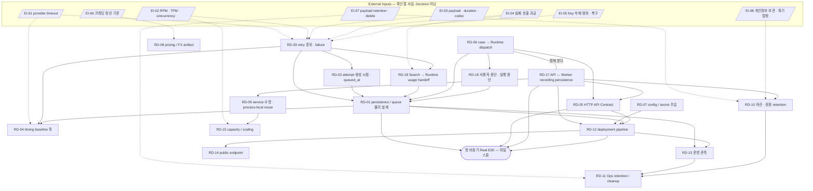

# Runtime/Ops Open Decision Register

**Status:** Working — Open Decision Register\
**Owner:** common/runtime — 김준영\
**Collected at:** 2026-10-02 · `origin/develop` `9ebb55f` (PR #238 merge 직후)\
**Revised:** 2026-10-03 · 같은 기준 SHA — Decision / External Input / Experiment / Follow-up 경계 정리 ([Change log](#change-log))\
**§5 tracking:** 2026-10-03 · `origin/develop` `43dd8ec` — Timing A 9개 Decision Issue 연결 · RD-01 일부 CLOSED\
**§5 closure:** 2026-10-04 — Timing A **9/9 CLOSED** (#244 ~ #250 ACCEPTED, PR #253) ([§5 진행 상태](#5-진행-상태--timing-a))\
**Workflow step:** [`runtime-ops-workflow.md`](./runtime-ops-workflow.md) §2 Open Decision 전수 수집\
**Input:** [§0 정합성 검수](./reviews/runtime-ops-consistency-audit-2026-10-02.md) D-01~D-17 · [Tech Spec](./runtime-tech-spec.md) §6·§7·§11·§18 · [Ops Spec](./ops-spec.md) §23 · [Runbook](./deployment-runbook.md) §8 · 관련 Contract/ADR/Owner 결정 · GitHub Issue 상태

> 이 문서는 Runtime/Ops의 **아직 닫히지 않은 결정**을 추적한다.
>
> **이 문서 자체는 Decision의 답을 정하지 않는다.** 각 항목은 「무엇을 정해야 하는가 · 왜 아직 열려 있는가 · 어디까지는 이미 닫혔는가 · 누가 관여하는가 · 무엇과 의존하는가」까지만 적는다.
>
> 답이 확정되면 Contract · Runtime Tech Spec · Ops Spec · Accepted Decision · ADR 중 적절한 SoT로 승격하고, 이 문서에서는 해당 항목을 `CLOSED`(승격 위치 링크) 또는 `SUPERSEDED`로 표시한다. 이 문서를 근거로 직접 규칙을 확정하지 않는다.

## 읽는 법

이 문서는 열린 항목을 네 가지로 나눈다. **Sub-decisions에는 Decision만 둔다.**

| 분류 | 뜻 | 어디에 두는가 |
| --- | --- | --- |
| **Decision** | 여러 선택지 가운데 우리가 정책·구조를 골라야 한다 | 각 RD group의 Sub-decisions |
| **External Input** | 우리가 고르는 것이 아니라 밖에서 확인해야 하는 사실(운영진 공지 · provider 정책 · 선정 모델 smoke · 법령 · 공식 가이드). Decision 가능한 범위를 좁힌다(workflow §1) | [External Inputs](#external-inputs--decision이-아니라-확인할-사실) — `EI-xx` |
| **Experiment** | 구현 후 측정으로 얻는 값 · 근거 | 각 group의 Follow-up needs 「Experiment」 · 하단 [Experiment-derived](#experiment-derived-최종-숫자--선택) |
| **Follow-up / Trigger** | 결정 뒤에 할 문서 · Issue · 검증 작업, 또는 Decision을 다시 여는 조건 | 각 group의 Follow-up needs 「Follow-up」 · 「Trigger」 |

이미 결정된 것과 구현만 안 된 것(Implementation Gap)은 하단 [제외 표](#excluded-from-open-decision-register)에 둔다.

- **Group 경계:** Owner · Contract surface · Timing · 의존 관계가 같으면 한 group, 그중 하나가 현저히 다르면 분리를 검토한다. 특히 B/C/D group 안에 구현을 막는 A sub-decision을 예외로 두지 않는다(A group 안의 일부 세부가 B로 내려갈 수 있다는 표시는 허용).
- **Timing candidate**는 §3 정식 분류 전의 **현재 후보값**이다. A = 구현 전 필수 · B = Provisional Baseline으로 구현 가능 · C = 구현 후 실측 · D = MVP 보류 가능 (workflow §3.2). 후보가 근거 없이 붙은 경우는 없지만 확정 판정도 아니다. §3 정식 분류(Timing · Gate · 결정권 · Closure route · §4 조사 필요)는 [`decision-classification.md`](./decision-classification.md)에 있다.
- **Already fixed / Do not reopen**은 이미 Contract · ADR · Owner 결정으로 닫힌 것이다. 논의가 그쪽으로 되돌아가면 이 칸을 먼저 본다.
- **Issue needed**는 `YES` / `NO` / `LATER`만 표시한다. 이번 단계에서 Issue를 만들지 않는다(§5에서 처리).
- **Research needed**는 조사할 질문만 적는다. 실제 조사는 workflow §4다.
- 「Source candidates」의 D-xx는 §0 검수 보고서의 후보 번호다. 줄 번호는 인용하지 않는다(문서가 계속 바뀐다). 절 번호로만 가리킨다.

---

## Summary

| 항목 | 값 |
| --- | --- |
| Open Decision Group | **18** — RD-01~RD-15 · RD-17~RD-19 (RD-16은 External Inputs로 해체, 번호 재사용 안 함) |
| Sub-decisions | **85** |
| Timing A 후보 (group 기준) | 9 — RD-01 · RD-02 · RD-03 · RD-05 · RD-06 · RD-07 · RD-17 · RD-18 · RD-19 — **workflow §5에서 9/9 CLOSED (2026-10-04)** |
| Timing B 후보 | 6 — RD-04 · RD-08 · RD-09 · RD-11 · RD-12 · RD-13 |
| Timing C 후보 | 1 — RD-15 |
| Timing D 후보 | 2 — RD-10(단 pre-deploy 전 필수) · RD-14 |
| 다른 Timing group 안의 A 후보 sub-decision | 없음 |
| External Input | **8** — EI-01~EI-08 |
| Sub-decision에서 내린 비-Decision | 6 — Follow-up 3 · Trigger 3 ([목록](#sub-decision에서-내린-항목)) |

| ID | Decision Group | Owner | Timing | Source candidates |
| --- | --- | --- | --- | --- |
| [RD-01](#rd-01--runtime-persistence--queue-physical-design) | Runtime Persistence / Queue Physical Design | common/runtime | A | D-01 · D-05 · D-06 |
| [RD-02](#rd-02--retry-attempt-생성-시점과-queued_at-의미) | Retry attempt 생성 시점 · `queued_at` 의미 (B-02) | common/runtime | A | D-02 · B-02 |
| [RD-03](#rd-03--retry-책임-층위--failure-lifecycle) | Retry 책임 층위 · Failure lifecycle | common/runtime | A | D-03 · D-17 일부 |
| [RD-04](#rd-04--execution-timing-provisional-baseline의-축과-제약) | Execution timing Provisional Baseline의 축과 제약 | common/runtime | B | D-04 |
| [RD-05](#rd-05--http-api-contract와-transport-담당) | HTTP API Contract와 transport 담당 | `api` composition root (Web Consumer) — [#247](https://github.com/kakaotechcampus-4/ktc4-chonnam-2/issues/247) | A | D-08 |
| [RD-06](#rd-06--case--runtime-dispatch-port와-결과-반영-경로) | case → Runtime dispatch port와 결과 반영 경로 | case + common/runtime | A | D-09 |
| [RD-07](#rd-07--runtime-configuration--secret-주입) | Runtime configuration / secret 주입 | common/runtime | A | D-10 |
| [RD-08](#rd-08--pricing--fx-artifact) | Pricing / FX artifact | common/runtime + search | B | D-07 |
| [RD-09](#rd-09--worker-domain-service-수명--analysissource-process-local-reuse) | Worker domain service 수명 · AnalysisSource process-local reuse | recording + common/runtime | B | D-11 |
| [RD-10](#rd-10--자산--원장-retention과-purge-범위-제품정책) | 자산 · 원장 retention과 purge 범위 (제품/정책) | recording | D (pre-deploy 전) | D-12a |
| [RD-11](#rd-11--ops-retention--cleanup) | Ops retention / cleanup | common/runtime | B | D-12b |
| [RD-12](#rd-12--deployment-pipeline-세부) | Deployment pipeline 세부 | common/runtime | B | D-13 |
| [RD-13](#rd-13--운영-관측-수단) | 운영 관측 수단 | common/runtime | B | D-14 |
| [RD-14](#rd-14--public-endpoint--domain--tls) | Public endpoint / domain / TLS | common/runtime | D | D-15 |
| [RD-15](#rd-15--capacity--scaling-선택) | Capacity / scaling 선택 | common/runtime | C | D-16 |
| [RD-17](#rd-17--api--worker-recording--source-persistence-boundary) | API ↔ Worker Recording / Source Persistence Boundary | recording + common/runtime | A | 신규(process 간 recording 상태) |
| [RD-18](#rd-18--search--runtime-usage--pricing-handoff) | Search → Runtime Usage / Pricing Handoff | search + common/runtime | A | D-07 일부 · D-03 일부 |
| [RD-19](#rd-19--사용자-중단cancellation-전달-경로와-실행-중단-semantics) | 사용자 중단(Cancellation) 전달 경로와 실행 중단 semantics | case + common/runtime | A | 신규(cancel 전이 경로) |

---

## §5 진행 상태 — Timing A

workflow §5(구현 전 필수 Decision 처리)의 추적표다. **결정의 선택지 · 근거 · Owner 의견은 각 Decision Issue가 담고, 확정 규칙은 아래 SoT에 있다. 여기에는 복제하지 않는다.** Umbrella: [#251](https://github.com/kakaotechcampus-4/ktc4-chonnam-2/issues/251). spike 근거: [`experiments/pre-implementation-spike-2026-10-03.md`](./experiments/pre-implementation-spike-2026-10-03.md).

2026-10-04 기준 Timing A **9/9 CLOSED**다. 각 Issue의 마지막 결정자 댓글(Runtime/API Owner 최종 결정)이 authority이며, 그 결정을 아래 SoT로 승격했다(PR #253).

| RD | §5 Status | Decision | 최종 결정 (한 줄) | 승격된 SoT | 다른 Owner 후속 (비차단) |
| --- | --- | --- | --- | --- | --- |
| RD-01 | **ACCEPTED / CLOSED** | [#250](https://github.com/kakaotechcampus-4/ktc4-chonnam-2/issues/250) | `job_execution` 단일 table = 실행 원장 + queue · RC + `(status, available_at, execution_id)` + `SKIP LOCKED` · `produced` JSON · `usage_refs` projection · durable usage in-flight · RUNNING row lease + 별도 heartbeat thread · `trace_id` 내부 column · PyMySQL + SQLAlchemy Core · Alembic forward-only | [Tech Spec](./runtime-tech-spec.md) §4.2 · §4.3 · §4.4 · §4.5 · §7.2 · §11.1 | `DECIMAL` precision/scale은 첫 migration(구현 세부) |
| RD-02 | **ACCEPTED / CLOSED** | [#248](https://github.com/kakaotechcampus-4/ktc4-chonnam-2/issues/248) | 다음 attempt는 이전 attempt terminal과 같은 transaction에서 `QUEUED` 생성 · `queued_at` = 생성 시각(attempt ≥ 2는 backoff 포함) · `available_at`은 내부 | [Tech Spec](./runtime-tech-spec.md) §6.3 · [JobExecution Contract](../architecture/contracts/contract-job-execution.md) §5 | — |
| RD-03 | **ACCEPTED / CLOSED** | [#244](https://github.com/kakaotechcampus-4/ktc4-chonnam-2/issues/244) | 일시 장애 = Search in-call retry · Runtime 자동 retry = `STALE`만 · `FAILED` terminal · 매핑표 · override 없음 · 사용자 재시도 = 새 `job_id` | [Tech Spec](./runtime-tech-spec.md) §6.2 | Search taxonomy에 계정 수준 실패 kind(search) |
| RD-05 | **ACCEPTED / CLOSED** | [#247](https://github.com/kakaotechcampus-4/ktc4-chonnam-2/issues/247) | HTTP Contract Producer = `api` composition root · Web Consumer · 필수 surface(`/cases` · `/sources` · `/commands` · `/view` · `/frames` · `/assets` · `/health/*`) · 발주 있으면 202 / 없으면 200 · body = case-command 응답 · 1 request = 1 file | [Tech Spec](./runtime-tech-spec.md) §13 (방향) — **HTTP API Contract 문서는 다음 단계** | HTTP API Contract 작성 → Web 필수 Consumer review · Case/Recording boundary review(api) · case-command 시작 · 중단 command(case) |
| RD-06 | **ACCEPTED / CLOSED** | [#245](https://github.com/kakaotechcampus-4/ktc4-chonnam-2/issues/245) | Case · JobRecord · Runtime이 같은 MySQL · composition root가 transaction 소유(각 repository 독자 commit 금지) · 결과 반영 push(case 반영 함수 `execution_id` idempotent) · 단일 kind registry | [Tech Spec](./runtime-tech-spec.md) §12.1 ~ §12.4 · [JobExecution Contract](../architecture/contracts/contract-job-execution.md) §9-8 · [Architecture](../architecture/module-architecture.md) §4-모듈5 ④ · §8-2 | `CaseStore` MySQL · 반영 함수(case) |
| RD-07 | **ACCEPTED / CLOSED** | [#249](https://github.com/kakaotechcampus-4/ktc4-chonnam-2/issues/249) | 값은 파일에서만 · `DAESINGO_ENV_FILE`은 composition root만 해석(`load_env_file()` 기본 = `cwd/.env`) · Parameter Store → EC2 role → host 보호 파일 → Compose secret · GitHub Actions는 OIDC → SSM 지시만 · recreate rotation · startup fail-fast(key 이름만 로그) | [Tech Spec](./runtime-tech-spec.md) §15.2 · [Ops Spec](./ops-spec.md) §4-1 · [Runbook](./deployment-runbook.md) §2 | Search 결정 5항 문구 정합(search) · M6 전 EC2 role 권한 확인 |
| RD-17 | **ACCEPTED / CLOSED** | [#246](https://github.com/kakaotechcampus-4/ktc4-chonnam-2/issues/246) | single-host shared mount 1개 · 같은 numeric UID · staging → `fsync` → same-mount publish → metadata commit · recording MySQL metadata · process 경계를 넘는 ref는 persistent(CaseView FrameRef 포함) | [Ops Spec](./ops-spec.md) §4-2 | recording MySQL repository · FrameRef durability 방식 · persistent 목록 확정(recording) |
| RD-18 | **ACCEPTED / CLOSED** | [#244](https://github.com/kakaotechcampus-4/ktc4-chonnam-2/issues/244) | provider HTTP 시도마다 usage identity 1개 · begin = durable in-flight(실패 시 HTTP 없음) · 완료 관측 durable 보존 · Run 관계 확정 뒤 Final 1건 · 실제 Run 미생성일 때만 `RUN_NOT_PRODUCED` · KRW 정규화 = Search, Runtime은 검증 · 보존 · 미확정 요율은 `amount=null` | [Tech Spec](./runtime-tech-spec.md) §11.1 · §11.3 · [UsageRecord Contract](../architecture/contracts/contract-usage-record.md) §2 | Search adapter tracker 호출 · 요율 기본값 0.0과 미확정 구분(search) · budget guard `amount=null`(case) |
| RD-19 | **ACCEPTED / CLOSED** | [#245](https://github.com/kakaotechcampus-4/ktc4-chonnam-2/issues/245) | 중단 command → 같은 transaction에서 cancel · QUEUED 즉시 CANCELLED · RUNNING은 capability 사이 checkpoint에서 협력적 중단(capability 내부 retry는 반환까지 계속) · first commit wins · 늦은 결과 배제 = 중단된 `job_id` 집합 + context 유효성(`case_rev` 일치 아님) | [Tech Spec](./runtime-tech-spec.md) §12.5 · [JobExecution Contract](../architecture/contracts/contract-job-execution.md) §9-8 | 중단 command · `running_jobs` 정의 문구(case) |

- 「다른 Owner 후속」은 각 Owner 문서 · 구현 범위이며 Runtime 구현을 막지 않는다. 결정 때문에 생긴 cross-module 문구 중 Runtime 소유 문서와 case Owner가 요청한 Contract · Architecture 문구는 PR #253에서 정합했고, 다른 모듈 문서는 그 Owner가 고친다.
- ADR: 분류 §3이 RD-03 · RD-17을 Follow-up ADR로 두었다. 이번 closure는 Primary route(JOINT_ISSUE)로 닫았고 결정 원문 · 선택지 · 근거는 각 Issue에 있다. 별도 ADR 문서는 PR #253에서 만들지 않았다.
- **다음 순서.** RD-05에서 HTTP API Contract를 Runtime/API planning의 선행 입력으로 정했으므로 이번 iteration은 `§5 closure → RD-05 HTTP API Contract SoT 작성 · Consumer review → §6 Provisional Baseline v0.1 → §7 Runtime Implementation Plan` 순으로 간다. 새 workflow 단계가 아니라 §5에서 결정된 Contract 승격 작업이다.
- 기존 Issue: [#153](https://github.com/kakaotechcampus-4/ktc4-chonnam-2/issues/153) 합의는 Already fixed로 두고 남은 전달 모양 · 주입 경로만 #244 · #249에서 닫았다.

### §5 → §6 Baseline 입력

§5 결정이 필요로 하는 숫자다. **값은 여기서 정하지 않는다**(workflow §6). 축과 제약의 SoT는 [RD-04](#rd-04--execution-timing-provisional-baseline의-축과-제약)이며 아래는 §6 입력 목록이다.

| Baseline parameter | Needed by | Allowed range / constraint | Evidence | Experiment |
| --- | --- | --- | --- | --- |
| STALE 자동 retry 상한 | #244 R-1 · #248 | 0 이상 정수. 자동 retry는 STALE에만 적용(provider 일시 장애 재시도는 Search 소유 값) | JobExecution 머리말 · fixture `scenario_infra_failure_001` | P2 · Real E2E의 STALE 빈도 |
| STALE retry backoff (`available_at` 계산) | #248 Q-1 | Worker가 sleep하지 않음 · attempt ≥ 2의 `queued_at → started_at`에 포함됨 | Tech Spec §6.3 | P2 |
| lease duration · STALE threshold | RD-01h · RD-04b | 정상 실행 중 한 번의 sync provider 호출 · ffmpeg 구간보다 길거나 heartbeat가 그 구간에도 갱신돼야 함(별도 heartbeat thread) · case job wall(`max_latency_sec`)과의 관계는 RD-04b | Tech Spec §7 · `timeout-fallback.md` | P2 — 실제 호출 지연 분포 |
| heartbeat interval | RD-01h · #245 C-3 | lease duration보다 충분히 짧음 · 중단 요청 관찰 지연의 하한을 정함 | #245 C-3 | P2 |
| stale sweep interval · Worker polling interval | RD-04e | 독립 config 축 여부는 RD-04 | Tech Spec §7.3 | P2 |
| Runtime session `innodb_lock_wait_timeout` | Tech Spec §4.3 | claim은 `SKIP LOCKED`라 대기하지 않음 · 전이 UPDATE의 대기 상한 | spike S1 · S2 | Runtime integration |
| DB pool pre-ping · recycle | Tech Spec §4.4 | MySQL `wait_timeout`보다 짧은 recycle | Research 01 §4.10 | 구현 test(Research 01 Spike F) |
| upload 전체 body 한도 | #247 H-5 | Starlette ≥ 1.6 middleware로 강제 · 단일 EC2 disk working set(Ops §11) 안 | Research 02 §4.7 | Research 02 Spike E · G · P2 |
| staging 잔여 · orphan 파일 정리 나이 | #246 S-2 | 진행 중 upload를 지우지 않을 만큼 김 | Research 02 §4.4 · §5 | Research 02 Spike D · F |
| UsageRecord `cost_amount` precision / scale | Tech Spec §4.5 | Contract 예시와 cost 생산자(#244 U-2) 출력 자릿수를 덮음 · 초과 자릿수는 거부 | UsageRecord Contract §4 · §6 | migration test — §6 값이 아니라 RD-01g 안의 구현 세부로 **첫 migration**에서 고정 |

---

## RD-01 — Runtime Persistence / Queue Physical Design

**Status:** CLOSED — 2026-10-04 · Decision [#250](https://github.com/kakaotechcampus-4/ktc4-chonnam-2/issues/250) ACCEPTED → [Tech Spec](./runtime-tech-spec.md) §4.2 · §4.3 · §4.4 · §4.5 · §7.2 · §11.1 (01b 핵심 규칙 · 01c · 01d · 01g · 01j는 2026-10-03, 나머지는 upstream #244 · #245 · #248 결정 뒤 2026-10-04). `DECIMAL` precision/scale은 첫 migration\
**Owner:** common/runtime — 김준영(결정) · 정철원(구현)\
**Consult:** case — 유소연(JobRecord 저장 위치·조회) · eval — 김대원(execution/usage 집계) · search — 서어진(usage 노출 모양)\
**Source candidates:** D-01 · D-05 · D-06 (+ Tech Spec §18의 heartbeat persistence · UsageRecord persistence shape)

### Question

Final Contract가 정한 JobExecution · UsageRecord의 논리 의미와 Runtime이 필요로 하는 queue metadata(`available_at` · claim owner · lease)를 MySQL에 **어떤 물리 구조로 두고, 어떤 transaction으로 claim · 전이 · 원장 append를 하는가**.

### Why this is open

- 논리 의미는 닫혔다: JobExecution 필드·enum·불변조건(Contract §4~§9), UsageRecord 기록 대상(Contract §8-14).
- 물리 구현은 상위 문서가 의도적으로 열어뒀다: [ERD ↔ Runtime ADR](../architecture/contracts/adr/adr-erd-runtime-alignment-2026-09-19.md) §5·§6·§7·§10 Non-decisions, Contract §11 「DB 구조 — Runtime 구현 세부」, Tech Spec §4.2 「table 분할·column 이름은 첫 DB 구현에서 고정」.
- develop에는 DB driver · migration · claim query가 하나도 없어(검수 C-01) 선례로 닫힌 것도 없다.

### Already fixed / Do not reopen

- MySQL 8.4 LTS / InnoDB 기반 DB Queue, FastAPI 1 + Worker 1 (Architecture §1-7 A3)
- Redis / Celery / RabbitMQ / SQS / 별도 DLQ는 baseline이 아니다 (Tech Spec §4.1 · §8, Ops §22)
- JobRecord = Intent, Queue row와 같은 개념이 아니다 · JobRecord에 status/attempt/lease/cost를 넣지 않는다 (JobRecord Contract A§3·§10-4)
- JobExecution = 실행 1회분 · status 6값 · 허용 전이 (JobExecution Contract §6)
- 자동 infra retry = same `job_id` + new `execution_id` + `attempt+1`, 기존 row 미부활 (Contract §9-1·2, ADR D7)
- queue scheduling metadata를 Final JobExecution Contract 필드로 승격하지 않는다 (Tech Spec §4.2)
- `produced: ContractRef[]` · `usage_refs: ID[]`는 논리 필드로 확정, 두 방향을 독립 authoritative 원장으로 이중 관리하지 않는다 (ADR D5·D6)
- UsageRecord: 실제 invocation이 시작된 호출만 기록 대상, dispatch 전 cancel/fail은 row 없음, append-only, raw payload 미보존 (Contract §8)
- claim 요구사항 5개 (Tech Spec §4.3), Runtime Integration acceptance 8개 (Tech Spec §16)

### Sub-decisions

- **RD-01a** — *(CLOSED → Tech Spec §4.2 — `job_execution` 단일 table = 실행 원장 + queue, 별도 queue table 없음 · case table과 FK 없음)* queue metadata · JobExecution · JobRecord의 table 분할과 관계(Queue row ↔ JobRecord ↔ JobExecution의 물리 연결)
- **RD-01b** — *(CLOSED → Tech Spec §4.3 — RC · INSERT 없는 짧은 claim · 조건부 전이 · `(status, available_at, execution_id)` index · `LIMIT 1 FOR UPDATE SKIP LOCKED`)* claim transaction의 exact query · lock 범위 · ORDER BY/LIMIT · commit 시점, claim과 `JobExecution(RUNNING)` 생성의 transaction 경계
- **RD-01c** — *(CLOSED → Tech Spec §4.5 — JSON column)* `JobExecution.produced` 물리 저장 — JSON vs `job_execution_products` (ADR D5)
- **RD-01d** — *(CLOSED → Tech Spec §4.5 — projection)* `JobExecution.usage_refs` materialization — 별도 저장 vs `UsageRecord.execution_ref` projection (ADR D6)
- **RD-01e** — *(CLOSED → Tech Spec §11.1 — durable in-flight 먼저, Run 관계 확정 뒤 Final 1건 append)* UsageRecord persistence 시점 — invocation 시작 시 incomplete row 선기록 여부 · final append 시점 (ADR D4)
- **RD-01f** — *(CLOSED → Tech Spec §11.1 — 관측값 보존 복구 · 실제 Run 미생성일 때만 `RUN_NOT_PRODUCED` · usage identity PK/UNIQUE)* Worker 소멸 시 in-flight invocation의 UsageRecord 복구 방식과 호출 1건당 중복 append 방지(idempotency 키)
- **RD-01g** — *(물리 표현 CLOSED → Tech Spec §4.5 — typed column · exact numeric `DECIMAL` 계열 + currency column · `Decimal`/문자열 경계 · float 금지 · silent rounding 금지. `DECIMAL` precision/scale은 새 Decision이 아니라 첫 migration에서 cost 생산자 출력 범위와 Contract 예시 기준으로 고정)* UsageRecord row 물리 shape — `pricing_context` · `token_usage` · `Money`(정밀도·column 분리/JSON, ERD §5.2 「Money 미정」). Search가 넘기는 모양은 RD-18
- **RD-01h** — *(CLOSED → Tech Spec §7.2 — RUNNING row lease · 별도 heartbeat thread · 0 rows면 소유 상실)* heartbeat / lease 기록 방식(어느 row에 어떤 주기로 갱신하는가의 구조. 주기 숫자는 RD-04)
- **RD-01i** — *(CLOSED → Tech Spec §4.2 · Ops §6-1 — `job_execution` 내부 column)* correlation metadata(`trace_id`)를 queue/execution 쪽에 둘지와 위치 (Ops §6-1 「첫 DB Queue/Worker 구현에서 정함」)
- **RD-01j** — *(CLOSED → Tech Spec §4.4 — sync DB access stack: PyMySQL + SQLAlchemy Core · ORM 미사용 · Alembic forward-only · startup migration 금지. FastAPI route `def`/`async def`는 이 항목이 정하지 않음 — HTTP/API 구현 범위)* DB 접근 계층과 migration 방식(driver · ORM 사용 여부 · migration tool). 현재 `pyproject.toml` 의존성에 DB 계층이 없다

### Dependencies

- **선행:** RD-02(다음 attempt를 언제 만드는지가 queue row · execution row 모양을 바꾼다) · RD-03a/b(retry 단위가 provider in-call인지 execution인지가 RD-01e/f를 바꾼다) · RD-06a/b(JobRecord가 어디에 저장되고 같은 transaction에 들어가는지가 RD-01a를 바꾼다) · RD-18(Search가 넘기는 usage 모양이 RD-01e/f/g를 바꾼다) · RD-19b/c(중단된 execution과 진행 중 invocation의 기록 방식이 RD-01b/e/f를 바꾼다)
- **막는 것:** Worker claim · retry · lease · stale sweep 구현, Final UsageRecord persistence, RD-04(heartbeat 구조 → 주기 축), RD-12(migration 절차), RD-13(queue/lease metric 출처)

### Current evidence

- Contract: [JobExecution](../architecture/contracts/contract-job-execution.md) §4~§11 · [UsageRecord](../architecture/contracts/contract-usage-record.md) §4·§8·§10 · [JobRecord/CaseView](../architecture/contracts/contract-job-record-case-view.md) A§3·§10
- ADR: [ERD ↔ Runtime](../architecture/contracts/adr/adr-erd-runtime-alignment-2026-09-19.md) D4~D6 · §10 Non-decisions (`runtime-db-schema.md`는 「후속 고려」)
- ERD: [`erd-draft.md`](../architecture/erd-draft.md) §5.2 `JobExecution.produced` · `usage_refs` · `Money` 행
- Spec: Tech Spec §4 · §7.4 · §11.1 · §11.4 · §18
- Code: `src/daesingo/common/job_execution.py` — `InMemoryJobExecutionStore`만 존재. `search/ledger.py`의 `UsageRecord`는 Final Contract와 다른 타입 (검수 C-04)

### Implementation impact

닫히지 않으면 MySQL Runtime persistence · migration · Worker claim loop · lease/heartbeat · stale sweep · Final UsageRecord append를 시작할 수 없다. workflow §7 Implementation Plan 우선순위 1·2가 전부 여기에 걸린다.

### Timing candidate

**A** (RD-01h의 주기 값과 RD-01j의 tool 세부는 B 가능)

### Follow-up needs

- **Issue needed:** LATER — 대부분 Runtime 단독 결정이다. RD-01a의 JobRecord 관계는 RD-06과 함께 case 확인이 필요하다
- **Research needed:** MySQL 8.4 InnoDB `SELECT … FOR UPDATE SKIP LOCKED`의 lock 범위 · gap lock · isolation level 영향 · ORDER BY/LIMIT 조합 · 동시 Worker failure mode / JSON column vs 관계 테이블의 조회·검증 tradeoff
- **Pre-implementation spike:** 가능 — 동시 claim 중복 없음 검증
- **Experiment:** 아니오 (P2는 이 결정 뒤의 운영 검증)
- **ADR 후보:** 예 — ADR Non-decision의 `runtime-db-schema` 후속과 연결

---

## RD-02 — Retry attempt 생성 시점과 `queued_at` 의미

**Status:** CLOSED — 2026-10-04 · Decision [#248](https://github.com/kakaotechcampus-4/ktc4-chonnam-2/issues/248) ACCEPTED → [Tech Spec](./runtime-tech-spec.md) §6.3 · [JobExecution Contract](../architecture/contracts/contract-job-execution.md) §5\
**Owner:** common/runtime — 김준영\
**Consult:** case — 유소연(CaseView projection) · web — 신유민(진행 표시) · eval — 김대원(queue 대기·latency 집계)\
**Source candidates:** D-02 · 검수 B-02

### Question

자동 retry가 필요할 때 **다음 attempt의 JobExecution을 언제 만드는가**(이전 attempt를 terminal로 기록하는 시점 / `available_at`이 도래한 시점 / 기타), 그리고 그 선택에서 `JobExecution.queued_at`이 무엇을 뜻하는가.

### Why this is open

두 SoT 문장이 동시에 참일 수 없는 상태가 남아 있다.

- Tech Spec §6.3: 「현재 execution terminal 기록 → `available_at` 계산 → 대기 → **시간이 된 뒤 새 JobExecution 생성**」. §0 처리 때 이 순서에 Open Decision 표지를 붙였고 확정 순서가 아니라고 적었다.
- JobRecord/CaseView Contract A§10-6: 대표 execution = attempt 최댓값이며 「attempt 1이 STALE로 판정된 순간에도 `progress[]`는 곧바로 FAILED로 깜빡이지 않는다」. 매핑 STALE→FAILED (B절 §13).
- Tech Spec 순서대로면 backoff 동안 attempt 최댓값이 STALE/FAILED라 대표 상태가 FAILED로 투영된다.

검수 B-02는 해소 경로 후보를 둘 적었다(같은 transaction에서 다음 attempt를 QUEUED로 생성 / projection이 「재시도 예정」을 아는 Contract 변경). **이 Register는 그중 하나를 고르지 않는다.**

### Already fixed / Do not reopen

- 대표 execution = attempt 최댓값, 같은 kind 대표 job = `requested_at` 최신 (Contract A§10-6·§10-7, ADR D3)
- STALE→FAILED · CANCELLED→PARTIAL 매핑 (Contract B§13)
- Worker는 backoff 동안 `sleep()`으로 실행 슬롯을 붙잡지 않는다 (Tech Spec §6.3 첫 문장)
- `available_at`은 Final Contract 필드가 아니다 (JobExecution Contract §10-2, Tech Spec §4.2)
- `queued_at` · `started_at` · `ended_at` 3점으로 queue 대기와 실행 시간을 분리한다는 목적 (Contract §10-2)

### Sub-decisions

- **RD-02a** — 다음 attempt JobExecution의 생성 시점
- **RD-02b** — `queued_at`이 backoff 대기를 포함하는지와 eval latency 집계에서의 의미

### Dependencies

- **선행:** RD-03b(어떤 terminal 상태가 자동 retry 대상인지가 정해져야 「retry 예정」 구간이 정의된다)
- **막는 것:** RD-01a·b(queue row와 execution row의 생성 순서·claim 대상) · CaseView projection 구현(case `get_job_executions` 경로)

### Current evidence

- Spec: Tech Spec §6.3 Open Decision 표지 · §7.2 · §9 · §18
- Contract: [JobRecord/CaseView](../architecture/contracts/contract-job-record-case-view.md) A§10-6 · B§13, [JobExecution](../architecture/contracts/contract-job-execution.md) §10-2
- Review: [§0 검수](./reviews/runtime-ops-consistency-audit-2026-10-02.md) B-02 · §11 「B-02 미결정 유지 → §2」
- Fixture: `scenario_infra_failure_001` 두 스냅샷이 A§10-6과 일치한다고 Contract가 적는다

### Implementation impact

닫히지 않으면 queue schema(RD-01a)와 claim query(RD-01b)를 확정할 수 없고, Worker retry 경로와 CaseView 진행 표시가 서로 다른 가정으로 구현된다.

### Timing candidate

**A**

### Follow-up needs

- **Issue needed:** YES — CaseView 대표 상태 계약(case · web)과 eval 지표가 걸린 공동 확인
- **Research needed:** 아니오
- **Pre-implementation spike:** 아니오
- **Experiment:** 아니오
- **ADR 후보:** Contract 명확화가 필요해지면 예
- **Follow-up:** RD-02a 결과가 Contract 문구 명확화(JobExecution §10-2 또는 CaseView A§10-6)를 요구하면 개정 경로와 Consumer 확인 범위를 연다 *(이전 RD-02c)*

---

## RD-03 — Retry 책임 층위 · Failure lifecycle

**Status:** CLOSED — 2026-10-04 · Decision [#244](https://github.com/kakaotechcampus-4/ktc4-chonnam-2/issues/244) ACCEPTED → [Tech Spec](./runtime-tech-spec.md) §6.2\
**Owner:** common/runtime — 김준영\
**Consult:** search — 서어진(provider in-call retry · failure taxonomy) · case — 유소연(timeout · 재개 정책) · readout — 신유민(1-call 불변조건)\
**Source candidates:** D-03 · D-17 일부(크레딧 초과 시 Runtime 쪽 대응)

### Question

provider adapter 안의 재시도, Runtime의 execution 재시도, case의 timeout/재개 정책이 **각각 어느 실패를 맡는가**, 그리고 그 실패들을 Runtime이 **어떤 retryable/terminal 상태로 다루는가**.

사용자 중단(CANCELLED)은 [RD-19](#rd-19--사용자-중단cancellation-전달-경로와-실행-중단-semantics)로 분리했다 — trigger Owner(case command)와 Contract surface(case-command · CaseView PARTIAL)가 다르고, RD-03b의 자동 retry 대상 후보(STALE · FAILED)에 CANCELLED가 없어 두 group은 서로의 답 없이 닫을 수 있다.

### Why this is open

- Search는 이미 슬롯 안에서 `sleep` 재시도를 한다(`search/config.py` `max_retries=3` · `retry_base_sec=5`, `search/retry.py` `call_with_retry` — 429/5xx만). case timeout 잠정값 150s/70s는 그 대기(최대 35초)를 예산에 포함해 계산됐다([`timeout-fallback.md`](../modules/case/decisions/timeout-fallback.md) 잠정값 표).
- Tech Spec §6은 Runtime execution retry를 「sleep으로 슬롯을 붙잡지 않는다」로 정의한다. 두 층의 관계는 어디에도 적혀 있지 않다.
- JobExecution Contract 머리말의 「같은 `job_id`·새 `attempt`는 자동 인프라 재시도(`STALE`)에 한정한다」가 FAILED(일시 장애) 자동 retry를 배제하는 한정인지, 사용자 Intent와 구분하려는 예시인지 문서가 닫지 않았다. Tech Spec §6.2는 「timeout · 일시 장애 · rate limit은 retry 후보」라고 쓴다.
- 공지상 팀 크레딧 한도를 넘으면 API Key가 자동 삭제된다([`mlapi.md`](./official-inputs/mlapi.md) §5 「외부 제약으로 확정」). 이것은 일시 장애와 성격이 다른 계정 수준 실패인데, Runtime이 이를 어떤 failure · 실행 상태로 다루는지는 어디에도 없다(삭제 범위 · 복구 절차라는 사실 확인은 EI-05).

### Already fixed / Do not reopen

- 사용자 재실행 · 이어서 찾기 · 재검색 · 재판독 = 새 JobRecord / 새 `job_id` ([`job-resume-identity-policy.md`](../modules/case/decisions/job-resume-identity-policy.md), Contract A§7)
- timeout 발생 여부 · 중단/계속 정책 · timeout 수치는 case 소유 (cross-cutting A-1, `timeout-fallback.md`). 수치는 runtime 머신 재측정 대기
- search 실행 상한의 단일 권위는 `AnalysisScope.budget.max_latency_sec` (#149 · #180, `timeout-fallback.md`)
- failure code taxonomy는 각 모듈이 소유하고 Runtime은 retryable/non-retryable 정책으로 매핑한다 (Tech Spec §6.2, Contract §6 `failure_kind`)
- readout worker는 1 execution 안에서 readout public 함수를 정확히 1회 호출 · STALE이면 `produced=[]` 허용 (JobExecution Contract §9-9)
- provider 호출은 `search/providers` 경계에서만 (Architecture A4)
- 자동 retry가 사용자 Intent를 대신 만들지 않는다 (Contract 머리말 2026-09-13 명확화)
- 시작된 invocation마다 UsageRecord row (UsageRecord Contract §8-14) — 실패 attempt의 usage를 Search가 넘기는 모양은 RD-18d
- Circuit Breaker는 baseline이 아니다 · threshold를 미리 만들지 않는다 (Ops §15)

### Sub-decisions

- **RD-03a** — provider in-call retry(Search adapter)와 Runtime execution retry의 책임 분담: 어떤 실패를 어느 층이 재시도하는가, 두 층이 겹칠 때의 상한
- **RD-03b** — 자동 execution retry 대상 상태: STALE만인지 FAILED(일시 장애)도 포함하는지 — Contract 머리말 문구 해석 포함
- **RD-03c** — case timeout(`RUN_DEADLINE_EXCEEDED` 등 deadline 계열 실패)을 Runtime이 retry 대상으로 보는지, 「이어서 찾기 = 새 `job_id`로 영상 전체를 다시 보는 새 탐색」 정책(`core-user-flow.md` · #168 결정 3 · #170 F, 2026-10-03 `timeout-fallback.md` 표기 정합)과의 경계
- **RD-03d** — readout 계열 job에서 retry와 「1 execution : public 호출 1회」 불변조건의 조합(provider in-call retry가 readout 경로에도 존재하는지 포함)
- **RD-03e** — retryable mapping이 놓이는 곳: 모듈 taxonomy → Runtime policy 매핑 표의 위치와 Runtime override 허용 여부 (Tech Spec §6.4 「runtime override 여부」)
- **RD-03f** — 계정 수준 provider 실패(크레딧 초과에 따른 Key 삭제 등)를 Runtime이 어떤 failure 분류 · 실행 정지 상태로 다루는가와 case budget guard와의 관계 *(이전 RD-16e의 Runtime 대응 부분. 이전 RD-03f는 RD-18d로 이동)*

### Dependencies

- **선행:** 없음 — External Input EI-01(timeout) · EI-02(rate/concurrency) · EI-03(payload 거절) · EI-04(실패 과금) · EI-05(Key 삭제 범위)가 입력이지만, 확인 전에는 Provisional 가정을 명시하고 진행할 수 있다
- **막는 것:** RD-02(retry 대상이 정해져야 retry 예정 구간이 정의됨) · RD-01e/f(usage append 단위) · RD-04(retry 대기가 어느 층에 있는지가 lease/STALE 축을 바꿈) · RD-18d(in-call retry가 있어야 실패 attempt usage 노출이 의미를 가짐) · Worker handler와 failure taxonomy 구현

### Current evidence

- Code: `src/daesingo/search/retry.py` `call_with_retry` · `search/config.py` retry 값 · `case/real_e2e.py` timeout 전달
- Spec: Tech Spec §6.2·§6.4 · §12 · §16 #7
- Contract: [JobExecution](../architecture/contracts/contract-job-execution.md) 머리말 · §6 · §9-3 · §9-9, [UsageRecord](../architecture/contracts/contract-usage-record.md) §8-14
- Owner decision: [`timeout-fallback.md`](../modules/case/decisions/timeout-fallback.md) · [`job-resume-identity-policy.md`](../modules/case/decisions/job-resume-identity-policy.md)
- Official input: [`mlapi.md`](./official-inputs/mlapi.md) §5 (크레딧 한도 · Key 자동 삭제)
- Spec: Ops §15 Provider 장애 운영
- Issue: #72 OPEN(timeout/retry 수치 환류) · #149 CLOSED(`max_latency_sec` 단일 권위)

### Implementation impact

닫히지 않으면 Worker handler의 실패 분류 · retry 정책 · UsageRecord 단위가 provider 쪽 retry와 이중으로 구현되거나 case timeout과 충돌한다.

### Timing candidate

**A** — 책임 층위와 failure 모양. retry 수치는 RD-04(B)

### Follow-up needs

- **Issue needed:** YES — search · case · readout 공동 결정
- **Research needed:** 아니오 (provider 사실은 External Inputs EI-01~EI-05)
- **Pre-implementation spike:** 아니오
- **Experiment:** 아니오
- **ADR 후보:** 예 — 여러 모듈에 장기 영향

---

## RD-04 — Execution timing Provisional Baseline의 축과 제약

**Status:** OPEN\
**Owner:** common/runtime — 김준영 · 정철원(구현)\
**Consult:** case — 유소연(timeout 잠정값과의 호환)\
**Source candidates:** D-04

### Question

retry max · backoff · jitter · lease duration · heartbeat interval · STALE threshold · sweep interval · polling interval 중 **Provisional Baseline으로 어떤 축을 config로 두고, 축 사이 · case timeout과의 제약 관계를 어떻게 정의하는가**. 초기값 숫자 자체는 workflow §6, 최종값은 실측이다.

### Why this is open

- Contract는 값을 Runtime 구현 세부로 위임했다(JobExecution Contract §11).
- Tech Spec §6.4 · §7.4는 값을 열어두고 기존 「최대 3회 · 2s→4s→8s」를 확정값으로 쓰지 않는다고 명시한다.
- case timeout 잠정값(Coarse 150s · Fine 70s, provider 재시도 대기 포함)은 lease · STALE threshold가 job wall보다 짧으면 정상 실행을 STALE로 오판할 수 있다는 제약을 만든다(검수 A-08). 이 관계는 아직 어디에도 적혀 있지 않다.

### Already fixed / Do not reopen

- 값은 Contract 필드가 아니며 Runtime config로 둔다 (Tech Spec §15)
- Worker startup 1회 + loop periodic stale sweep, 별도 reaper 없음 (Tech Spec §7.3)
- case timeout 수치는 case 소유, Runtime 문서에 복제하지 않는다 (Tech Spec §7.4)
- 근거 없는 운영 threshold를 만들지 않는다 (workflow §6)

### Sub-decisions

- **RD-04a** — Provisional Baseline에 포함할 config 축 목록(Tech Spec §15 후보 중 실제로 필요한 것)
- **RD-04b** — lease duration · STALE threshold와 case job wall(timeout + provider 재시도 대기)의 제약 관계, 그리고 그 관계식이 provider 쪽 시간 상한(EI-01)을 어떤 출처로 받는가
- **RD-04c** — heartbeat interval과 lease duration의 관계 규칙
- **RD-04d** — backoff 계산 규칙의 모양(curve 종류 · jitter 유무 · 상한), `available_at` 계산 규칙
- **RD-04e** — Worker polling interval과 stale sweep interval을 독립 축으로 둘지

### Dependencies

- **선행:** RD-03a(retry 대기가 어느 층에 있는지) · RD-01h(heartbeat 기록 구조) · External Input EI-01(provider timeout — 확인 전에는 Provisional)
- **막는 것:** Worker loop 구현의 기본값 · P2 baseline config

### Current evidence

- Spec: Tech Spec §6.4 · §7.4 · §15 · §18
- Contract: [JobExecution](../architecture/contracts/contract-job-execution.md) §11
- Owner decision: [`timeout-fallback.md`](../modules/case/decisions/timeout-fallback.md) 잠정값 · 「runtime 머신 재측정」
- Experiment: [P2 plan](./experiments/elice-runtime-capacity-smoke-plan.md) Planned

### Implementation impact

축과 제약이 없으면 구현자가 숫자를 임의로 고르게 된다. 숫자 자체는 B baseline이면 구현을 막지 않는다.

### Timing candidate

**B** (최종값 C — P2)

### Follow-up needs

- **Issue needed:** NO — Runtime 단독 reversible. case timeout과의 제약(RD-04b)만 case 확인
- **Research needed:** 아니오
- **Pre-implementation spike:** 아니오
- **Experiment:** 예 — P2에서 조정
- **ADR 후보:** 아니오 (tuning)
- **Follow-up:** 축이 정해지면 각 Provisional 값에 검증 실험과 변경 조건을 workflow §6 형식으로 붙인다 *(이전 RD-04f)*

---

## RD-05 — HTTP API Contract와 transport 담당

**Status:** CLOSED — 2026-10-04 · Decision [#247](https://github.com/kakaotechcampus-4/ktc4-chonnam-2/issues/247) ACCEPTED → [Tech Spec](./runtime-tech-spec.md) §13 (방향 · surface). HTTP API Contract 문서 작성은 다음 단계(Follow-up 「CONTRACT」)\
**Owner:** HTTP API Contract Producer / Owner = `api` composition root — 김준영 ([#247](https://github.com/kakaotechcampus-4/ktc4-chonnam-2/issues/247) H-1, 2026-10-04). route 구현자는 Contract Owner와 같을 필요가 없다\
**Consumer:** web — 신유민\
**Consult:** case — 유소연(`get_view` · `handle_command` 진입점 · command 경계) · recording — 정철원(upload · frame · asset 경계) — boundary consult\
**Source candidates:** D-08

### Question

Web ↔ Backend HTTP 경계의 **경로 · 응답 모양 · 비동기 작업 조회 방식 · upload 방식**을 무엇으로 하고, 그 계약과 transport 구현을 **누가 소유하는가**.

### Why this is open

- HTTP API 계약 문서가 없다. `case-command/v0` Draft §2는 transport(HTTP 경로 · 인증 · 직렬화)를 범위 밖으로 둔다.
- 담당이 두 곳에 적혀 있다.
  - `api/README.md`: `api/` Owner 김준영.
  - [`design-refinement-w7-baseline.md`](../modules/case/design-refinement-w7-baseline.md) 6순위 · #106 코멘트(2026-09-30): web 구현 일정 때문에 「이번에는 신유민(web)이 진행」.
  - #106 종료 코멘트(2026-10-02): HTTP transport는 Runtime/Ops workflow의 **HTTP API Contract / API composition root**로 추적한다.
- 현재 web에는 HTTP 호출이 없다(fixture 기반, PR #224 OPEN도 화면 흐름). 아직 불일치가 생길 수는 없지만 계약 부재는 그대로다.

### Already fixed / Do not reopen

- FastAPI 1 · 긴 작업은 요청 안에서 끝내지 않고 `202 Accepted` (Architecture §1-5 · A3)
- FastAPI `BackgroundTasks`를 영상 처리 queue로 쓰지 않는다 (Tech Spec §13)
- web은 CaseView projection만 읽는다 · read 진입점 `case.get_view()` · write 진입점 `case.handle_command()` (`case-command/v0` Draft, PR #216)
- transport에 판단을 넣지 않는다 · case 공개 함수만 부른다 · 긴 작업을 요청 안에서 돌리지 않는다 (#106 case 조건 3개)
- command 요청·응답·error code 모양은 case 소유 Draft (`contract-case-command.md`)
- polling은 MVP baseline이지만 polling interval은 Runtime Contract가 아니다 · WebSocket/SSE는 baseline이 아니다 (Tech Spec §9, Ops §22)

### Sub-decisions

- **RD-05a** — *(CLOSED → [#247](https://github.com/kakaotechcampus-4/ktc4-chonnam-2/issues/247) H-1 — Producer / Owner = `api` composition root, web = Consumer)* HTTP API Contract와 transport 구현의 Owner 확정(`api/` composition root ↔ web 진행분의 관계)
- **RD-05b** — endpoint 집합: CaseView 조회 · command 제출 · upload · 별도 job 상태 조회의 필요 여부
- **RD-05c** — `202 Accepted` 응답 모양과 반환하는 조회 식별자(`case_id` · `case_rev` · `job_id` 중 무엇)
- **RD-05d** — polling 계약(클라이언트가 무엇을 다시 부르는가). interval 숫자는 계약 밖
- **RD-05e** — upload endpoint 방식(요청 형식 · 크기 한도 전달 · 업로드 완료와 source 등록의 관계)
- **RD-05f** — HTTP 수준 직렬화 · error 표현과 case `error.code`의 관계(HTTP status 매핑)

인증 방식(Architecture A2 「별도 결정」)은 이 group에서 정하지 않는다. RD-05의 경로 설계가 인증을 전제해야 하면 그 의존만 기록한다.

### Dependencies

- **선행:** RD-06c(dispatch 직후 돌려줄 식별자) · RD-17a/b(upload된 파일과 등록 정보를 Worker가 어떻게 보는가 — RD-05e가 여기에 걸린다)
- **막는 것:** API composition root 구현 · web 실연동 · deployment smoke endpoint(RD-12) · `/health/*` 외 외부 smoke 경로

### Current evidence

- Code: `src/daesingo/api/README.md`(코드 없음) · `apps/web`(HTTP 호출 0건)
- Contract Draft: [`contract-case-command.md`](../modules/case/contracts/contract-case-command.md) §2·§3
- Owner decision: [`design-refinement-w7-baseline.md`](../modules/case/design-refinement-w7-baseline.md) 6순위
- Spec: Tech Spec §2 · §13 · §14, Architecture §1-5 · §1-7 A2
- Issue/PR: #106 CLOSED(2026-10-02, transport는 Runtime 추적으로 이관) · PR #206 · #216 merged · PR #224 OPEN

### Implementation impact

닫히지 않으면 API composition root와 web 실연동이 서로 다른 경로·응답을 가정한다. web이 이미 진행 중이라 늦을수록 재작업 비용이 커진다.

### Timing candidate

**A** (workflow §5가 Baseline 전 처리 예시로 명시)

### Follow-up needs

- **Issue needed:** YES — api ↔ web Owner 확정과 Contract 합의
- **Research needed:** 아니오
- **Pre-implementation spike:** 아니오
- **Experiment:** 아니오
- **ADR / Contract 후보:** 예 — HTTP API Contract
- **Follow-up:** RD-05a가 닫혔으므로 Owner(`api`)가 HTTP API Contract 문서의 위치와 Status 경로(Draft → Final)를 정한다 — 다음 단계(`docs/architecture/contracts/`, Web 필수 Consumer review) *(이전 RD-05g)*

---

## RD-06 — case → Runtime dispatch port와 결과 반영 경로

**Status:** CLOSED — 2026-10-04 · Decision [#245](https://github.com/kakaotechcampus-4/ktc4-chonnam-2/issues/245) ACCEPTED → [Tech Spec](./runtime-tech-spec.md) §12.1 ~ §12.4 · [JobExecution Contract](../architecture/contracts/contract-job-execution.md) §9-8\
**Owner:** case — 유소연 + common/runtime — 김준영\
**Consult:** web — 신유민(재선택 가드 표시) · recording — 정철원(export kind dispatch)\
**Source candidates:** D-09

### Question

case가 append한 JobRecord가 **어떤 port로 Runtime queue에 도달하고**, Worker가 만든 결과가 **어떤 경로로 case domain state에 반영되는가**. JobRecord · Case 상태는 어디에 저장되고 dispatch와 같은 transaction에 들어가는가.

### Why this is open

- Architecture §6-2는 「case --JobIntent--> composition root」만 있고 기전이 없다.
- 현재 real 경로는 case adapter가 Search · Fine · Readout을 동기 in-process로 직접 호출하고 JobRecord는 in-memory case store에만 있다(검수 C-03). `RealAdapter.get_job_executions()`는 `NotImplementedError`.
- ERD는 `cases` 테이블 상세 schema를 「미정 / 유소연」으로 둔다.
- 결과 반영 시점은 case 쪽 조건만 있다: 늦게 도착한 결과는 `candidate_id`가 현재 선택과 맞을 때만(`timeout-fallback.md`), 재선택 가드는 「worker 배선 때」(`design-refinement-w7-baseline.md` 6.6순위).

### Already fixed / Do not reopen

- case = orchestrator · common/runtime = executor (Architecture 원칙 6)
- JobRecord Producer = case, append-only · 사용자 재실행 = 새 `job_id` (JobRecord Contract A§2·§3)
- case가 반영하지 않은 SUCCEEDED는 SUCCEEDED 유지 (JobExecution Contract §9-8, Tech Spec §7.1). *(2026-10-04 정합: 반영 기준은 `case_rev` 일치가 아니라 case의 context 유효성 판단 — #245 C-1a, Contract §9-8)*
- cache/reuse 판단 Owner는 case, Runtime은 fingerprint를 재계산하지 않는다 (Tech Spec §5)
- `purge_case()`는 JobRecord로 발주하지 않는 관리 동작 (JobRecord Contract A§7)
- `case`가 Worker 구현을 직접 import하지 않는다 · Worker는 orchestration 결정을 만들지 않는다 (Tech Spec §12)
- command 응답은 발주까지만 돌려주고 진행은 다음 CaseView로 본다 (`case-command/v0` §3)

### Sub-decisions

- **RD-06a** — JobRecord → Runtime 도달 방식(같은 transaction에서 enqueue / composition root가 JobRecord를 읽어 enqueue / 기타)
- **RD-06b** — JobRecord · Case aggregate의 저장 위치와 dispatch transaction 경계(Case schema 자체는 case 소유)
- **RD-06c** — dispatch 결과로 API가 받을 식별자와 enqueue 실패의 표현
- **RD-06d** — 같은 `job_id`의 중복 enqueue 방지(Runtime 측). command 수준 `idempotency_key`는 case-command Draft의 case 결정이다
- **RD-06e** — Worker 결과의 case 반영 경로: Worker가 case 공개 함수를 부르는지 / case가 JobExecution을 읽어 반영하는지 / 기타, 그리고 반영 시점
- **RD-06f** — case가 CaseView projection을 위해 JobExecution을 읽는 port(`get_job_executions` 대체)
- **RD-06g** — Job kind → domain public capability dispatch registration의 소유 위치(Worker composition root)와 미구현 capability(export 2종)를 registration에서 다루는 방식

### Dependencies

- **선행:** 없음 (가장 상류). 단 RD-06b는 case의 persistence 결정과 함께 닫힌다
- **함께 본다:** RD-17 — Case · JobRecord와 recording 상태가 process 밖 어디에 머무는지는 같은 persistence 판단 안에서 본다(한쪽이 다른 쪽을 엄격히 선행하지는 않는다)
- **막는 것:** RD-01a(Queue row ↔ JobRecord 관계) · RD-05c(202 응답 식별자) · RD-19a(중단이 같은 port로 Runtime에 도달하는지) · RD-02의 projection 구현 · case 재선택 가드(6.6순위)

### Current evidence

- Code: `case/command.py` · `case/jobs.py` · `case/store.py`(in-memory) · `case/adapters.py`(`get_job_executions` 미구현, 동기 real 경로)
- Architecture: §2 원칙 6 · §6-2 · §8-1
- ERD: [`erd-draft.md`](../architecture/erd-draft.md) §5.2 `Case` 행
- Owner decision: [`timeout-fallback.md`](../modules/case/decisions/timeout-fallback.md) · [`design-refinement-w7-baseline.md`](../modules/case/design-refinement-w7-baseline.md) 6.6순위
- Contract Draft: [`contract-case-command.md`](../modules/case/contracts/contract-case-command.md) §3 · `RUN_NOTICE_ACTION` 중복 제출 항목
- Issue: #47 OPEN(PLATE_IMAGE export 입력) · 검수 C-07(export capability 없음)

### Implementation impact

닫히지 않으면 API의 `202` 경로 · Worker의 결과 반영 · CaseView 진행 표시가 연결되지 않는다. 현재의 동기 real 경로를 비동기로 바꾸는 첫 slice가 여기서 시작된다.

### Timing candidate

**A**

### Follow-up needs

- **Issue needed:** YES — case + common/runtime 공동 결정
- **Research needed:** 아니오
- **Pre-implementation spike:** 아니오
- **Experiment:** 아니오
- **ADR 후보:** 가능 — dispatch port 모양이 여러 kind에 장기 영향

---

## RD-07 — Runtime configuration / secret 주입

**Status:** CLOSED — 2026-10-04 · Decision [#249](https://github.com/kakaotechcampus-4/ktc4-chonnam-2/issues/249) ACCEPTED → [Tech Spec](./runtime-tech-spec.md) §15.2 · [Ops Spec](./ops-spec.md) §4-1 · [Runbook](./deployment-runbook.md) §2\
**Owner:** common/runtime — 김준영\
**Consult:** search — 서어진(`.env` 단일 출처 결정의 Owner) · eval — 김대원(로컬 평가 실행)\
**Source candidates:** D-10

### Question

배포 환경에서 api · worker process가 **config와 secret을 어떤 출처 · 우선순위로 받는가**, Runtime config는 어떤 shape로 모듈에 전달되는가.

### Why this is open

- `common/env.py`는 「설정의 유일한 출처는 이 파일(`.env`)이며 shell 환경변수는 쓰지 않는다」고 쓰고 `os.getcwd()/.env`만 읽는다. 이 규칙은 Search 결정 [`gemini-3.8-proxy-baseline-2026-09-18.md`](../modules/search/decisions/gemini-3.8-proxy-baseline-2026-09-18.md) 5항(「모든 설정은 `.env`에서만 읽는다」, 담당자 로컬 평가 맥락)에서 왔다.
- 이 상태면 Compose `environment:` / `env_file:`로 주입한 값은 무시된다. 배포 주입 경로는 그 결정이 다루지 않았다.
- Ops §4-1은 「동일 image 재사용 · 환경 차이는 runtime 주입 · exact secret source는 deployment workflow 구현 때 확정」까지만 정했다. Runbook §8 「runtime secret source / injection」 미결.
- Tech Spec §18 「Runtime configuration shape」 미결.

### Already fixed / Do not reopen

- provider label · provider config 의미 · validation은 Search 소유 (#153 합의, Tech Spec §15.1)
- `GEMINI_API_KEY → ELICE_ML_API_KEY` rename 방향 · 호환 alias는 `common/env.py`가 아니라 Search config 내부 · alias 제거는 secret migration 뒤 (#153 합의). rename 구현은 Search 작업(검수 C-06)
- common/runtime은 provider semantics를 별도 설정 모델로 복제하지 않는다 (Tech Spec §15.1)
- secret을 repository · image · log에 남기지 않는다 · build-time과 runtime 값 구분 (Ops §4-1, Runbook §2)
- GitHub Actions용 장기 AWS Access Key 없음 (Ops §2-1)

### Sub-decisions

- **RD-07a** — config 출처와 우선순위: `.env` 파일 · process environment · 기타 출처의 관계(Search 결정 5항과의 정합 경로 포함)
- **RD-07b** — Runtime config shape: Runtime 값(DB · polling · retry · lease 등)과 모듈 config를 composition root가 묶어 전달하는 모양
- **RD-07c** — 배포 환경 secret source(EC2 host 파일 · SSM Parameter Store · 기타)와 container 전달 방식
- **RD-07d** — 변수 이름 ownership: 어떤 key를 누가 정의·문서화하는가(`.env.example` 포함)
- **RD-07e** — 로컬 개발 · eval 실행과 배포 실행이 같은 loader를 쓰는지

### Dependencies

- **선행:** 없음. 단 RD-07a는 Search 결정 Owner 확인이 필요하다
- **막는 것:** RD-12(Compose · secret wiring) · Worker/API composition root의 config 조립 · `ELICE_ML_API_KEY` rename의 배포 secret 이름 확정 시점

### Current evidence

- Code: `src/daesingo/common/env.py` · `src/daesingo/search/config.py` · `.env.example`
- Owner decision: [`gemini-3.8-proxy-baseline-2026-09-18.md`](../modules/search/decisions/gemini-3.8-proxy-baseline-2026-09-18.md) 5항
- Spec: Tech Spec §15 · §15.1 · §18, Ops §4-1 · §23, Runbook §2 · §8
- Official input: [`aws-environment.md`](./official-inputs/aws-environment.md)(Parameter Store 사용 사례 존재)
- Issue: #153 OPEN(합의는 2026-09-26 코멘트로 닫힘) · PR #155~#157 merged

### Implementation impact

닫히지 않으면 Compose로 주입한 값이 코드에 도달하지 않거나 secret이 image/host 파일에 섞인다. Docker/Compose slice 전에 닫혀야 한다.

### Timing candidate

**A** (Compose 전)

### Follow-up needs

- **Issue needed:** YES — Search 결정(5항)과 맞물린다
- **Research needed:** 조사 질문만 — Docker Compose의 env 주입과 SSM Parameter Store 연동 패턴 (§4)
- **Pre-implementation spike:** 아니오
- **Experiment:** 아니오
- **ADR 후보:** 가능

---

## RD-08 — Pricing / FX artifact

**Status:** OPEN\
**Owner:** common/runtime — 김준영 + search — 서어진\
**Consult:** eval — 김대원(비용 분모) · case — 유소연(budget 판정)\
**Source candidates:** D-07 (Search → Runtime 접합은 RD-18, 정산 기준 확인은 EI-06)

### Question

`pricing_id`가 가리키는 versioned pricing/FX artifact를 **어디에 어떤 schema로 두고, KRW 환산에 어떤 FX source를 쓰며, 가격 변경 이력을 어떻게 보존하는가**.

Search가 Runtime에 `pricing_id` · `unit` · cost를 넘기는 **모듈 간 전달 모양**은 [RD-18](#rd-18--search--runtime-usage--pricing-handoff)로 분리했다 — Final UsageRecord append를 막는 A급 경계인 반면, 이 group은 placeholder `pricing_id`로 진행할 수 있는 B급 artifact 결정이다. Runtime은 `pricing_id`를 파싱하지 않고 보존하므로(UsageRecord Contract §5) RD-18은 이 group의 답 없이 닫을 수 있다.

### Why this is open

정책은 닫혔고 구현 세부만 남았다(Tech Spec §11.3 「아직 닫히지 않은 것은 정책이 아니라 구현 세부」). `budget-krw-normalization.md` 「남은 것」은 artifact를 「common/runtime 구현 시점에 결정」으로 둔다. 현재는 `fx-krw-2026-09`라는 opaque id만 Mock에 있고 조회 가능한 artifact가 없다. 코드의 비용은 USD(`search/config.py` `*_USD_PER_MILLION`)이고 KRW budget guard는 집행되지 않는다(검수 C-05).

### Already fixed / Do not reopen

- budget 판정 원천 = UsageRecord · `UsageRecord.cost`는 저장 전 KRW 정규화 · `currency="KRW"` · provider-native 통화와 FX provenance는 `pricing_id`가 가리키는 artifact가 보존 ([`budget-krw-normalization.md`](../modules/case/decisions/budget-krw-normalization.md), #19 CLOSED)
- 공용 versioned pricing catalog는 지금 만들지 않는다 · MVP는 Search가 rate를 주입받아 cost를 계산 · `pricing_id`(+`unit`)를 지금 추가 · Runtime은 `pricing_id`를 파싱하지 않고 보존 (#153 합의, UsageRecord Contract §5, Tech Spec §11.3)
- 실행 시점 cost를 이후 가격표로 덮어쓰지 않는다 (Contract §8-2)
- 가격표 숫자의 SSOT는 하나, 사용 주체는 하나로 제한하지 않는다 (Tech Spec §11.3)

### Sub-decisions

- **RD-08a** — versioned pricing/FX artifact의 위치와 schema
- **RD-08b** — KRW 환산 FX source와 갱신 주기
- **RD-08c** — provider/model 가격 변경 이력 보존 방식

### Dependencies

- **선행:** 없음 — External Input EI-06(팀 크레딧 정산 기준)과 Search의 운영 모델 선택(다른 모듈)이 입력
- **막는 것:** 다른 Decision은 막지 않는다. case KRW budget 집행(Implementation Gap C-05)의 실제 FX 값 · eval 비용 분모의 provenance 조회

### Current evidence

- Contract: [UsageRecord](../architecture/contracts/contract-usage-record.md) §4·§5·§10
- Owner decision: [`budget-krw-normalization.md`](../modules/case/decisions/budget-krw-normalization.md) 「남은 것」
- Spec: Tech Spec §11.3 · §11.4 · §18
- Code: `search/config.py` USD rate · `search/coarse.py` `max_cost_krw` 미집행
- Official input: [`mlapi.md`](./official-inputs/mlapi.md) §5 · §7.2
- Issue: #153 합의 · #19 CLOSED

### Implementation impact

placeholder `pricing_id`로 B baseline 구현이 가능하다. 닫히지 않으면 저장된 cost의 FX provenance를 조회할 곳이 없다.

### Timing candidate

**B**

### Follow-up needs

- **Issue needed:** LATER — search와 artifact 위치 확인
- **Research needed:** 아니오
- **Pre-implementation spike:** 아니오
- **Experiment:** 아니오 (과금 관측은 EI-04 · EI-06의 확인 경로)
- **ADR 후보:** 가능 — artifact 위치가 여러 소비자에 영향을 줄 때

---

## RD-09 — Worker domain service 수명 · AnalysisSource process-local reuse

**Status:** OPEN\
**Owner:** recording — 정철원 + common/runtime — 김준영\
**Consult:** search — 서어진(AnalysisSource 소비 · base64 전송)\
**Source candidates:** D-11

### Question

Worker process 안에서 RecordingService 같은 domain service를 **어떤 범위의 수명으로 두고**, 준비된 AnalysisSource bytes를 **process 안에서 얼마 동안 · 어느 범위에서 재사용**하는가.

API와 Worker가 별도 process일 때 업로드 원본과 등록 상태를 **process 밖에서 어떻게 공유 · 복원하는가**는 [RD-17](#rd-17--api--worker-recording--source-persistence-boundary)로 분리했다. 이 group은 Provisional로 시작해 P2에서 조정할 수 있는 B급 성능 · 수명 범위이고, RD-17은 첫 비동기 Real E2E를 막는 A급 구조 경계다.

### Why this is open

- 현재 recording은 `InMemoryRecordingRepository`와 `_local_analysis` · `_local_clips` dict에 등록 정보와 준비된 bytes를 인스턴스 메모리로 보관하고 `close()` 때 해제한다(Ops §11 구현 사실 주석, 검수 A-07). 그래서 working set이 disk보다 Worker RSS에 먼저 쌓인다.
- Ops §11 · §13은 local reuse를 「성능 최적화 후보이지 durability guarantee가 아님」으로 두고, Object Storage 도입 기준만 정했다.

### Already fixed / Do not reopen

- AnalysisSource public 계약에 locator를 노출하지 않는다 · RemoteCopy registry는 recording (AnalysisSource Contract §4.2)
- Object Storage는 baseline 의무가 아니다 · 도입 기준 6개 · 도입해도 storage adapter 뒤에 둔다 (Ops §13)
- local reuse의 성능 이득만으로 Object Storage를 선결하지 않는다 (Ops §13)
- P2는 concurrency=1에서 working set · restart/reuse를 먼저 관측한다 (Ops §12-1 · §17)

### Sub-decisions

- **RD-09a** — Worker 안 RecordingService(및 다른 domain service) 인스턴스 범위: job별 / process별 / 기타
- **RD-09b** — process-local AnalysisSource reuse를 job 간에 유지할지와 메모리 상한 · 해제 시점
- **RD-09c** — Worker restart 후 동작: 재생성 비용을 수용하는지, 재생성 신호를 어떻게 다루는지

### Dependencies

- **선행:** RD-17(process 밖에 무엇이 남는지가 정해져야 process-local reuse의 역할과 RD-09c의 restart 동작이 정해진다)
- **막는 것:** RD-15(working set이 어디에 쌓이는가) · P2 실험 설계

### Current evidence

- Code: `src/daesingo/recording/service.py`(`InMemoryRecordingRepository` · `_local_analysis` · `_local_clips` · `close`) · `recording/materialization.py`(`TemporaryDirectory`는 encode 동안만)
- Spec: Ops §11 · §12-1 · §13 · §17
- Experiment: [P2 plan](./experiments/elice-runtime-capacity-smoke-plan.md) · [experiments router](./experiments/README.md) Decision/ADR 승격 절
- Issue: #95 CLOSED(R3 local reuse 관측)

### Implementation impact

초기 구현을 막지 않는다. Provisional로 시작하고 P2에서 조정할 수 있다.

### Timing candidate

**B** (최종 범위는 P2-B/D 결과로 조정)

### Follow-up needs

- **Issue needed:** YES — recording Owner 결정이 필요하다(RD-09a·b)
- **Research needed:** 아니오 (process 간 파일 공유 조사 질문은 RD-17)
- **Pre-implementation spike:** 아니오
- **Experiment:** 예 — P2-B/P2-D (RSS · restart · reuse)
- **ADR 후보:** 아니오
- **Trigger:** P2-B/D 결과가 Ops §13 Object Storage 도입 기준에 닿는지 확인한다 — 도입 여부라는 선택 자체는 RD-15d *(이전 RD-09e)*

---

## RD-10 — 자산 · 원장 retention과 purge 범위 (제품/정책)

**Status:** OPEN\
**Owner:** recording — 정철원(보관기간과 일괄 삭제, [`ownership.md`](../management/ownership.md) recording 행)\
**Consult:** common/runtime — 김준영(UsageRecord Contract Owner · PM B-1) · case — 유소연(C-4 학습 데이터 재사용)\
**Source candidates:** D-12a

### Question

Managed Source Copy · AnalysisSource · IncidentClip · DerivedAsset · RemoteCopy의 **보관 기간과 삭제 정책**, 그리고 `purge_case()`가 **UsageRecord(비용 원장)를 지우는지**.

### Why this is open

- AnalysisSource/Derived Contract §11-4 · §5: retention 기간 Pending · 「retention days 임의 확정 금지」.
- UsageRecord Contract §10: 「`purge_case`가 UsageRecord를 지우는지 정하지 않았다 → 정철원과 확인 필요」. 같은 Contract §8-1은 row를 append-only · 삭제 금지로 둔다. 두 문장의 관계가 확인 대기다(Contract §9 머리말).
- Ops §14는 7개 축을 한 목록에 두었다. 이 group은 그중 제품/정책 축만 다룬다(Ops 축은 RD-11).

### Already fixed / Do not reopen

- 사용자 External Source는 purge 대상이 아니다 · `purge_case()`는 Case 관리 자산만 처리 · MVP에서 Case 간 관리 자산 공유 금지 (ERD §4.1 recording 결정, Ops §10)
- `purge_case()`는 `DeletionReport`를 직접 반환하는 관리 동작이며 JobRecord로 발주하지 않는다 (JobRecord Contract A§7)
- 즉시 삭제를 보장할 수 없으면 `PENDING_EXPIRY` (Ops §10)
- 근거 없이 「7일 · 30일」 같은 숫자를 선결하지 않는다 · video asset retention과 UsageRecord retention을 자동 동일시하지 않는다 (Ops §14)
- 학습/평가 데이터 재사용 「한다」 전제 (cross-cutting C-4)

### Sub-decisions

- **RD-10a** — Managed Source Copy · AnalysisSource · IncidentClip · DerivedAsset 보관 기간
- **RD-10b** — RemoteCopy expiry/delete 정책(provider 쪽 지원 범위는 EI-07)
- **RD-10c** — UsageRecord retention 기간
- **RD-10d** — `purge_case()`와 UsageRecord의 관계(append-only 불변조건과의 정합)
- **RD-10e** — `DeletionReport` 삭제 감사 기록의 저장 위치와 보관(ERD §5.2 「DeletionReport 미정」)

### Dependencies

- **선행:** RD-17(관리 자산이 process 밖 어디에 머무는가). External Input EI-07(provider delete 지원)이 RD-10b의 입력, EI-08(개인정보 법령 · 공식 가이드상 보관 · 파기 제약)이 RD-10a · RD-10b의 입력
- **막는 것:** RD-11 cleanup 구현 · pre-deploy review(Ops §21 「cleanup/retention이 실제 adapter에 구현됐는가」)

### Current evidence

- Contract: [AnalysisSource/Derived](../architecture/contracts/contract-analysis-source-derived.md) §5 · §8 · §11 · [UsageRecord](../architecture/contracts/contract-usage-record.md) §8-1 · §10
- ERD: [`erd-draft.md`](../architecture/erd-draft.md) §4.1 · §5.2 `DeletionReport`
- Spec: Ops §10 · §14 · §21, Tech Spec §11.4
- Ownership: [`ownership.md`](../management/ownership.md) recording 소유 항목 · C-4

### Implementation impact

Mock/합성 데이터 중심 개발에서는 구현을 막지 않는다. 실제 사용자 데이터를 받는 배포 전에는 닫혀야 한다.

### Timing candidate

**D** — 단 pre-deploy 전 필수

### Follow-up needs

- **Issue needed:** LATER — pre-deploy review 전에 recording · common/runtime · case
- **Research needed:** 아니오
- **Pre-implementation spike:** 아니오
- **Experiment:** 아니오
- **ADR 후보:** 예 — 사용자 데이터 정책

---

## RD-11 — Ops retention / cleanup

**Status:** OPEN\
**Owner:** common/runtime — 김준영\
**Consult:** recording — 정철원(temp media 정리 · RemoteCopy cleanup 실행)\
**Source candidates:** D-12b

### Question

운영 로그 보관 기간, temp transform output 정리 방식, provider RemoteCopy cleanup 운영을 **무엇으로 실행하는가**.

### Why this is open

Ops §23 「log retention」 · 「provider RemoteCopy cleanup 운영」 미결. 현재 temp는 ffmpeg encode 동안의 `TemporaryDirectory`뿐이지만 Worker 비정상 종료 시 남는 temp의 회수는 정해지지 않았다(Ops §11 관측 대상 「cleanup 이후 steady-state disk」).

### Already fixed / Do not reopen

- 민감 원문을 일반 운영 로그에 남기지 않는다 (Ops §7)
- log retention과 asset retention은 다른 축이다 (Ops §14)
- provider delete API 호출 경계는 provider adapter (Ops §10)

### Sub-decisions

- **RD-11a** — 운영 로그 보관 기간과 rotation 방식
- **RD-11b** — Worker crash 뒤 남은 temp media 회수 방식(startup 정리 등)
- **RD-11c** — RemoteCopy cleanup 운영 실행 주체와 시점(현재 Elice 경로는 RemoteCopy 미사용 — 필요 여부 포함)

### Dependencies

- **선행:** RD-13a(log transport) · RD-10b(RemoteCopy 정책). External Input EI-07이 RD-11c의 입력
- **막는 것:** pre-deploy review · P2 cleanup 관측 기준

### Current evidence

- Spec: Ops §7 · §10 · §11 · §14 · §23
- Code: `recording/materialization.py` `TemporaryDirectory`
- Security: [`pre-deploy-security-review.md`](../management/pre-deploy-security-review.md) §1·§3

### Implementation impact

초기 구현을 막지 않는다. Provisional로 시작하고 배포 전 확인한다.

### Timing candidate

**B**

### Follow-up needs

- **Issue needed:** NO — Runtime 단독
- **Research needed:** 아니오
- **Pre-implementation spike:** 아니오
- **Experiment:** P2 cleanup 관측
- **ADR 후보:** 아니오

---

## RD-12 — Deployment pipeline 세부

**Status:** OPEN\
**Owner:** common/runtime — 김준영\
**Consult:** —\
**Source candidates:** D-13

### Question

api · worker · mysql을 **어떤 image/Compose 모양으로 만들고, 어떤 경로로 EC2에 전달하며, revision을 어떻게 식별 · 기록 · rollback하고, DB migration과 backup을 어떤 절차로 운영하는가**.

### Why this is open

Ops §4 「정확한 Dockerfile/Compose service command는 composition root 구현 후」, §19 Release 원칙은 정했지만 exact 절차는 Runbook §8 미결 10개로 남아 있다. develop에 Dockerfile · compose · deploy workflow가 없다(검수 C-08).

### Already fixed / Do not reopen

- EC2 1대 + Docker Compose(api · worker · mysql) · RDS/ALB/EIP/추가 EC2 미가정 (Ops §2)
- GitHub OIDC → `ktc-github-deploy` AssumeRole · SSM Session Manager/Run Command · SSH key 저장·22번 개방 없음 · `AWS_ACCOUNT_ID`는 Variable · 비-AWS CI에 OIDC 권한 없음 · fork PR을 배포 경로로 쓰지 않음 (Ops §2-1)
- api/worker는 같은 dependency baseline, command만 분리 · MySQL volume은 container layer와 분리 · secret bake 금지 (Ops §4)
- 배포 성공 = revision 식별 + health/readiness + 외부 smoke + 직전 known-good 식별 · commit SHA 식별 · registry면 `latest`만 의존 금지 · DB migration은 자동 rollback 대상으로 가정하지 않음 (Ops §19, Runbook §1·§5)
- Blue-Green/Canary는 기본값이 아님 (Ops §19)

### Sub-decisions

- **RD-12a** — Dockerfile 구조(api · worker 단일 image 여부)와 Compose service · entrypoint
- **RD-12b** — artifact 전달 방식: EC2에서 build / registry(ECR) / S3 경유 / 기타
- **RD-12c** — image tag · digest convention과 known-good revision 기록 위치
- **RD-12d** — SSM Run Command로 실행할 배포 명령과 순서
- **RD-12e** — rollback exact 절차
- **RD-12f** — DB migration 실행 시점 · 순서와 restore 절차
- **RD-12g** — MySQL volume · backup baseline
- **RD-12h** — post-deploy health/readiness + 외부 smoke 연결(smoke 대상 endpoint는 RD-05)

### Dependencies

- **선행:** RD-07(config/secret 주입) · RD-01j(migration 방식) · RD-05(smoke endpoint) · RD-17(api · worker가 공유해야 하는 파일 · 상태 경계 — volume 구성에 반영) · API/Worker composition root 구현
- **막는 것:** 실제 배포 · RD-13(log 수집 위치) · RD-14(endpoint 구성의 전제) · pre-deploy review

### Current evidence

- Spec: Ops §2 · §2-1 · §4 · §4-1 · §19 · §23, Runbook 전체
- Official input: [`aws-environment.md`](./official-inputs/aws-environment.md) §2 · §8(S3 · ECR 사용 가능, 리소스 없음)
- Review: 검수 C-08 · A-10(OIDC 공지 원문 미보존 — 보류 상태)

### Implementation impact

composition root가 생긴 뒤의 slice다(workflow §7 「Deployment automation은 실행 단위가 만들어진 뒤 별도 slice」). 그 전에는 구현을 막지 않는다.

### Timing candidate

**B** (composition root 이후)

### Follow-up needs

- **Issue needed:** NO — Runtime 단독. 단 RD-12b에서 AWS 자원 요청이 필요하면 운영진 확인
- **Research needed:** 조사 질문만 — single EC2 + Compose에서 ECR pull vs host build의 운영 차이 · SSM Run Command 배포 패턴 · MySQL container backup 방식
- **Pre-implementation spike:** OIDC 인증 전용 workflow(`sts get-caller-identity`)는 Ops §2-1 순서상 첫 단계
- **Experiment:** 배포 smoke
- **ADR 후보:** topology가 바뀔 때만

---

## RD-13 — 운영 관측 수단

**Status:** OPEN\
**Owner:** common/runtime — 김준영\
**Consult:** —\
**Source candidates:** D-14

### Question

structured stdout 로그를 **어디로 수집하고**, queue · lease · heartbeat 지표를 **어떤 방식으로 보며**, health 실패 시 **restart/alert를 어떤 정책으로 거는가**.

### Why this is open

Ops §8 1차 관측 수단은 「structured stdout → AWS log collection + Runtime DB query + UsageRecord + EC2 기본 지표」로 방향만 있다. CloudWatch Agent는 서버에 설치되어 있지 않고 Log Group도 없다([`aws-environment.md`](./official-inputs/aws-environment.md) §SSM/CloudWatch · §8). Ops §9 「실제 restart/alert threshold는 deployment 환경이 생긴 뒤」.

### Already fixed / Do not reopen

- Prometheus/Grafana/OpenTelemetry full stack은 baseline이 아니다 · 확장 기준 (Ops §8 · §22)
- key-value structured log · correlation 필드 · `trace_id`는 business identity가 아님 (Ops §6 · §6-1)
- liveness failure = restart 후보 · readiness failure = 처리 불가 신호 · provider 장애를 liveness failure로 보지 않음 (Ops §9, Tech Spec §14)
- 근거 없는 CPU/disk threshold를 만들지 않는다 (workflow §6)

### Sub-decisions

- **RD-13a** — production log transport(CloudWatch Agent / Docker logging driver / 기타)
- **RD-13b** — queue wait · oldest queued · lease/heartbeat 지표를 보는 방식(DB query 수동 / 정기 기록 / 기타)
- **RD-13c** — container restart policy와 health 기반 alert 여부
- **RD-13d** — Worker 상태 관측 방식(heartbeat 기반, Tech Spec §14)의 운영 노출

### Dependencies

- **선행:** RD-12(deployment 모양) · RD-01h(heartbeat 구조)
- **막는 것:** RD-11a(log retention) · P2 관측 수단

### Current evidence

- Spec: Ops §6 · §8 · §9 · §23
- Official input: [`aws-environment.md`](./official-inputs/aws-environment.md) SSM/CloudWatch 절
- Review: 검수 C-09(structured logging 없음)

### Implementation impact

초기 구현을 막지 않는다. structured log 자체(C-09)는 Implementation Gap이며 이 group은 수집·알림 수단만 다룬다.

### Timing candidate

**B** (일부 C)

### Follow-up needs

- **Issue needed:** NO
- **Research needed:** 조사 질문만 — EC2 단일 서버에서 CloudWatch Agent vs Docker awslogs driver의 운영 차이
- **Pre-implementation spike:** 아니오
- **Experiment:** 예 — P2에서 관측 수단 자체를 검증
- **ADR 후보:** 아니오

---

## RD-14 — Public endpoint / domain / TLS

**Status:** OPEN — trigger 대기\
**Owner:** common/runtime — 김준영\
**Consult:** web — 신유민 · PM\
**Source candidates:** D-15

### Question

외부 공개 demo나 OAuth 요구가 생길 때 **EIP · DNS · reverse proxy · TLS · callback**을 어떻게 구성하는가.

### Why this is open

Ops §2-2가 trigger 조건과 순서, 「Caddy를 첫 후보로 검토」라는 선택 기준까지만 정했다. 요구 자체가 아직 발생하지 않았다.

### Already fixed / Do not reopen

- EIP는 현재 필수 자원이 아니다 · 무료 서브도메인 공급자를 미리 고정하지 않는다 · 사용자 데이터가 오가면 HTTPS를 pre-deploy 조건으로 검토 · 단순 내부 개발/Real E2E 때문에 domain/EIP/OAuth를 선행하지 않는다 (Ops §2-2)
- Caddy는 고정이 아니라 첫 구현 후보 (Ops §2-2)
- 인증 방식은 Architecture A2 별도 결정 (이 group에서 정하지 않음)

### Sub-decisions

- **RD-14a** — EIP 요청 여부(운영진 요청 자원, [`aws-environment.md`](./official-inputs/aws-environment.md) §2)
- **RD-14b** — DNS 공급자 · reverse proxy · 인증서 구성
- **RD-14c** — Security Group 80/443 변경 범위

### Dependencies

- **선행:** Architecture A2(인증) · RD-12
- **막는 것:** 외부 smoke(RD-12h)의 외부 경로 부분

### Current evidence

- Spec: Ops §2-2 · §18 Elastic IP · §23
- Official input: [`aws-environment.md`](./official-inputs/aws-environment.md) §2 · 외부 공개 절

### Implementation impact

현재 구현을 막지 않는다.

### Timing candidate

**D** (요구 발생 시)

### Follow-up needs

- **Issue needed:** LATER
- **Research needed:** 그때
- **Pre-implementation spike:** 아니오
- **Experiment:** 아니오
- **ADR 후보:** 아니오
- **Trigger:** 외부 공개 demo 또는 OAuth 요구가 실제로 생기면 이 group을 연다(Ops §2-2 순서) *(이전 RD-14a)*

---

## RD-15 — Capacity / scaling 선택

**Status:** OPEN\
**Owner:** common/runtime — 김준영\
**Consult:** recording — 정철원 · search — 서어진\
**Source candidates:** D-16

### Question

P2/P3 결과를 근거로 **Worker concurrency 증가 · EC2 사양 상향 · disk 확장 · Object Storage · RDS · 전용 Queue · GPU** 중 무엇을 언제 택하는가.

### Why this is open

판단 기준은 Ops §13 · §16 · §17 · §18에 이미 있다. 남은 것은 그 기준을 실측에 적용한 **선택**이고, P2는 Planned 상태로 결과가 없다.

### Already fixed / Do not reopen

- Worker 1 baseline · concurrency=1 측정 전에는 Worker 수 증가를 성능 개선책으로 선결하지 않음 · 증가 전 claim/lease concurrent-safe integration test 필요 (Ops §17)
- 전용 Queue · RDS · EC2 상향 · disk 확장 · GPU · ALB의 검토 trigger (Ops §16 · §18)
- Object Storage 도입 기준 (Ops §13)
- 외부 사례 숫자를 baseline으로 복사하지 않는다 (workflow §4)

### Sub-decisions

- **RD-15a** — Worker concurrency를 1보다 늘릴지
- **RD-15b** — EC2 사양 상향 요청 여부
- **RD-15c** — disk working-set guardrail의 기준과 disk 확장 여부
- **RD-15d** — Object Storage · RDS · 전용 Queue · GPU 도입 여부(각 trigger 충족 판단)

### Dependencies

- **선행:** RD-09(working set이 어디에 쌓이는가) · P2 실행(Worker · MySQL persistence 구현 후). External Input EI-02(provider 동시 요청 한도)가 RD-15a의 입력
- **막는 것:** —

### Current evidence

- Spec: Ops §11 · §13 · §16~§18 · §23
- Experiment: [P2 plan](./experiments/elice-runtime-capacity-smoke-plan.md) Planned
- Official input: [`aws-environment.md`](./official-inputs/aws-environment.md)(t3.medium · usable memory)
- Owner decision: [`timeout-fallback.md`](../modules/case/decisions/timeout-fallback.md) 클립 Job 동시성 1(로컬 측정, runtime 머신 재측정 대기)

### Implementation impact

구현을 막지 않는다. 구현 후 실측의 출력이다.

### Timing candidate

**C**

### Follow-up needs

- **Issue needed:** LATER — Experiment Issue(workflow §7)
- **Research needed:** §4 단계 — CPU-bound(ffmpeg/OCR) vs I/O-bound(provider) scaling · MySQL claim contention
- **Pre-implementation spike:** 아니오
- **Experiment:** 예 — P2. P3(30분~1시간)를 실제로 수행하면 그 측정값도 Experiment다
- **ADR 후보:** 결과에 따라 (Object Storage · RDS · 전용 Queue 도입 시)
- **Trigger:** P2 결과를 Tech/Ops 가정과 대조해 장시간 workload가 여전히 중요한 미확인 변수이면 P3 plan을 별도 Experiment Issue로 연다([P2 plan](./experiments/elice-runtime-capacity-smoke-plan.md) §12 · workflow §9) *(이전 RD-15e)*

---

## RD-17 — API ↔ Worker Recording / Source Persistence Boundary

**Status:** CLOSED — 2026-10-04 · Decision [#246](https://github.com/kakaotechcampus-4/ktc4-chonnam-2/issues/246) ACCEPTED → [Ops Spec](./ops-spec.md) §4-2\
**Owner:** recording — 정철원(recording 저장 경계) + common/runtime — 김준영(process topology · Compose)\
**Consult:** case — 유소연(Case · JobRecord persistence와 같은 판단, RD-06b) · api/web — RD-05 Owner(upload endpoint)\
**Source candidates:** 신규 — process 간 recording 상태(§0 후보 목록에 없던 항목, 이전 RD-09d)

### Question

API와 Worker가 별도 process/container일 때, **업로드된 원본 파일과 SourceAsset · MediaStream 등록 상태를 두 process가 어떻게 함께 보고, restart 뒤에 source reference를 어떻게 다시 찾는가** — 이를 위해 recording에 어떤 persistence boundary가 필요한가.

### Why this is open

- Ops §2 baseline은 api · worker를 같은 image 계열의 **별도 container**로 둔다.
- 현재 recording 상태는 전부 process 메모리다. `InMemoryRecordingRepository`가 SourceAsset · MediaStream · local locator(`LocalSource`) · timeline · span resolution · case별 자산 목록을 dict로 들고, `RecordingService`는 준비된 bytes를 `_local_analysis` · `_local_clips`에 둔다. `RecordingService`는 repository 구체 타입(`InMemoryRecordingRepository`)을 받는다.
- `register_local_source(path)`는 매 성공 호출마다 새 opaque ref(`sa_*` · `ms_*`)를 발급하고 그 등록을 process 메모리에만 남긴다. API가 upload를 받아 등록하면 별도 process인 Worker는 그 등록도 파일도 볼 수 없고, 어느 process든 restart하면 발급된 ref가 가리킬 대상이 사라진다.
- 이 경계를 다룬 문서가 없다. Architecture A6은 provider upload 전략이고, Ops §13은 Object Storage 도입 기준이다. 둘 다 process 간 공유 · 복원을 정하지 않는다.

### Already fixed / Do not reopen

- EC2 1대 + Docker Compose(api · worker · mysql), api/worker는 별도 composition root (Ops §2)
- AnalysisSource public 계약에 locator를 노출하지 않는다 (AnalysisSource Contract §4.2)
- Object Storage는 baseline 의무가 아니다 · 도입해도 storage adapter 뒤에 둔다 · local reuse 성능 이득만으로 선결하지 않는다 (Ops §13)
- local reuse는 durability guarantee가 아니다 (Ops §11 · §13)
- 사용자 External Source는 overwrite/delete하지 않는다 · `purge_case()`는 Case 관리 자산만 (Ops §10, ERD §4.1)
- upload 전략(원본 · 부분 · proxy · 분할)은 Architecture A6 — 이 group에서 정하지 않는다

### Sub-decisions

- **RD-17a** — 업로드된 원본 파일을 API와 Worker가 함께 접근하는 경로: 어떤 파일 공유 경계(공유 파일 시스템 · storage adapter · 기타)를 두는가
- **RD-17b** — SourceAsset · MediaStream 등록 metadata와 그 local locator가 process 메모리 밖에서 유지되는 위치
- **RD-17c** — recording repository 상태 중 process 경계를 넘어야 하는 범위(SourceAsset · MediaStream 외 timeline · span resolution · case별 자산 목록 · AnalysisSource registry 등)와 그 persistence 인터페이스 경계
- **RD-17d** — restart 후 source reference 복원: 발급된 `sa_*` · `ms_*` ref가 restart 뒤에도 같은 자산을 가리키는지와 그 복원 방식

### Dependencies

- **선행:** 없음
- **함께 본다:** RD-06b — Case · JobRecord 상태와 recording 상태가 process 밖 어디에 머무는지는 같은 persistence 판단이다
- **막는 것:** RD-05e(upload endpoint — 업로드 완료와 source 등록의 관계) · RD-12(Compose volume · service 구성) · RD-09(process-local reuse의 역할 · restart 동작) · RD-10(managed asset retention의 대상 위치) · 첫 비동기 Real E2E

### Current evidence

- Code: `src/daesingo/recording/repository.py`(`InMemoryRecordingRepository` 전체 상태) · `src/daesingo/recording/service.py`(`register_local_source` · `_local_analysis` · `_local_clips` · 생성자의 repository 타입)
- Spec: Ops §2 · §10 · §11 · §13
- Architecture: §1-7 A6
- Contract: [AnalysisSource/Derived](../architecture/contracts/contract-analysis-source-derived.md) §4.2

### Implementation impact

닫히지 않으면 API에서 받은 영상을 Worker가 처리하는 첫 비동기 end-to-end 경로가 성립하지 않는다. upload endpoint(RD-05e)와 Compose volume(RD-12)이 서로 다른 가정으로 구현된다.

### Timing candidate

**A** — 첫 비동기 Real E2E가 여기 걸린다

### Follow-up needs

- **Issue needed:** YES — recording Owner 결정 + common/runtime topology 확인, RD-06b와 같은 자리에서
- **Research needed:** 조사 질문만 — Docker Compose에서 process 간 파일 공유 시 권한 · 정리 · 동시 접근 failure mode / process 재시작 뒤 file-backed metadata 복원 패턴 (§4)
- **Pre-implementation spike:** 가능 — api · worker 두 process에서 같은 source를 등록 · 조회하는 최소 경로
- **Experiment:** 아니오 (P2-D restart 관측은 이 결정 뒤의 검증)
- **ADR 후보:** 예 — process topology와 recording persistence 경계는 여러 구현에 장기 영향

---

## RD-18 — Search → Runtime Usage / Pricing Handoff

**Status:** CLOSED — 2026-10-04 · Decision [#244](https://github.com/kakaotechcampus-4/ktc4-chonnam-2/issues/244) ACCEPTED → [Tech Spec](./runtime-tech-spec.md) §11.1 · §11.3 · [UsageRecord Contract](../architecture/contracts/contract-usage-record.md) §2\
**Owner:** search — 서어진(usage 노출 · adapter) + common/runtime — 김준영(UsageRecord Producer)\
**Consult:** eval — 김대원(비용 분모) · case — 유소연(budget 판정 입력)\
**Source candidates:** D-07 일부(이전 RD-08d) · D-03 일부(이전 RD-03f)

### Question

provider 호출은 Search adapter 안에서 일어나고 UsageRecord는 common/runtime이 append한다. 그 사이에서 **invocation 1건의 usage(`pricing_context` · `token_usage` · `cost`)와 연결 context가 어떤 모양으로 Search에서 Runtime으로 넘어오는가**.

정책은 닫혔다. 남은 것은 **모듈 간 전달 계약 모양**이다.

### Why this is open

- UsageRecord Contract §2: Producer는 common/runtime이고 「외부 호출을 실제로 수행하는 계층이 호출 1건당 1 row를 append」한다. 실제 호출은 `search/providers` 경계(Architecture A4) 안에서 일어난다.
- 현재 `search/ledger.py`의 `UsageRecord`는 Final Contract와 다른 타입이다(검수 C-04). Final Producer가 없어 접합 선례가 없다.
- 현재 `call_with_retry`는 실패 attempt의 usage를 내놓지 않는다. Contract §8-14는 시작된 invocation마다 row를 요구한다.
- 코드의 비용은 USD rate로 계산된다(`search/config.py`). 저장 전 KRW 정규화는 정해졌지만, 그 정규화가 Search 출력 전에 일어나는지 Runtime append 전에 일어나는지는 정해지지 않았다.

### Already fixed / Do not reopen

- MVP는 Search가 rate를 주입받아 cost를 계산 · 공용 versioned pricing catalog는 지금 만들지 않음 · `pricing_id`(+`unit`) 추가 · Runtime은 `pricing_id`를 파싱 · 재해석하지 않고 보존 (#153 합의, UsageRecord Contract §5, Tech Spec §11.3)
- `UsageRecord.cost`는 저장 전 KRW 정규화 · `currency="KRW"` ([`budget-krw-normalization.md`](../modules/case/decisions/budget-krw-normalization.md), #19 CLOSED)
- 실행 시점 cost를 이후 가격표로 덮어쓰지 않는다 · append-only · raw payload 미보존 (Contract §8)
- 시작된 invocation마다 row · dispatch 전 cancel/fail은 row 없음 (Contract §8)
- provider 의미 해석과 config validation은 Search (Tech Spec §15.1)

### Sub-decisions

- **RD-18a** — 전달 interface 모양: Search가 invocation 단위 `pricing_context` · `token_usage` · `cost`를 Runtime에 내놓는 경로와 타입, 그리고 `unit` 값 어휘를 정의하는 위치
- **RD-18b** — `cost`가 Runtime에 도달할 때의 통화: KRW 정규화가 일어나는 층(Search 출력 전 / Runtime append 전)
- **RD-18c** — 연결 context(`execution_ref` · `run_ref` · `run_ref_reason`)를 어느 쪽이 채우는가
- **RD-18d** — provider in-call retry의 실패 attempt마다 usage를 노출하는 모양 *(이전 RD-03f)*

### Dependencies

- **선행:** RD-03a(in-call retry가 어느 층에 남는지가 RD-18d의 범위를 정한다). External Input EI-04(실패 호출 과금)가 RD-18d의 cost 값에 들어간다
- **막는 것:** RD-01e/f/g(UsageRecord persistence 시점 · 중복 방지 · row shape) · Final UsageRecord append
- **독립:** RD-08(artifact 위치) — `pricing_id`는 opaque하게 보존되므로 artifact 없이 닫을 수 있다

### Current evidence

- Contract: [UsageRecord](../architecture/contracts/contract-usage-record.md) §2 · §4 · §5 · §7-1 · §8
- Code: `search/ledger.py`(내부 `UsageRecord`) · `search/retry.py` `call_with_retry` · `search/config.py` USD rate
- Owner decision: [`budget-krw-normalization.md`](../modules/case/decisions/budget-krw-normalization.md)
- Spec: Tech Spec §11.3 · §11.4
- Review: 검수 C-04
- Issue: #153 합의 · #19 CLOSED

### Implementation impact

닫히지 않으면 Final UsageRecord append 구현이 Search 쪽 출력 모양을 추정해야 하고, 실패 attempt usage가 원장에서 빠진다.

### Timing candidate

**A** — Final UsageRecord append(workflow §7 우선순위 1)를 막는다

### Follow-up needs

- **Issue needed:** YES — search · common/runtime 공동 경계
- **Research needed:** 아니오
- **Pre-implementation spike:** 아니오
- **Experiment:** 아니오
- **ADR / Contract 후보:** 가능 — 전달 모양이 search-internal이 아니면 Contract 보강

---

## RD-19 — 사용자 중단(Cancellation) 전달 경로와 실행 중단 semantics

**Status:** CLOSED — 2026-10-04 · Decision [#245](https://github.com/kakaotechcampus-4/ktc4-chonnam-2/issues/245) ACCEPTED → [Tech Spec](./runtime-tech-spec.md) §12.5 · [JobExecution Contract](../architecture/contracts/contract-job-execution.md) §9-8\
**Owner:** case — 유소연(중단 command · 결과 반영) + common/runtime — 김준영(실행 중단 semantics)\
**Consult:** web — 신유민(중단 버튼 · 진행 표시) · search — 서어진(진행 중 provider 호출)\
**Source candidates:** 신규 — cancel 전이 경로(§0 후보 목록에 없던 항목, 검수 A-08 Impact에서 언급. 이전 RD-03g · RD-03h)

### Question

사용자 중단이 **어떤 command와 port로 Runtime에 도달하고**, QUEUED · RUNNING execution을 **실제로 어떻게 멈추며**, 이미 시작된 provider invocation과 그 UsageRecord를 **어떻게 다루는가**.

### Why this is open

- JobExecution Contract v1.1은 `CANCELLED` status와 전이(`QUEUED→CANCELLED` · `RUNNING→CANCELLED`)만 열었다.
- `case-command/v0` Draft §2의 command에 중단이 없다. 사용자 중단이 case를 거쳐 Runtime으로 가는 경로가 없다.
- 실행 중인 handler를 실제로 멈추는지, 이미 보낸 provider 호출을 어떻게 하는지는 어디에도 적혀 있지 않다.

### Already fixed / Do not reopen

- CANCELLED 상태 의미 · 허용 전이 · CANCELLED `produced`는 domain state PARTIAL로만 반영 (JobExecution Contract §6 · §9-3, CaseView B§13)
- 중단은 확인 대화 없이 즉시 · 보존된 결과는 버리지 않음 (`core-user-flow.md` 「사용자가 분석을 중단한 경우」)
- 현재 범위에서 중단된 탐색은 보존할 부분 후보를 남기지 않는다 — 구간 단위 부분 결과가 생긴 뒤의 동작이다 (`core-user-flow.md` 같은 절, #168 결정 3 · #170 F)
- `이어서 찾기` = 영상 전체를 다시 보는 새 탐색 의도 · 새 `job_id` (`core-user-flow.md`, [`job-resume-identity-policy.md`](../modules/case/decisions/job-resume-identity-policy.md))
- timeout은 사용자 중단이 아니다 — timeout 때 진행 중 Job을 강제 취소하지 않고 case가 기다리는 것만 멈춘다 (case 소유, [`timeout-fallback.md`](../modules/case/decisions/timeout-fallback.md))
- dispatch 전 cancel은 UsageRecord row 없음 (UsageRecord Contract §8)
- command 요청·응답·error code 모양은 case 소유 Draft (`contract-case-command.md`)

### Sub-decisions

- **RD-19a** — 중단의 trigger 경로: case command 표면 확장(case 소유)과 case → Runtime 전달 port(RD-06과 같은 port인지)
- **RD-19b** — QUEUED · RUNNING execution의 중단 semantics: 실행 중인 handler를 실제로 멈추는지와 언제 `CANCELLED`로 기록하는지, 현재 탐색 범위 밖 kind에서 `produced`를 남기는지
- **RD-19c** — 이미 시작된 provider invocation의 처리와 그 UsageRecord 기록(「시작된 invocation마다 row」 원칙과 중단 시점의 관계)

### Dependencies

- **선행:** RD-06a/e(dispatch · 결과 반영 port — 중단이 같은 경로를 쓰는지가 RD-19a를 바꾼다)
- **막는 것:** RD-01b/e/f(claim이 중단된 QUEUED를 다루는 방식 · 진행 중 invocation의 usage 기록) · Worker handler 구조 · web 중단 버튼 실연동
- **독립:** RD-03 — 자동 retry 대상 후보(STALE · FAILED)에 CANCELLED가 없어 서로의 답 없이 닫을 수 있다

### Current evidence

- Contract: [JobExecution](../architecture/contracts/contract-job-execution.md) 머리말 v1.1 · §6 · §9-3, [UsageRecord](../architecture/contracts/contract-usage-record.md) §8, [JobRecord/CaseView](../architecture/contracts/contract-job-record-case-view.md) B§13
- Contract Draft: [`contract-case-command.md`](../modules/case/contracts/contract-case-command.md) §2 (중단 command 없음)
- Product: [`core-user-flow.md`](../product/core-user-flow.md) 「사용자가 분석을 중단한 경우」
- Owner decision: [`timeout-fallback.md`](../modules/case/decisions/timeout-fallback.md) 「timeout 시 유지/취소하는 Job 집합」

### Implementation impact

닫히지 않으면 중단 버튼의 실제 동작에 구현 기준이 없고, Worker handler가 중단 가능 여부를 가정하지 못한 채 만들어진다. 나중에 정하면 handler · heartbeat 경로를 다시 열어야 한다.

### Timing candidate

**A** — 중단은 제품 흐름(core-user-flow)이고, RUNNING 중단 방식이 Worker handler 구조를 바꾼다

### Follow-up needs

- **Issue needed:** YES — case(command) · common/runtime · web 공동 결정
- **Research needed:** 아니오
- **Pre-implementation spike:** 아니오
- **Experiment:** 아니오
- **ADR 후보:** 가능 — 실행 중단 semantics가 모든 job kind에 장기 영향

---

## External Inputs — Decision이 아니라 확인할 사실

workflow §1의 경계를 따른다. 아래 항목은 **우리가 고르는 것이 아니라 밖에서 확인해야 하는 사실**이고, 위 Decision 가능한 범위를 좁히는 입력이다. 이 문서에서 답을 조사하거나 채우지 않는다.

- **전제:** EI-01~EI-07은 Search가 선택한 운영 모델 기준이다(EI-08은 모델과 무관). 모델 선택은 Search 소유(다른 모듈 결정)이고, 모델이 바뀌면 다시 확인한다. Flash 관측을 다른 모델에 일반화하지 않는다 ([`mlapi.md`](./official-inputs/mlapi.md) §7.1, Ops §12-1).
- **확인 경로:** 미확정 외부 정책 = 운영진 문의(PM 경로) · 모델별 호환성과 과금 관측 = 선정 모델 API smoke · 실제 부하 = Runtime capacity / Real E2E ([`mlapi.md`](./official-inputs/mlapi.md) §5) · 법령 · 규제 = 법령 원문과 감독기관 공식 가이드.
- **이미 확인된 외부 사실**은 [`mlapi.md`](./official-inputs/mlapi.md) §5 「외부 제약으로 확정」에 있다. 여기에 복제하지 않는다.
- **Decision과의 관계:** EI가 확인되지 않아도 입력 대상 Decision은 Provisional 가정을 명시하고 진행할 수 있다. EI 확인은 Decision을 막는 선행이 아니라 재검토 trigger다. Runtime 문서는 provider timeout · rate · codec을 확정값으로 쓰지 않는다 (Tech Spec §6.4 · §7.4, Ops §12-1).
- **확인되면:** 결과는 [`official-inputs/`](./official-inputs/README.md)(공지 · 정책) 또는 smoke evidence로 남기고, 여기서는 상태를 `CONFIRMED`(링크)로 바꾼다.

| ID | 확인할 사실 | 확인 경로 | 확인 담당 | 입력 대상 Decision | 상태 |
| --- | --- | --- | --- | --- | --- |
| EI-01 | provider 측 timeout 보장값이 있는지와 그 값 | 운영진 문의 · 선정 모델 API smoke | PM · search — 서어진 | RD-03a · RD-04b | UNCONFIRMED |
| EI-02 | RPM · TPM · 동시 요청 한도 | 운영진 문의 · smoke 관측 | PM · search — 서어진 | RD-03a · RD-03e · RD-15a | UNCONFIRMED |
| EI-03 | payload 크기 · 영상 duration 상한과 지원 codec/container | 운영진 문의 · 선정 모델 API smoke | PM · search — 서어진 | RD-03e(거절 응답의 retryable 분류) · 다른 모듈(AnalysisSource profile, Architecture A6) | UNCONFIRMED |
| EI-04 | 실패 · 재시도 호출의 과금 여부 | 운영진 문의 · smoke 과금 관측 | PM · search — 서어진 | RD-03a(재시도 상한의 비용) · RD-18d | UNCONFIRMED |
| EI-05 | 크레딧 한도 초과 시 Key 자동 삭제의 범위와 복구 절차 | 운영진 문의 | PM | RD-03f | UNCONFIRMED |
| EI-06 | 팀 원화 크레딧과 provider 표시 가격의 환산 · 정산 기준 | 운영진 문의 | PM | RD-08a · RD-08b | UNCONFIRMED |
| EI-07 | provider의 payload retention · logging · delete 지원 | 운영진 문의 | PM · search — 서어진 | RD-10b · RD-11c | UNCONFIRMED |
| EI-08 | 블랙박스 영상과 그 안의 식별정보(제3자 번호판 · 얼굴 등)의 보관 · 파기에 국내 개인정보 법령 · 공식 가이드가 주는 제약 | 법령 원문 · 감독기관 공식 가이드 | PM(C-2 Review Coordinator) · recording — 정철원 | RD-10a · RD-10b | UNCONFIRMED |

이전 RD-16(「선정 provider/model의 운영 한도 입력」)은 이 표로 해체했다. RD-16a~d는 EI-01~EI-04, RD-16e는 사실 부분(EI-05)과 Runtime 대응 부분(RD-03f)으로 나눴다. RD-08e는 EI-06, RD-10b에 괄호로 있던 provider delete 지원 여부는 EI-07로 옮겼다. EI-08은 §3 분류 때 추가했다 — Ops §14가 retention 값을 「개인정보」 축으로 정하라고 하지만 그 근거가 repository에 없고, 법령상 제약은 우리가 고르는 기술 사례가 아니라 RD-10의 선택 범위를 좁히는 외부 사실이다(workflow §1).

---

## Dependency graph

실선 화살표는 「앞이 닫혀야 뒤를 확정할 수 있다」는 뜻이다. 답의 방향을 암시하지 않는다.

- **점선**은 External Input → Decision 입력이다. 선행 차단이 아니라 Provisional 가정의 재검토 trigger다.
- **무방향 선(`함께 본다`)**은 같은 persistence 판단 안에서 함께 보는 관계다.
- **둥근 노드**는 마일스톤이며 Decision이 아니다.



같은 내용을 text로:

```text
[External Inputs — 점선 ··→ 는 Decision 입력, 선행 차단 아님]
EI-01 provider timeout ·······→ RD-03 · RD-04
EI-02 RPM · TPM · 동시성 ·····→ RD-03 · RD-15
EI-03 payload · codec ········→ RD-03
EI-04 실패 호출 과금 ·········→ RD-03 · RD-18
EI-05 Key 삭제 범위 · 복구 ···→ RD-03
EI-06 크레딧 정산 기준 ·······→ RD-08
EI-07 retention · delete ·····→ RD-10 · RD-11
EI-08 개인정보 보관 · 파기 ···→ RD-10

[Decisions — 실선 ─→ 는 앞이 닫혀야 뒤를 확정]
RD-03 retry 층위 ─┬→ RD-02 attempt 생성 시점 ─→ RD-01 persistence/queue
                  ├→ RD-04 timing 축
                  ├→ RD-18 usage handoff ─→ RD-01
                  └→ RD-01
RD-06 dispatch port ─┬→ RD-01
                     ├→ RD-05 HTTP API
                     ├→ RD-19 사용자 중단 ─→ RD-01
                     └─ (함께 본다) RD-17
RD-17 recording persistence ─┬→ RD-05 (upload) ─→ RD-12
                             ├→ RD-09 service 수명 · reuse ─→ RD-15 capacity (P2 이후)
                             ├→ RD-10 retention ─→ RD-11
                             └→ RD-12
RD-01 ─┬→ RD-04 (heartbeat 구조)
       ├→ RD-12
       └→ RD-13 (heartbeat 구조 → 관측)
RD-07 config ─→ RD-12 deployment ─┬→ RD-13 관측 ─→ RD-11
                                  └→ RD-14 endpoint
RD-08 pricing artifact — 다른 Decision을 막지 않음 (EI-06만 입력)

[마일스톤 — Decision 아님]
첫 비동기 Real E2E ←─ RD-01 · RD-05 · RD-17 · RD-12
```

**상류 노드(선행 Decision 없음 — External Input만 있거나 없음):** RD-03 · RD-06 · RD-07 · RD-08 · RD-17(RD-06b와 함께 본다).

---

## Excluded from Open Decision Register

헷갈릴 만한 것만 적는다. 전체 근거는 [§0 검수](./reviews/runtime-ops-consistency-audit-2026-10-02.md) §10 「올리지 말 것」 · §11을 따른다.

### Already decided

| 항목 | 닫힌 근거 |
| --- | --- |
| KRW 정규화 (저장 전 KRW, `currency="KRW"`) | [`budget-krw-normalization.md`](../modules/case/decisions/budget-krw-normalization.md) (2026-09-09, #19 CLOSED). 남은 것은 RD-08 artifact · FX source와 정규화가 일어나는 층(RD-18b)뿐 |
| Search rate 주입 유지 · 공용 catalog 미도입 · `pricing_id`(+`unit`) 추가 | #153 합의(2026-09-26), UsageRecord Contract §5 표기 정합(2026-10-02). #153 Issue가 OPEN이어도 정책은 닫혔다 |
| provider config 의미 · validation = Search, `ELICE_ML_API_KEY` rename 방향 · alias 위치 | #153 합의, Tech Spec §15.1. 주입 경로(RD-07)와 별개 |
| STALE = Worker 소멸 실행 상태, case가 반영하지 않은 늦은 SUCCEEDED는 SUCCEEDED 유지 | JobExecution Contract §6 · §9-8. Architecture §8-2 · `worker/README.md`는 §0 처리에서 정합화(반영 기준 문구는 2026-10-04 #245 C-1a로 재정합) |
| 사용자 재실행 = 새 `job_id`, 자동 retry = same `job_id` + new `execution_id` + attempt+1 | Contract · ADR D7 · PR #46 |
| 같은 kind 대표 job = `requested_at` 최신, 대표 execution = attempt 최댓값 | JobRecord/CaseView Contract A§10-6·§10-7, ADR D3. RD-02는 이 규칙을 지키는 **구현 시점**의 문제이지 규칙 재검토가 아니다 |
| FastAPI 1 + Worker 1 + MySQL 8.4 DB Queue | Architecture A3 |
| OIDC + SSM 배포 인증 · 접속, `ktc-github-deploy` | Ops §2-1 (공지 원문 보존은 검수 A-10 보류 — 결정 재오픈 사유 아님) |
| timeout 소유 = case, 잠정값 150s/70s · 클립 Job 동시성 1 | cross-cutting A-1, `timeout-fallback.md`. 확정은 runtime 머신 재측정 대기 — Runtime 결정이 아니다 |
| `max_latency_sec` 단일 권위 | #149 CLOSED · #180 |
| Web → case write command 표면 | `case-command/v0` Draft · PR #216, #106 종료(2026-10-02). HTTP transport만 RD-05로, 중단 command 추가 여부만 RD-19a로 남음 |
| 현재 범위에서 중단 · timeout된 탐색은 부분 후보를 남기지 않음 | `core-user-flow.md` 「사용자가 분석을 중단한 경우」 · #168 결정 3 · #170 F. RD-19b는 이 범위 밖 kind만 다룬다 |

### Implementation Gap (§7 Implementation Plan 대상)

| 항목 | 근거 |
| --- | --- |
| MySQL Queue · JobExecution · UsageRecord persistence 없음 | 검수 C-01 — 물리 설계 선택은 RD-01, 「없다」는 사실 자체는 Gap |
| API / Worker composition root · `/health/live` · `/health/ready` 없음 | 검수 C-02 · C-03 — endpoint 의미는 Tech Spec §14로 닫힘 |
| Final UsageRecord Producer 없음 · Search 내부 ledger 타입 불일치 | 검수 C-04 — 접합 모양만 RD-18 |
| KRW budget guard 미집행 | 검수 C-05 |
| `ELICE_ML_API_KEY` rename 미구현 | 검수 C-06 (Search 작업) |
| `REPORT_VIDEO_EXPORT` · `PLATE_IMAGE_EXPORT` public capability 없음 | 검수 C-07, #47 OPEN (recording 작업) — registration 처리 방식만 RD-06g |
| Docker / Compose · deployment workflow 없음 | 검수 C-08 — 세부 선택은 RD-12 |
| structured logging · correlation 없음 | 검수 C-09 — 수집 수단만 RD-13 |
| Runtime boundary 규칙 · MySQL integration CI · dispatch registration test 없음 | 검수 C-10 |
| Ruff · type checker · secret scan CI gate | Ops §19 목표 순서 · §23 — Implementation Plan의 CI 묶음. type checker 도구 선택도 그 안에서 다룬다 |

### External input / fact-finding

provider · 운영진 정책처럼 우리가 고르지 않고 확인해야 하는 사실은 Decision에서 뺐다. 목록과 입력 대상 Decision은 [External Inputs](#external-inputs--decision이-아니라-확인할-사실) — EI-01~EI-08.

### Experiment-derived (최종 숫자 · 선택)

| 항목 | 처리 |
| --- | --- |
| retry max · backoff · jitter · lease · heartbeat · STALE threshold · sweep · polling의 **최종값** | 축과 제약만 RD-04, 초기값은 workflow §6, 최종값은 P2 |
| Worker concurrency 최종 숫자 · CPU/disk threshold | RD-15 선택의 입력. 숫자 자체를 Register에 두지 않는다 |
| case timeout 확정값 | case 소유, runtime 머신 재측정 |
| AnalysisSource profile 값 · proxy profile | recording · search 소유 (Architecture A6 · Contract Pending) |

### Sub-decision에서 내린 항목

정책 · 구조를 고르는 것이 아니라 결정 뒤에 할 일이거나 Decision을 다시 여는 조건이라 Sub-decisions에서 내리고 해당 group의 Follow-up needs에 두었다.

| 이전 ID | 항목 | 분류 | 현재 위치 |
| --- | --- | --- | --- |
| RD-02c | RD-02a 결과가 Contract 명확화를 요구하는지 · 개정 경로 | Follow-up | RD-02 Follow-up |
| RD-04f | Provisional 값별 검증 실험 · 변경 조건 연결 | Follow-up | RD-04 Follow-up (workflow §6 형식) |
| RD-05g | HTTP API Contract 문서 위치 · Status 경로 | Follow-up | RD-05 Follow-up |
| RD-09e | Object Storage 검토를 여는 시점 | Trigger | RD-09 Trigger — 선택 자체는 RD-15d |
| RD-14a | 외부 공개 endpoint 요구 발생 여부 · 시점 | Trigger | RD-14 Trigger |
| RD-15e | P2 결과에 따라 P3 추가 수행 여부를 판단하는 조건 | Trigger | RD-15 Trigger — P2 · P3 측정값 자체는 RD-15 Experiment |

### 다른 모듈 소유 (Register에서 다루지 않음)

| 항목 | 소유 |
| --- | --- |
| `RUN_NOTICE_ACTION` 중복 제출 `idempotency_key` · 발주가 `case_rev`를 올리는지 | case — `case-command/v0` Draft. Runtime 쪽 enqueue 중복 방지만 RD-06d |
| 클립 분할 발주 · overlap · 중복 제거 | case · search — #168 |
| readout attempt ≥ 2일 때 logical run 처리 | readout — UsageRecord Contract §7 |
| 인증 방식 | Architecture A2 |
| upload 전략(원본 · 부분 · proxy · 분할) | Architecture A6 · recording — process 간 공유 · 복원 경계만 RD-17 |
| 운영 provider/model 선택 | search — External Inputs의 전제 |

### 중복으로 병합

| 후보 | 병합 위치 |
| --- | --- |
| D-01 · D-05 · D-06 | RD-01 sub-decision a~f |
| Tech Spec §18 「UsageRecord persistence shape」 · 「heartbeat persistence 방식」 | RD-01g · RD-01h |
| Ops §23 「Dockerfile/Compose」 · 「MySQL volume/backup」 · 「immutable release」 · 「rollback」 · 「post-deploy health/smoke」 · 「OIDC+SSM workflow 구현」 · 「artifact 전달」 + Runbook §8 | RD-12 (OIDC+SSM 방식 자체는 제외 — 이미 결정) |
| Ops §23 「build-time/runtime 주입」 · Runbook §8 「runtime secret source」 | RD-07 |
| Ops §23 「disk working-set guardrail」 · 「capacity/scaling threshold」 · 「P2 수행」 · 「P3 계획」 | RD-15 (P2 수행은 Experiment · P3 추가 수행 여부는 Trigger) |
| Ops §23 「Object Storage 사용 범위」 | RD-15d (P2 결과 확인은 RD-09 Trigger) |
| Ops §23 「Managed asset retention」 · 「UsageRecord retention」 | RD-10 |
| Ops §23 「log retention」 · 「provider RemoteCopy cleanup 운영」 | RD-11 |
| D-12 (a·b 혼재) | RD-10(제품/정책) · RD-11(Ops)로 분리 — Owner가 다르다 |
| D-07 (artifact · 접합 혼재) | RD-08(artifact · FX, B) · RD-18(Search → Runtime 접합, A)로 분리 — Timing과 blocker 성격이 다르다 |
| D-17 | External Inputs EI-01~EI-05 + RD-03f(Runtime 대응) |

---

## Change log

| 날짜 | 변경 | 기준 |
| --- | --- | --- |
| 2026-10-02 | 최초 작성 — D-01~D-17 정규화, 16 group / 90 sub-decision | `origin/develop` `9ebb55f` |
| 2026-10-03 | 분류 경계 정리 — Decision / External Input / Experiment / Follow-up 분리, group 경계 재조정. 18 group / 85 sub-decision / EI 7. 새 조사 · 답 확정 없음 | `origin/develop` `9ebb55f` |
| 2026-10-03 | §3 분류 중 정합 — dependency graph에 RD-01 → RD-13 edge 추가, RD-12 「막는 것」에 RD-14 추가(본문 Dependencies와 graph 일치). 「읽는 법」에 §3 분류 문서 링크. EI-08(개인정보 법령 · 공식 가이드상 보관 · 파기 제약) 추가 — RD-10 입력. Timing · Owner · group 변경 없음 | `origin/develop` `10787d8` |
| 2026-10-03 | workflow §5 — Timing A 9개에 Decision Issue(#244 ~ #250, Umbrella #251) 연결 · [§5 진행 상태](#5-진행-상태--timing-a) · 「§5 → §6 Baseline 입력」 추가. RD-01b 핵심 규칙 · 01c · 01d · 01g · 01j를 Tech Spec §4.3 · §4.4 · §4.5로 승격(Runtime 단독 · upstream 독립). 나머지 A는 `PROPOSED`. Timing · Owner · group · EI 변경 없음, 새 RD 없음 | `origin/develop` `43dd8ec` |
| 2026-10-03 | §5 보정(Owner review 전) — RD-01g는 물리 표현만 CLOSED(`DECIMAL` precision/scale은 첫 migration) · RD-01j는 sync DB access stack만 CLOSED(FastAPI route `def`/`async def`는 정하지 않음) · RD-19 C-1a(중단 때 `case_rev` +1의 병렬 Job 영향) case Owner 확인 추가 · RD-03c 「이어서 찾기」 표기를 Product 결정에 정합. 새 RD 없음 | `origin/develop` `43dd8ec` |
| 2026-10-04 | workflow §5 closure — #244 ~ #250 최종 결정(각 Issue 마지막 결정자 댓글)을 SoT로 승격하고 Timing A 9개를 `CLOSED`로 표시. Tech Spec §4.2 · §4.3 · §6.2 · §6.3 · §7.2 · §9 · §11.1 · §11.3 · §12.1 ~ §12.5 · §13 · §15.2 · §16, Ops §4-1 · §4-2 · §6-1, Runbook §2, JobExecution Contract §2 · §5 · §9-8, UsageRecord Contract §2, Architecture §4-모듈5 ④ · §8-2. HTTP API Contract 문서는 다음 단계. B · C · D는 OPEN 그대로, Timing · Owner · group · EI 변경 없음, 새 RD 없음 | PR #253 |

2026-10-03 ID 대응표(이전 → 현재):

| 이전 | 현재 | 이유 |
| --- | --- | --- |
| RD-03g | RD-19a | Cancellation 분리 — Owner(case command)와 Contract surface가 retry와 다르고 서로 독립적으로 닫힌다 |
| RD-03h | RD-19b · RD-19c | 중단 semantics와 진행 중 invocation의 UsageRecord를 나눔 |
| RD-03f | RD-18d | Search → Runtime usage 전달 모양에 속함 |
| (신규) | RD-03f | 이전 RD-16e 중 Runtime 대응 부분. **이전 RD-03f와 다른 항목** |
| RD-08d | RD-18a · RD-18b · RD-18c | A급 module boundary를 B급 artifact group에서 분리 — 전달 모양 / 통화 층 / 연결 context |
| RD-08e | EI-06 | 운영진 확인 사실 |
| RD-09d | RD-17a~d | A급 process 경계를 B급 수명 · reuse group에서 분리 |
| RD-09e | RD-09 Trigger | 선택은 RD-15d |
| RD-16a~d | EI-01~EI-04 | 외부 사실 |
| RD-16e | EI-05 + RD-03f | 사실과 Runtime 대응을 나눔 |
| RD-16 (group) | 해체 | 번호를 재사용하지 않는다 |
| RD-02c · RD-04f · RD-05g | 각 group Follow-up | 결정 뒤 작업 |
| RD-14a | RD-14 Trigger | 요구 발생 여부는 trigger |
| RD-14b · c · d | RD-14a · b · c | 위 이동에 따른 재번호 |
| RD-15e | RD-15 Trigger | P2 결과에 따라 P3를 여는 조건 |
| RD-10b 괄호 「provider delete 지원 여부」 | EI-07 | 외부 사실 |
